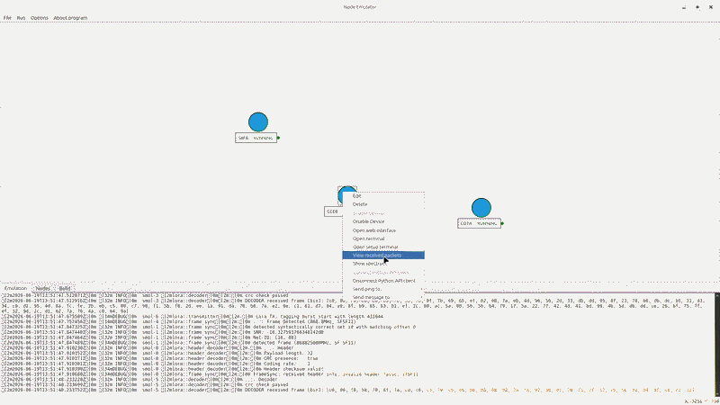
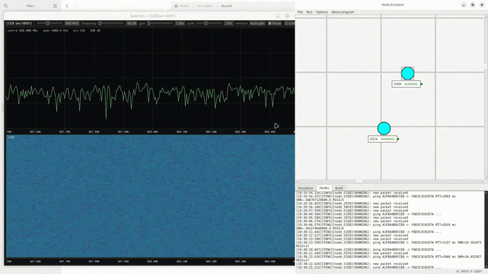

# LoRa Emulator

A **Software-in-the-Loop (SITL)** emulator for LoRa mesh networks. It runs the **real Meshtastic firmware** on top of a **software-modeled LoRa physical layer** (built with FutureSDR), so you can place, configure and test multiple virtual LoRa nodes and observe real mesh behaviour — without any radio hardware.

Instead of an SX126x/SX127x transceiver over SPI, the firmware talks to a virtual radio driver via the **KISS protocol over UDP**, and a separate channel process mixes the per-node signals with distance-based attenuation and additive white Gaussian noise (AWGN).

## Demonstrations

**Broadcast propagation across the mesh**



**Launch, direct ping and multi-hop ping (relaying)**


**Live spectrum & waterfall**



## What it does

- **Visual node management** — place, configure and arrange virtual LoRa nodes on a 2D canvas.
- **Real firmware in containers** — each node runs the `meshtasticd` daemon in its own Docker container.
- **Physical-layer emulation** — the LoRa channel (modulation/demodulation, path loss, AWGN) is modeled in software with FutureSDR.
- **Packet visualization** — live arrows and overlays for transmissions, receptions, ACKs and relay (RETX) hops.
- **Live channel control** — drag a node and the path loss is recomputed on the fly (no restart).
- **Spectrum & waterfall** — a per-node live spectrum/waterfall viewer fed by the post-channel IQ stream.
- **Benchmark harness** — scripted measurement of PDR/RTT/SNR vs distance, relaying, and engine CPU/RAM scalability.
- **Project management** — save/load network configurations as JSON.

## Architecture

The system is split into cooperating processes on one host:

- **GUI** (Python / PyQt6) — node configuration, topology canvas, packet monitor, controllers.
- **channel_process** (Rust / FutureSDR) — the radio-channel model: per-node receive/transmit flowgraphs, signal mixing with attenuation + AWGN, a UDP control port for live positions, and a per-node spectrum WebSocket.
- **Docker containers** — one per node, each running the Meshtastic `meshtasticd` firmware (native_virtual build), connected to the channel model over KISS/UDP.
- **spectrum_viewer** (Rust / eframe) — optional per-node live spectrum/waterfall window.


Data flow: user settings and messages go through the Meshtastic Python API to a TCP server inside `meshtasticd`, then down to the virtual radio over KISS/UDP. The virtual nodes exchange IQ samples through the channel emulator, and received frames flow back up to the application layer.

### Channel model

The received signal at node *m* is the sum of all transmitted signals, each attenuated with distance, plus Gaussian noise:

```
C_nm = (d_nm + 1)^-3 / sqrt(2)
y_m(i) = Σ x_n(i) · C_nm + η_m(i)
```

where `d_nm` is the 2D distance between nodes *n* and *m*. The `(d+1)^-3` exponent sits between free space (`-2`) and urban propagation (`-4`). At `d = 0` the self-signal is not summed.

## Features

### Node management
- **Visual placement** — drag and drop nodes on an infinite 2D canvas.
- **Node states** — colour-coded status (Created, Starting, Running, Stopped, Error).
- **Per-node configuration** — MAC address (auto-generated), network ports, region and modem preset, receiver noise level.

### Emulation control
- **Individual control** — start/stop nodes from the context menu.
- **Live position updates** — dragging a running node updates path loss immediately.
- **Auto-cleanup** — containers are removed on shutdown.

### Observability
- **Packet monitor** — visual arrows/overlays for TX, RX, ACK and relay hops; reconstruction of relay paths; broadcast visualization.
- **Spectrum & waterfall viewer** — live STFT of the post-channel signal per node (frequency/gain/zoom/window controls, pause, scrollback).

### Project management
- **Save / Load** — network configurations as JSON.
- **New project** — clear canvas and start fresh.

## Prerequisites

The emulator targets **Linux**.

- **Python 3.10+** — for the GUI (`pip install -r requirements.txt`; key deps: PyQt6, docker, meshtastic).
- **Rust (nightly)** — FutureSDR requires the nightly toolchain with `rustfmt` and `clippy`:
  ```bash
  rustup toolchain install nightly --component rustfmt clippy
  rustup default nightly
  rustup target add wasm32-unknown-unknown --toolchain nightly
  cargo install --locked trunk
  ```
- **Docker** — runs each node's firmware container (the image is built automatically on first launch).

> Rust components (`channel_process`, `spectrum_viewer`) are built automatically on first use from the GUI, so manual compilation is usually not required.

### System requirements

| Resource | Minimum (≤ 3 nodes) | Recommended |
|----------|---------------------|-------------|
| CPU      | 4 logical cores     | 16+ logical cores |
| RAM      | 8 GB                | 16 GB       |
| GPU      | OpenGL support      | OpenGL support |

## Installation

1. **Clone with submodules**:
   ```bash
   git clone --recursive https://github.com/Emile1154/LoRaEmulator.git
   cd LoRaEmulator
   ```
2. **Install Python dependencies**:
   ```bash
   pip install -r requirements.txt
   ```

## Usage

### Run the GUI

```bash
python app/main.py
```

### Build a network

1. **Add nodes** — right-click the canvas to create nodes.
2. **Configure** — double-click a node or use *Edit* from the context menu.
3. **Position** — drag nodes to arrange the topology (drag while running to change link conditions live).
4. **Launch** — *Run → Launch All Devices*, or start nodes individually.

### Context menu (per node)

- **Edit** / **Delete** — modify or remove a node.
- **Enable / Disable Device** — start/stop the node container.
- **Open Web Interface** — node web UI (when running).
- **Open Terminal** — node logs / shell (when running).
- **Show Spectrum** — open the live spectrum/waterfall window for the node.

### Node states

| State    | Color  | Description                    |
|----------|--------|--------------------------------|
| CREATED  | Gray   | Defined but not started        |
| STARTING | Yellow | Container is launching         |
| RUNNING  | Green  | Active and operational         |
| STOPPING | Yellow | Container is shutting down     |
| STOPPED  | Blue   | Stopped by the user            |
| ERROR    | Red    | Failed to start or crashed     |

## Submodules

### [meshtastic_firmware](https://github.com/Emile1154/firmware)
Meshtastic firmware adapted for a native virtual environment. Provides the `meshtasticd` daemon that runs inside each node container and talks to the channel model through a virtual KISS-over-UDP radio driver.

### [LoRaSDR](https://github.com/Emile1154/LoRaSDR.git)
Rust Software-Defined LoRa transceiver and channel model. Implements LoRa modulation/demodulation, frame synchronization, the channel process (path loss + AWGN), the KISS driver and the spectrum viewer.

### [FutureSDR](https://github.com/FutureSDR/FutureSDR.git)
SDR framework providing the runtime and DSP building blocks used by LoRaSDR.

## Development

### Build the Meshtastic firmware

Built automatically on first node launch; to build manually:
```bash
cd meshtastic_firmware
pio run -e native_virtual
```

### Project file format

Projects are JSON arrays of node configurations:

```json
[
  {
    "web_port": 9000,
    "local_port": 8000,
    "remote_port": 8002,
    "tcp_port": 4403,
    "x": 100.0,
    "y": 200.0,
    "MAC_address": "A1B2C3D4E5F6",
    "region": "EU_868",
    "modem_preset": "LONG_FAST",
    "noise_std": 2e-6,
    "network_type": "meshtastic"
  }
]
```

## Troubleshooting

### Firmware build failures
Make sure submodules are initialized:
```bash
git submodule update --init --recursive
```

### Port conflicts
Ensure the configured ports (defaults: local 8000, remote 8002, web 9000, TCP 4403) and the channel ports (control 17000, spectrum 18000+) are free.

## Acknowledgments

- [Meshtastic](https://meshtastic.org/) — mesh networking firmware
- [FutureSDR](https://github.com/FutureSDR/FutureSDR) — SDR framework
- [gr-lora_sdr](https://github.com/tapparelj/gr-lora_sdr) by Tapparel et al. — LoRa PHY implementation
