СОДЕРЖАНИЕ

# 

[СПИСОК СОКРАЩЕНИЙ [6](#_Toc219672752)](#_Toc219672752)

[ВВЕДЕНИЕ [7](#_Toc232629655)](#_Toc232629655)

[1 ПОСТАНОВКА ЗАДАЧИ [9](#постановка-задачи)](#постановка-задачи)

[1.1. Определение задач [9](#определение-задач)](#определение-задач)

[2 ОБЗОРНАЯ ЧАСТЬ [10](#обзорная-часть)](#обзорная-часть)

[2.1. Физический уровень LoRa
[10](#физический-уровень-lora)](#физический-уровень-lora)

[2.1.1. Линейная частотная модуляция с расширением спектра
[10](#линейная-частотная-модуляция-с-расширением-спектра)](#линейная-частотная-модуляция-с-расширением-спектра)

[2.1.2. Структура кадра LoRa
[11](#структура-кадра-lora)](#структура-кадра-lora)

[2.1.3. Выравнивание данных
[13](#выравнивание-данных)](#выравнивание-данных)

[2.1.4. Структура заголовка
[13](#структура-заголовка)](#структура-заголовка)

[2.1.5. Диагональное перемежение
[14](#диагональное-перемежение)](#диагональное-перемежение)

[2.1.6. Преобразование в код Грея
[16](#преобразование-в-код-грея)](#преобразование-в-код-грея)

[2.1.7. Преамбула [16](#преамбула)](#преамбула)

[2.1.8. Параметры модуляции LoRa
[17](#параметры-модуляции-lora)](#параметры-модуляции-lora)

[2.2. LoRaWAN [18](#lorawan)](#lorawan)

[2.2.1. Модель сети [18](#модель-сети)](#модель-сети)

[2.2.2. Активация конечного устройства
[20](#активация-конечного-устройства)](#активация-конечного-устройства)

[2.2.3. Механизм управления скоростью передачи данных
[21](#механизм-управления-скоростью-передачи-данных)](#механизм-управления-скоростью-передачи-данных)

[2.3. Meshtastic [22](#meshtastic)](#meshtastic)

[2.3.1. Модель сети [22](#модель-сети-1)](#модель-сети-1)

[2.3.2. Стек протоколов [22](#стек-протоколов)](#стек-протоколов)

[2.3.3. Пресеты модема и частотные планы
[23](#пресеты-модема-и-частотные-планы)](#пресеты-модема-и-частотные-планы)

[2.3.4. Интерфейсы управления
[24](#интерфейсы-управления)](#интерфейсы-управления)

[2.4. MeshCore [24](#meshcore)](#meshcore)

[2.4.1. Модель сети [25](#модель-сети-2)](#модель-сети-2)

[2.4.2. Стек протоколов и особенности
[25](#стек-протоколов-и-особенности)](#стек-протоколов-и-особенности)

[2.4.3. Интерфейсы и управление
[26](#интерфейсы-и-управление)](#интерфейсы-и-управление)

[2.5. Reticulum [26](#reticulum)](#reticulum)

[2.5.1. Модель сети [26](#модель-сети-3)](#модель-сети-3)

[2.5.2. Стек протоколов и особенности
[26](#стек-протоколов-и-особенности-1)](#стек-протоколов-и-особенности-1)

[2.6. Сравнение сетевых стеков
[27](#сравнение-сетевых-стеков)](#сравнение-сетевых-стеков)

[2.7. Обзор существующих решений эмуляции и симуляции LoRa-сетей
[28](#обзор-существующих-решений-эмуляции-и-симуляции-lora-сетей)](#обзор-существующих-решений-эмуляции-и-симуляции-lora-сетей)

[3 ПРОГРАММНОЕ ОБЕСПЕЧЕНИЕ
[31](#программное-обеспечение)](#программное-обеспечение)

[3.1. Обоснование выбора технологий
[31](#обоснование-выбора-технологий)](#обоснование-выбора-технологий)

[3.1.1. Симуляция и эмуляция: обоснование выбора SITL
[31](#симуляция-и-эмуляция-обоснование-выбора-sitl)](#симуляция-и-эмуляция-обоснование-выбора-sitl)

[3.1.2. Инструменты эмуляции физического уровня
[32](#инструменты-эмуляции-физического-уровня)](#инструменты-эмуляции-физического-уровня)

[3.1.3. Виртуализация [33](#виртуализация)](#виртуализация)

[3.1.4. Графический интерфейс
[33](#графический-интерфейс)](#графический-интерфейс)

[3.2. Теоретическая модель радиоканала
[33](#теоретическая-модель-радиоканала)](#теоретическая-модель-радиоканала)

[3.3. Архитектура эмулятора
[35](#архитектура-эмулятора)](#архитектура-эмулятора)

[3.4. Физический уровень [37](#физический-уровень)](#физический-уровень)

[3.4.1. Реализация модели канала
[37](#реализация-модели-канала)](#реализация-модели-канала)

[3.4.2. Структура узла [39](#структура-узла)](#структура-узла)

[3.4.3. Граф приема и передачи сигнала
[40](#граф-приема-и-передачи-сигнала)](#граф-приема-и-передачи-сигнала)

[3.4.4. Пользовательские блоки
[43](#пользовательские-блоки)](#пользовательские-блоки)

[3.4.5. Обновление позиций узлов
[44](#обновление-позиций-узлов)](#обновление-позиций-узлов)

[3.4.6. Расширяемость физического уровня
[44](#расширяемость-физического-уровня)](#расширяемость-физического-уровня)

[3.5. Сетевой уровень [45](#сетевой-уровень)](#сетевой-уровень)

[3.5.1. KISS команды [45](#kiss-команды)](#kiss-команды)

[3.5.2. Передача данных на физический уровень
[46](#передача-данных-на-физический-уровень)](#передача-данных-на-физический-уровень)

[3.5.3. Прием данных с физического уровня
[47](#прием-данных-с-физического-уровня)](#прием-данных-с-физического-уровня)

[3.5.4. Прием данных с сетевого уровень
[47](#прием-данных-с-сетевого-уровень)](#прием-данных-с-сетевого-уровень)

[3.5.5. Передача данных на сетевой уровень
[48](#передача-данных-на-сетевой-уровень)](#передача-данных-на-сетевой-уровень)

[3.5.6. Расширяемость работы с другими сетевыми стеками
[49](#расширяемость-работы-с-другими-сетевыми-стеками)](#расширяемость-работы-с-другими-сетевыми-стеками)

[3.6. Графический интерфейс
[49](#графический-интерфейс-1)](#графический-интерфейс-1)

[3.6.1. Конфигурация и состояние узлов
[50](#конфигурация-и-состояние-узлов)](#конфигурация-и-состояние-узлов)

[3.6.2. Изоляция узлов [51](#изоляция-узлов)](#изоляция-узлов)

[3.6.3. Мониторинг пакетов
[51](#мониторинг-пакетов)](#мониторинг-пакетов)

[3.6.4. Реконструкция пути ретрансляции
[52](#реконструкция-пути-ретрансляции)](#реконструкция-пути-ретрансляции)

[3.6.5. Визуализация широковещательных пакетов и подтверждений
[53](#визуализация-широковещательных-пакетов-и-подтверждений)](#визуализация-широковещательных-пакетов-и-подтверждений)

[3.6.6. Ограничения визуализации
[53](#ограничения-визуализации)](#ограничения-визуализации)

[3.6.7. Отображение частотного спектра и водопада
[54](#отображение-частотного-спектра-и-водопада)](#отображение-частотного-спектра-и-водопада)

[3.6.8. Управление узлами через контекстное меню
[56](#управление-узлами-через-контекстное-меню)](#управление-узлами-через-контекстное-меню)

[3.6.9. Пересборка компонентов через UI
[58](#пересборка-компонентов-через-ui)](#пересборка-компонентов-через-ui)

[3.7. Технические детали реализации
[59](#технические-детали-реализации)](#технические-детали-реализации)

[4 ТЕСТИРОВАНИЕ И ОЦЕНКА ПОТРЕБЛЕНИЯ РЕСУРСОВ
[61](#тестирование-и-оценка-потребления-ресурсов)](#тестирование-и-оценка-потребления-ресурсов)

[4.1. Методика проверки [61](#методика-проверки)](#методика-проверки)

[4.2. Проверка модели канала
[62](#проверка-модели-канала)](#проверка-модели-канала)

[4.3. Оценка потребления системных ресурсов
[66](#оценка-потребления-системных-ресурсов)](#оценка-потребления-системных-ресурсов)

[4.4. Минимальные и рекомендуемые требования
[68](#минимальные-и-рекомендуемые-требования)](#минимальные-и-рекомендуемые-требования)

[ЗАКЛЮЧЕНИЕ [70](#_Toc232629724)](#_Toc232629724)

[СПИСОК ИСПОЛЬЗОВАННЫХ ИСТОЧНИКОВ [71](#_Toc232629725)](#_Toc232629725)

[Приложение A
[73](#xpasted-image-16.pngприложение-a)](#xpasted-image-16.pngприложение-a)

[Приложение B [74](#приложение-b)](#приложение-b)

[Приложение C [75](#приложение-c)](#приложение-c)

[Приложение D [76](#приложение-d)](#приложение-d)

СПИСОК СОКРАЩЕНИЙ

ACK (Acknowledgement) — подтверждение приема пакета

AWGN (Additive White Gaussian Noise) — аддитивный белый гауссовский шум

BW (Bandwidth) — ширина полосы пропускания

CR (Coding Rate) — скорость кода

CRC (Cyclic Redundancy Check) — циклический избыточный код

CSV (Comma-Separated Values) — текстовый формат табличных данных

DSP (Digital Signal Proccessing) — цифровая обработка сигналов

FFT (Fast Fourier Transform) — быстрое преобразование Фурье (БПФ)

HITL (Hardware-in-the-Loop) — эмуляция с помощью аппаратных средств

IQ (In-phase/Quadrature) — синфазная и квадратурная составляющие сигнала

KISS (Keep It Simple, Stupid) — протокол обмена кадрами  
LDRO (Low Data Rate Optimization) — оптимизация передачи данных

LoRa (Long Range) — линейная частотная модуляция с расширением спектра

LPWAN (Low-Power Wide-Area Network) — энергоэфф. сеть дальнего радиуса

OpenGL (Open Graphic Library) — графический программный интерфейс

PDR (Packet Delivery Ratio) — доля доставленных пакетов

RETX (Retransmission) — повторная передача

RSSI (Received Signal Strength Indicator) — метрика уровня мощности
сигнала

RTT (Round-Trip Time) — время отправки и получения ответа

SDR (Software-Defined Radio) — программно-определяемое радио

SF (Spreading Factor) — коэффициент расширения спектра

SITL (Software-in-the-Loop) — эмуляция с помощью программных средств

SNR (Signal-to-Noise Ratio) — отношение сигнал/шум

TCP/UDP — транспортные протоколы передачи

ОЗУ — оперативное запоминающее устройство

ЦП — центральный процессор

СКО — среднеквадратичное отклонение

ВВЕДЕНИЕ

В современных условиях возрастающей зависимости от централизованных
систем связи особую актуальность приобретают децентрализованные системы
связи. Одним из востребованных решений является технология Meshtastic —
открытый проект, реализующий децентрализованную mesh-сеть с
использованием трансиверов LoRa на физическом уровне.

Технология LoRa (LongRange) использует запатентованную модуляцию с
расширением спектра методом линейной частотной модуляции. Такой подход
обеспечивает высокую помехоустойчивость и дальность передачи при
минимальном энергопотреблении, что делает его основой большинства
LPWAN-решений. LoRaWAN и Meshtastic является стандартным протоколом
сетевого уровня поверх LoRa. При разработке распределённых беспроводных
систем, таких как mesh-сети, ключевой задачей является корректная оценка
поведения радиоканала. Экспериментальная проверка таких систем в
реальных условиях требует значительных материальных и временных
ресурсов: необходимо несколько физических устройств, возможность их
размещения на требуемых расстояниях, а повторяемость экспериментов
существенно ограничена. В связи с этим особую актуальность приобретают
программные методы эмуляции физического уровня радиоканала.

Одним из подходов является концепция Software-in-the-Loop (SITL), при
которой встроенное программное обеспечение и алгоритмы выполняются на
хост-компьютере путём запуска в виртуальной среде. В отличие от
Hardware-in-the-Loop (HITL), где используются реальные физические
компоненты, SITL позволяет эмулировать все уровни программно, что
снижает затраты и обеспечивает высокую воспроизводимость экспериментов.

Настоящая работа посвящена разработке программного эмулятора
LoRamesh-сети на базе реальной прошивки Meshtastic с применением подхода
SITL. Документ включает описание физического уровня LoRa, протоколов
LoRaWAN и Meshtastic, архитектуры разработанного программного
обеспечения и результатов его работы.

# ПОСТАНОВКА ЗАДАЧИ

## Определение задач

Цель работы — разработка программного SITL-эмулятора полного стека
Meshtastic, позволяющего эмулировать поведение сети на всех уровнях без
использования физических устройств.

Для достижения цели были поставлены следующие задачи:

1.  Разработать модель канала связи, реализующую распространение
    квадратурных сигналов между виртуальными узлами с учетом затухания и
    шума.

2.  Реализовать описание узлов в виде двух независимых графов обработки
    сигналов (путь приема и передачи) на базе инструмента FutureSDR.

3.  Разработать механизм, связывающий узлы FutureSDR с моделью канала
    связи (блоки Signal Subscriber и Signal Publisher через каналы
    crossbeam)

4.  Реализовать виртуальный драйвер для эмуляции физического интерфейса
    Meshtastic

5.  Реализовать базовый графический интерфейс для управления
    виртуальными узлами и конфигурацией сети.

Ограничения и допущения:

Модель затухания — свободное пространство (d-3), многолучевое
распространение не моделируется.

Канал не обладает частотной избирательностью. Сигналы от всех активных
передатчиков суммируются в общем широкополосном буфере без учета их
несущей частоты и полосы пропускания.

# ОБЗОРНАЯ ЧАСТЬ

## Физический уровень LoRa

Среди множества технологий сетей дальнего радиуса действия с низким
энергопотреблением LoRaWAN стал одним из самых популярных и широко
распространённых решений. LoRa является физическим уровнем технологии
маломощных сетей дальнего радиуса (LPWAN).

LoRa использует запатентованную модуляцию с расширением спектра методом
линейной частотной модуляции (или расширение спектра с помощью чирпов).
Данная модуляция используется вместе с помехоустойчивым кодированием и
перемежением.

Протокол LoRaWAN является открытым стандартом, но физический уровень,
называемый LoRa, запатентован (Seller&Sornin U.S. Patent 9 252 834)
\[1\] и является собственностью компании Semtech, что послужило причиной
обратного проектирования для понимания структуры кадров, кодирования и
модуляции \[2, 3\].

### Линейная частотная модуляция с расширением спектра 

Линейная частотная модуляция с расширением спектра, определяется двумя
параметрами передачи: коэффициентом расширения спектра (SF) и шириной
полосы канала (BW).

Каждый символ состоит из *N* = 2*SF* чипов. Каждому значению
символа s соответствует определённый циклический сдвиг начальной
частоты,

где *s* ∈ *{*0*, ..., N}.*

Время передачи одного символа:

$$\begin{array}{r}
T\_{s} = \frac{N}{BW},\\\\\\\lbrack c\rbrack\\\\(2.1)
\end{array}$$

Символ кодируется как чирпированный сигнал, в котором частота линейно
нарастает от –BW/2 до +BW/2 за время *Ts*, после чего
циклически повторяется. Циклический сдвиг, соответствующий значению
символа s, определяет начальную частоту чирпа.

На приёмной стороне для демодуляции применяется операция умножения
принятого сигнала на down-chirp с последующим FFT (Fast Fourier
Transform/Быстрое преобразование Фурье) — пик FFT соответствует номеру
символа \[4\].

Рисунок 2.1 — Спектрограмма c границами символов LoRa

Ключевые свойства ЛЧМ с расширением спектра:

Устойчивость к допплеровскому сдвигу: частотный сдвиг сигнала
проявляется как временной сдвиг в демодуляторе, который компенсируется
алгоритмом синхронизации.

Устойчивость к многолучевому распространению: расширение спектра снижает
влияние интерференции от отражений.

### Структура кадра LoRa

Существуют два вида фрейма, явный и неявный. Отличие в наличие
заголовка, который присутствует только в явных кадрах. Через заголовок
кадр задает скорость помехоустойчивого кодирования (CR 4/5, 4/6, 4/7,
4/8) и наличие 2 байт контрольной суммы (CRC) в конце кадра.

Кадр состоит из преамбулы, заголовка (только для явных кадров), полезной
нагрузки и контрольной суммы. (Рисунок 2.2)

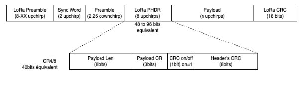

Рисунок 2.2 — Структура кадра LoRa

> 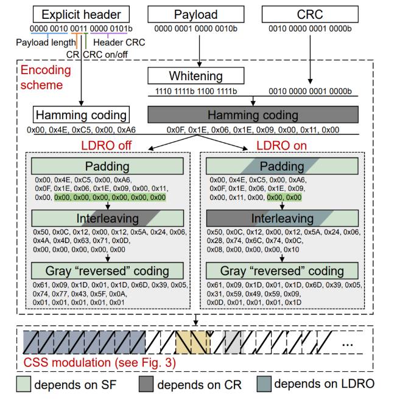 style="width:5.48292in;height:5.5in" />

Рисунок 2.3 — Cтруктура кодирования, выравнивания и перемежения в кадре
LoRa

###  Выравнивание данных

Операция выравнивания рандомизирует битовые последовательности и
уменьшают вероятность появления длинных серий единиц или нулей на основе
операции суммы по модулю 2, для предотвращения проблем при передаче
данных. Взбалтывается только полезная нагрузка (Рисунок 2.3).

Псевдослучайная последовательность сгенерирована регистром сдвига с
линейной обратной связью.

Полином обратной связи:
*x*8 + *x*6 + *x*5 + *x*4 + 1

Рисунок 2.4 — Функциональная схема взбалтывания для одного байта данных

### Структура заголовка

Заголовок используется для передачи информации, которая необходима для
декодирования кадра. Состоит из длины полезной нагрузки, наличия CRC

для полезной нагрузки, скорость кодирования и контрольной суммы для
заголовка.

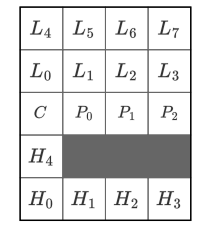

Рисунок 2.5 — Структура заголовка кадра LoRa( L - байт для длины
полезной нагрузки, C - используется ли помехоустойчивое кодирование, P -
скорость кодирования, H - CRC для заголовка)

CRC заголовка вычисляется по формуле:

$$\begin{array}{r}
H\_{CRC} = G \cdot \overline{h},\\\\(2.2)
\end{array}$$

где
$\overline{h} = \left\lbrack L\_{7}\\,\\ L\_{6}\\,\\\ldots\\,\\ C\\ \right\rbrack$
является двоичным вектором;

*G* — порождающей матрицей:

$$\begin{array}{r}
G = \begin{bmatrix}
1 & 1 & 1 & 1 & 0 & 0 & 0 & 0 & 0 & 0 & 0 & 0 \\
1 & 0 & 0 & 0 & 1 & 1 & 1 & 0 & 0 & 0 & 0 & 1 \\
0 & 1 & 0 & 0 & 1 & 0 & 0 & 1 & 1 & 0 & 1 & 0 \\
0 & 0 & 1 & 0 & 0 & 1 & 0 & 1 & 0 & 1 & 1 & 1 \\
0 & 0 & 0 & 1 & 0 & 0 & 1 & 0 & 1 & 1 & 1 & 1
\end{bmatrix}\\\\(2.3)
\end{array}$$

### Диагональное перемежение 

Перемежение используется для распределения битов кодового слова для

улучшения возможности исправления ошибок кода.

Размер блока перемежителя задается количеством битов в кодовом слове

4 + *P*, где *P* количество битов четности, и используемом коэффициентом
расширения спектра (SF). Перемежитель преобразует двоичную матрицу *D*
размером *S**F* ⋅ (4 + *P*), в которой каждая строка является словом.

Диагональное перемежение определяется уравнением:

$$\begin{array}{r}
I\_{i,j} = D\_{\left\lbrack i - (j + 1) \right\rbrack\\ mod\\ SF,\\ i\\},\\\\(2.4)
\end{array}$$

где *i* ∈ {0, …, 3 + *P*}; *j* ∈ {0, … , *S**F* − 1}.

В LoRa eсть оптимизированный режим низкой скорости передачи данных
(LDRO), который уменьшает количество битов в блоке перемежителя до
(*S**F* − 2) ⋅ (4 + *P*). После перемежения к каждому кодовому слову
добавляется бит четности, значение которого определяется выражением:

$$\begin{array}{r}
P = \\ B\_{0} \oplus B\_{1} \oplus \ldots \oplus B\_{SF - 2\\},\\\\(2.5)
\end{array}$$

Рисунок 2.6 — Иллюстрация отличия перемежения с оптимизацией (*P* = 2,
CR = 4/6, SF = 7)

Для полного декодирования кадра приемнику нужно знать длину полезной
нагрузки, наличие CRC и кодовую скорость. Однако приемник не знает
заголовок до декодирования первого блока перемежителя (Рисунок 2.2). Для
этого первый блок перемежителя кодируется с наиболее надежной кодовой

скоростью CR = 4/8, для SF &gt; 6 используется с включенным LDRO.

Важно отметить, что первый блок всегда использует CR = 4/8, даже если
это передача неявного кадра.

### Преобразование в код Грея

Каждая строка перемеженной матрицы интерпретируется как вектор двоичных
значений. Операция декодирования кода Грея используется для
восстановления последовательности, закодированных кодом Грея, в
десятичные числа. После преобразования Грея каждый символ s отличается
от соседних символов только одним битом.

Преобразование, используемое LoRa задается формулой:

$$\begin{array}{r}
s\\ = \\\left\lbrack I\_{i}\\ \oplus \left( I\_{i} \gg 1 \right)\\ + 1 \right\rbrack\\ mod\\ SF,\\\\(2.6)
\end{array}$$

где *I**i* - i-я строка матрицы.

Преобразование Грея используемое LoRa включает произвольное смещение +1
к преобразованным значениям.

### Преамбула

Для синхронизации кадр LoRa начинается с преамбулы. Преамбула содержит
*N*up восходящих чирпов, затем 2 символа называемых сетевым
идентификатором и в конце 2.25 нисходящих чирпов. (Рисунок 2.7). Число
*N*up ∈ {0, … , 65535 } , где 8 является наиболее
распространённым.

Рисунок 2.7 — Спектрограмма преамбулы кадра LoRa

Типовое значение сетевого идентификатора 0x34 для LoRaWAN или 0x12 для
частных сетей.

Значение может быть в диапазоне
*Sw* ∈ {10*h*, … , *F**F**h* }. Некоторые приемопередатчики
определяют сетевой идентификатор как 16 битное значение, которое
эквивалентно 8 битному через соотношение:

$$\begin{array}{r}
XYh = X4Y4h,\\\\(2.7)
\end{array}$$

Разбивание сетевого идентификатора на слова Sw0 и
Sw1 задаются через соотношения:

$$\begin{array}{r}
S\_{w0} = \left( S\_{w} \gg 4 \right)\*8,\\\\(2.8)
\end{array}$$

$$\begin{array}{r}
S\_{w1} = \left( S\_{w}\\\\\\0x0F \right)\*8,\\\\(2.9)
\end{array}$$

### Параметры модуляции LoRa

SF (SpreadingFactor, 7–12) — коэффициент расширения спектра. Определяет
количество чипов на символ (*N* = 2*SF*). Увеличение SF
повышает дальность и чувствительность, но снижает скорость передачи
данных. SF7 обеспечивает наибольшую скорость (~5,47 кбит/с при
BW=125кГц), SF12 — наибольшую дальность (~0,29 кбит/с).

BW (Bandwidth) — ширина полосы пропускания. Поддерживаемые значения:
62,5; 125; 250; 500кГц. Увеличение BW повышает скорость передачи, но
снижает чувствительность приёмника.

CR (CodeRate, 4/5–4/8) — скорость помехоустойчивого кодирования кодом
Хэмминга. CR 4/5 добавляет минимальную избыточность (1 бит на 4), CR 4/8
— максимальную (4 бита на 4). Увеличение избыточности повышает
устойчивость к ошибкам за счёт снижения скорости.

LDRO (Low Data Rate Optimization) — режим оптимизации для низких
скоростей передачи. Уменьшает размер блока перемежителя с SF·(4+*P*) до
(SF−2)·(4+*P*).

##  LoRaWAN

LoRaWAN — это протокол канального уровня, ориентированный на передачу
данных на большие расстояния при минимальном энергопотреблении.
Описывает организацию сети поверх физического уровня LoRa \[5\].

### Модель сети

Основные компоненты сети LoRaWAN.

**Конечное устройство (End-device)** — это трансивер датчика, трансивер
исполнительного механизма, либо устройство, совмещающее оба типа. Может
содержать набор датчиков и управляемых элементов. Обмен данными
происходит через радиошлюз.

**Радиошлюз (Radio Gateway)** работает полностью на физическом уровне.

Uplink (восходящий канал) – декодирует принятые радиопакеты и передает
их на сетевой сервер без обработки.

Downlink (нисходящий канал) – запросы от сетевого сервера передаются к
конечному устройству.

**Сетевой сервер (Network server)** — Центральный управляющий элемент

LoRaWAN сети. Каждый сетевой сервер имеет один или более ID (IEEE
EUI64).

Сетевой сервер выполняет функции:

\- Проверки адреса конечного устройства, и кадров.

\- Механизм подтверждения.

\- Адаптация скорости передачи данных.

\- Отправка ответов на MAC-запросы, поступающего от конечного
устройства.

\- Пересылка полученных сообщений uplink с конечного устройства на
соответствующий сервер приложения.

\- Постановка в очередь сообщений downlink на отправку с любого сервера
приложений на конечное устройство.

\- Пересылка рукопожатий между конечным устройством и сервером
активации.

**Сервер активации (Join Server)** — Отвечает за процедуру активации по
воздуху (OTA).

Его функции:

\- Обработка Join-request кадра от конечных устройств.

\- Отправка Join-accept кадра и передача на конечное устройство

\- Генерация ключа сеанса сети (NetworkSessionKey)для обмена между
конечным устройством и сетевым сервером.

\- Генерация ключа сеанса приложения (ApplicationSessionKey) для обмена
между сетевым сервером и сервером приложений.

Для генерации ключей Join server должен иметь следующие данные:

\- DevEUI, глобальный id конечного устройства.

\- AppKey.

\- NwkKey (только для конечного устройства LoRaWANv.1.1)

\- ID сетевого сервера и сервера приложений.

\- Версия LoRaWAN конечного устройства.

AppKey и NwkKey – root ключи. Объявлены только у конечного устройства и
у сервера активации, и никогда не отправляются ни в сетевой сервер, ни в
сервер приложения.

**Сервер приложений (Application Server)** — обрабатывает все данные,
полученные от конечного устройства, и отображает пользователю. Также
генерирует на уровне приложений downlink запросы.

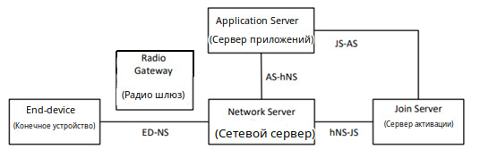

Рисунок 2.8 — Модель частной сети LoRaWAN.

### Активация конечного устройства

Существуют два вида активации конечного устройства в сети LoRaWAN:

1.  ABP (Activation by Personalization) — статическая активация. В
    данном случае все ключи и параметры устройства задаются вручную до
    подключения к сети, без использования Join-request (Join EUI).

2.  Конечное устройство получает DevAddr, AppSkey, сетевые ключи сессии
    (SNwkSIntKey, FNwkSIntKey, NwkSEncKey). Данные параметры заданы
    производителем или сконфигурированы пользователем. После включения
    устройство сразу может передавать данные, не проходя активацию.

Условия со стороны сервера:

\- Сетевой сервер должен быть настроен с DevAddr и сетевыми ключами.

\- Сервер приложений должен иметь одинаковый DevAddr и AppSKey для
декодирования.

1.  OTA (Over the Air) – динамическая активация.

Процедура включает Join-request (Join EUI) и получение сгенерированных

ключей от сервера активации (Join Server):

\- Изначально конечное устройство – Generic Device

\- После привязки к сети (commissioning) оно становится Commissioned
Device.

\- При успешной активации — OTA Activated Device.

\- Конечное устройство может быть деактивировано по инициативе сервера
или пользователя, через процедуру Exit.

\- Повторная активация приведет к созданию нового LoRaWAN сеанса.

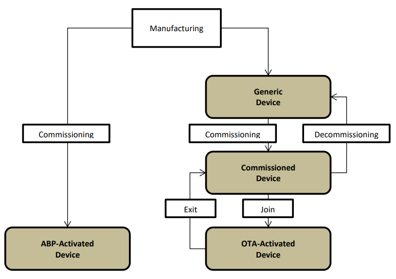

Рисунок 2.9 — Два типа активации конечного устройства в сети LoRaWAN.

Generic Device — только DevEUI и корневые ключи (AppKey, NwkKey)

Commissioned Device — устройство связано с сетью.

OTA Activated Device — сервер активации активировал устройство. передав
сгенерированные ключи (Network Session Key) конечному устройству.

### Механизм управления скоростью передачи данных

ADR (Adaptive data rate) — механизм оптимизации использования
радиоканала, при котором сетевой сервер управляет параметрами передачи
конечного устройства.

Алгоритм ADR на стороне сервера:

1\. Сервер накапливает историю SNR последних 20 пакетов uplink.

2\. Вычисляется максимальное SNR: SNR\_max.

3\. Запас по каналу: Margin = SNR\_max − SNR\_required(DR\_current) − 10
дБ.

4\. Если Margin &gt; 0, сервер снижает SF (повышает DR) на Margin / 3
ступени.

5\. Если устройство не отвечает на несколько последовательных запросов
Link ADR Req, оно увеличивает SF (снижает DR) вплоть до максимального.

## Meshtastic

Meshtastic — открытый проект, реализующий децентрализованную mesh-сеть
для приёмопередатчиков LoRa \[6\]. В отличие от LoRaWAN, не требует
централизованной инфраструктуры (шлюзов, серверов).

### Модель сети

Meshtastic использует децентрализованную mesh-топологию на основе
управляемой лавинной маршрутизации (managed flooding). Каждый узел,
получивший пакет впервые, ретранслирует его (с учётом счётчика
hop\_limit).

Роли узлов:

\- CLIENT — стандартный узел с интерфейсом пользователя
(Bluetooth/WiFi/Serial).

\- CLIENT\_MUTE — принимает пакеты, но не ретранслирует.

\- ROUTER — оптимизирован для ретрансляции, не имеет пользовательского
интерфейса.

\- ROUTER\_CLIENT — совмещает функции ROUTER и CLIENT.

\- REPEATER — ретранслирует пакеты с максимальным приоритетом.

\- TRACKER — оптимизирован для периодической отправки данных о
местоположении.

Параметр hop\_limit (по умолчанию 3) ограничивает максимальное число
ретрансляций пакета и предотвращает зацикливание. Уникальный
идентификатор пакета (packet\_id + sender) позволяет каждому узлу
отбросить уже обработанный пакет.

Роли позволяют регулировать частоту передачи и приоритеты ретрансляции,
что важно в плотных сетях или при построении стационарных узлов.

### Стек протоколов

Meshtastic реализует полный стек уровней модели взаимодействия открытых
систем.

Таблица 2.1 — Уровни в meshtastic

<table>
<colgroup>
<col style="width: 50%" />
<col style="width: 50%" />
</colgroup>
<thead>
<tr>
<th style="text-align: center;">Название уровня</th>
<th style="text-align: center;">Реализация в meshtastic</th>
</tr>
</thead>
<tbody>
<tr>
<td style="text-align: center;">Уровень приложений</td>
<td style="text-align: center;">Текстовые сообщения</td>
</tr>
<tr>
<td style="text-align: center;">Уровень представлений</td>
<td style="text-align: center;">Protobuf,шифрование</td>
</tr>
<tr>
<td style="text-align: center;">Транспортный уровень</td>
<td style="text-align: center;">hop-by-hop ACK</td>
</tr>
<tr>
<td style="text-align: center;">Сетевой уровень</td>
<td style="text-align: center;">Адресация, hop лимиты</td>
</tr>
<tr>
<td style="text-align: center;">Канальный уровень</td>
<td style="text-align: center;">MeshPacket</td>
</tr>
<tr>
<td style="text-align: center;">Физический уровень</td>
<td style="text-align: center;">LoRaPHY</td>
</tr>
</tbody>
</table>

Описание уровней:

Физический уровень полностью основан на стандарте LoRa. Используется ЛЧМ
с настраиваемыми параметрами: BW, SF, CR и LDRO. Канальный уровень
определяет формат кадров — MeshPacket. На этом уровне обеспечивается
доставка только между узлами в пределах видимости.

> Выполняются функции:

\- Сетевой уровень ретранслирует пакеты при hop\_limit &gt; 0, выполняет
адресацию по 32-битными идентификаторами узлов, поддерживает broadcast и
unicast. Meshtastic не делит сеть на логические подсети, а разделяет по
физической досягаемости (количество хопов).

\- На транспортном уровне надежная доставка реализована только между
соседними узлами. Сквозная надежная доставка от отправителя до конечного
получателя на уровне стека отсутствует.

\- Уровень представлений выполняет обработку данных (сериализация
protobuf, шифрование)

\- Уровень приложения: мобильное приложение, web-интерфейс, мессенджеры
и т.д.

### Пресеты модема и частотные планы

Meshtastic предлагает набор предопределенных настроек, которые позволяют
балансировать между дальностью связи, скоростью передачи данных и
устойчивостью к помехам. Каждая преднастройка определяет комбинацию
параметров LoRa: BW, SF, CR и LDRO. Доступные частоты и слоты берутся из
настроек регионов в Meshtastic.

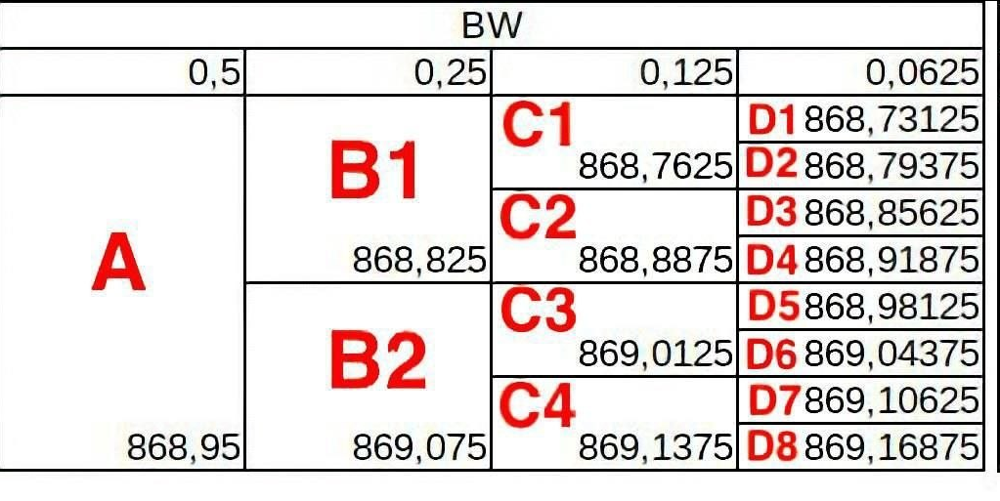

Рисунок 2.10 — Частотные слоты для разных полос пропускания для региона
RU

### Интерфейсы управления

Прошивка Meshtastic поддерживает несколько интерфейсов управления и
конфигурирования устройства.

Основные интерфейсы управления:

Bluetooth, Serial (UART/USB), TCP/IP (Ethernet/Wi-Fi), MQTT.

Вся конфигурация основана на protocol buffers (protobuf), где можно
переопределить имя устройства, роль узла, параметры радио, управление
интерфейсами и другими настройками которые есть в документации.

Для программного управления рекомендуется использовать Meshtastic python
api библиотеку \[7\].

## MeshCore

MeshCore — это новый открытый протокол и прошивка для создания
децентрализованных LoRa mesh-сетей, позиционируемый как более
структурированная и масштабируемая альтернатива Meshtastic \[8\]. Проект
появился в 2024-2025 годах.

### Модель сети

MeshCore использует гибридный подход к маршрутизации с разделением ролей
устройств. В отличии от meshtastic, где почти все узлы могут
ретранслировать трафик, meshcore строит сеть вокруг выделенных
ретрансляторов.

Основные роли устройств:

\- Companion — клиентское устройство. Не ретранслирует сообщения других
узлов, только отправляет и получает свои.

\- Repeater — Инфраструктурный ретранслятор. Основной элемент сети,
отвечает за пересылку сообщений. Стационарный компонент сети.

\- Room Server — сервер для хранения и распространения сообщений.

Алгоритм маршрутизации:

\- Основной режим — структурированная маршрутизация через известные
Repeaters.

\- При отсутствии маршрута используется flooding или fallback

\- Максимальное количество ретрансляций — до 64.

\- Поддерживается явное указание пути сообщения.

### Стек протоколов и особенности

MeshCore использует собственный легкий протокол. Поддерживает end-to-end
шифрование. В отличие от Meshtastic, работает с более жестким контролем
доступа к среде и уменьшенным количеством ретрансляций.

Ключевые отличия от Meshtastic:

\- Клиенты (Companion) не ретранслируют трафик других пользователей.

\- Pull модель для телеметрии и позиций (данные запрашиваются, а не
постоянно отправляются)

\- Улучшенная аналитика, просмотр маршрутизации пакетов и связей

Данные отличия позволяют проще и эффективнее расширять инфраструктуру на
MeshCore в отличие от Meshtastic.

### Интерфейсы и управление

Интерфейсы управления такие же, как и в meshtastic:

\- мобильные приложения;

\- веб-интерфейс

\- Bluetooth, Serial (UART/USB), TCP/IP (Ethernet/Wi-Fi), MQTT.

Или python-клиент или javascript библиотеки для управления и
взаимодействия с сетью.

## Reticulum

Reticulum — это криптографически адресованный сетевой стек \[9\].
Разработан как альтернатива традиционным IP-сетям для среды с
ненадежными каналами связи.

### Модель сети

Reticulum не привязан к определенному физическому интерфейсу и может
работать поверх любых интерфейсов: Wi-Fi, Ethernet, LoRa и других.

Ключевые концепции:

\- Destination — вместо традиционных IP-адресов используются
криптографические идентификаторы (128-битный публичный ключ)

\- Самоконфигурирующаяся многопролетная маршрутизация

\- Поддержка высоких задержек и низкой пропускной способности

\- Transport Nodes — узлы, выполняющие ретрансляцию

\- Instances — конечные пользовательские узлы

Reticulum работает в децентрализованном режиме с элементами
инфраструктуры, объединяя разные физические интерфейсы в единую сеть.

### Стек протоколов и особенности

Reticulum реализует полный сетевой стек с акцентом на криптографию.

Типы получателей (Destination):

\- Одиночный, шифрование end-to-end

\- Групповой

\- Plain, без шифрования

\- Link, установка зашифрованного канала(PFS)

Отсутствует фиксированная топология, узлы обнаруживают маршруты через
механизм Announce.

Механизм Announce: узлы периодически рассылают объявления со своим
адресом и публичным ключом. Transport Nodes накапливают эти объявления и
строят таблицу маршрутизации, отслеживая количество hop до каждого.

Типы пакетов: Announce (объявление), Packet (передача данных без
установки соединения), Link request/proof (установка зашифрованного
канала)

Основные характеристики:

\- End-to-end шифрование, анонимность и защита метаданных

\- Сообщение-ориентированный подход. Каждое сообщение передается как
целостная единица с гарантией доставки или уведомлением об ошибке.
Данный принцип лучше подходит для сетей с высокой задержкой.

\- Автоматическая сборка и фрагментация сообщений с поддержкой повторной
передачи.

\- Много интерфейсная работа — стек может одновременно использовать
несколько физических интерфейсов и динамически выбирать оптимальный
путь.

\- Динамическая маршрутизация на основе криптографических
идентификаторов.

\- Устойчивость к длительным задержкам и нестабильным каналам связи.

## Сравнение сетевых стеков

Для объективной оценки технологий, рассмотренных ранее, ниже приведено
сравнение LoRaWAN, Meshtastic, MeshCore и Reticulum.

Таблица 2.2 — Сравнение характеристик

<table>
<colgroup>
<col style="width: 19%" />
<col style="width: 18%" />
<col style="width: 20%" />
<col style="width: 20%" />
<col style="width: 20%" />
</colgroup>
<thead>
<tr>
<th>Параметр</th>
<th>LoRaWAN</th>
<th>Meshtastic</th>
<th>MeshCore</th>
<th>Reticulum</th>
</tr>
</thead>
<tbody>
<tr>
<td>
Архитектура

Топология
</td>
<td>Централизованная, Звезда</td>
<td>Децентрализованная, Mesh</td>
<td>Децентрализованная, Mesh</td>
<td>Децентрализованная, Мульти-интерфейсный mesh</td>
</tr>
<tr>
<td>Требования инфраструктуры</td>
<td>Да</td>
<td>Нет</td>
<td>Минимально</td>
<td>Нет</td>
</tr>
<tr>
<td>Максимальное кол-во хопов</td>
<td>1</td>
<td>7</td>
<td>64</td>
<td>Не ограничено</td>
</tr>
<tr>
<td>Масштабируемость</td>
<td>1000 узлов на шлюз</td>
<td>До 1000 узлов</td>
<td>До 3000 узлов</td>
<td>Не ограничено</td>
</tr>
<tr>
<td>Интерфейсы</td>
<td>Только LoRa</td>
<td>Только LoRa</td>
<td>Только LoRa</td>
<td>Любой</td>
</tr>
<tr>
<td>Сложность развертывания</td>
<td>
Высокая

(нужна инфраструктура)
</td>
<td>Низкая</td>
<td>Низкая</td>
<td>Высокая (наличие навыков разработчика)</td>
</tr>
</tbody>
</table>

Выводы: LoRaWAN подходит для стационарных IoT-систем с централизованным
управлением и доступом к инфраструктуре.

Meshtastic — лучшее решение для самоорганизующихся mesh-сетей с быстрым
развертыванием.

MeshCore подходит для построения более крупных региональных mesh-сетей.

Reticulum предлагает гибкую архитектуру, с работой по разным каналам.

## Обзор существующих решений эмуляции и симуляции LoRa-сетей

Анализ существующих инструментов позволяет выявить их ключевые
ограничения.

Таблица 2.3 — Сравнение существующих инструментов эмуляции и симуляции
LoRa-сетей.

<table>
<colgroup>
<col style="width: 24%" />
<col style="width: 25%" />
<col style="width: 25%" />
<col style="width: 25%" />
</colgroup>
<thead>
<tr>
<th style="text-align: center;">Решение</th>
<th style="text-align: center;">Физ. уровень</th>
<th style="text-align: center;">Сетевой уровень</th>
<th style="text-align: center;">Реальное ПО</th>
</tr>
</thead>
<tbody>
<tr>
<td>GNURadio, gr-lora</td>
<td style="text-align: center;">DSP</td>
<td style="text-align: center;">Нет</td>
<td style="text-align: center;">—</td>
</tr>
<tr>
<td>ns-3</td>
<td style="text-align: center;">Вероятностный</td>
<td style="text-align: center;">LoRaWAN</td>
<td style="text-align: center;">Нет</td>
</tr>
<tr>
<td>OMNeT++/FLoRa</td>
<td style="text-align: center;">Вероятностный</td>
<td style="text-align: center;">LoRaWAN</td>
<td style="text-align: center;">Нет</td>
</tr>
<tr>
<td>LoRaSim</td>
<td style="text-align: center;">Вероятностный</td>
<td style="text-align: center;">Нет</td>
<td style="text-align: center;">—</td>
</tr>
<tr>
<td>Meshtasticator</td>
<td style="text-align: center;">Вероятностный</td>
<td style="text-align: center;">Meshtastic</td>
<td style="text-align: center;">Да</td>
</tr>
<tr>
<td>Данная работа</td>
<td style="text-align: center;">DSP</td>
<td style="text-align: center;">Meshtastic</td>
<td style="text-align: center;">Да</td>
</tr>
</tbody>
</table>

GNURadio gr-lora\_sdr — реализует DSP-цепочку физического уровня LoRa.
Достоинство: полная верификация физического уровня. Ограничение: нет
поддержки сетевого уровня и реальной прошивки; требует вычислительных
ресурсов.

Ns-3 (LoRaWAN module) — дискретно-событийный симулятор с моделью
LoRaWAN. Достоинство: масштабируемость, поддержка большого числа узлов.
Ограничение: упрощенная вероятностная модель физического уровня; нет
поддержки Meshtastic; не использует реальную прошивку.

OMNeT++ / FLoRa — аналогичен ns-3 по классу инструментов. Предоставляют
вероятностные модели LoRa – канала и LoRaWAN. Ограничения те же, что и в
ns-3.

LoRaSim — Python-симулятор, оценивающий вероятность успешной доставки
пакета в сети LoRaWAN. Ограничение: отсутствует реализация сетевого
стека.

Meshtasticator — симулятор, специально разработанный для Meshtastic.
Реализует модель канала и алгоритм маршрутизации Meshtastic.
Достоинство: запускает реальную прошивку. Ограничение использует
упрощенную вероятностную модель физического уровня; сложность
использования и отсутствует документация по использованию.

Вывод: ни одно из рассмотренных решений не совмещает DSP-модель
физического уровня с запуском реальной прошивки, конечного устройства,
что ограничивает возможности эмуляции сетей LoRa.

# ПРОГРАММНОЕ ОБЕСПЕЧЕНИЕ

В данном разделе описывается реализация физической, сетевой и
графической части программного эмулятора, и также приводится обоснование
использованных инструментов.

## Обоснование выбора технологий

В этом разделе обоснован выбор инструментов для воспроизведения
аппаратной части, средства изоляции узлов и отображения графики.

### Симуляция и эмуляция: обоснование выбора SITL

В задачах тестирования и разработки беспроводных систем применяются два
принципиально разных подхода: симуляция и эмуляция аппаратной части.
Симуляция предполагает математическое упрощение поведения аппаратных
компонентов и среды распространения сигнала, оперируя абстрактными
моделями. Это позволяет исследовать поведение системы на высоком уровне,
но не учитывает особенности физической и аппаратной реализации.
Эмуляция, в отличие от симуляции, ориентирована на воспроизведение
поведения аппаратной части таким образом, чтобы на ней могло исполняться
реальное программное обеспечение — то есть копирование функционала одной
системы на другую.

В данной работе используется подход Software-in-the-Loop (SITL) с
применением SDR, который относится к классу эмуляции. Выбор SITL
обусловлен возможностью запуска встроенного программного обеспечения
узлов в виртуальной среде на хост-компьютере. В отличие от HITL, где
используются реальные физические компоненты, SITL позволяет эмулировать
все уровни программно, снижает затраты и обеспечивает высокую
воспроизводимость экспериментов.

Это обеспечивает создание контролируемой и воспроизводимой среды для
тестирования, позволяя анализировать поведение системы в условиях,
которые сложно воссоздать в реальности.

### Инструменты эмуляции физического уровня

В качестве среды реализации физического уровня выбран инструмент
FutureSDR \[10\]. GNU Radio \[11\] ориентирован на визуальное
проектирование потоков обработки сигналов в среде GNU Radio Companion
(GRC): пользователь формирует граф обработки, соединяя блоки между
собой, и на основе созданной схемы генерируется программный код. Однако
данный подход накладывает ограничение на гибкость и затрудняет
реализацию нестандартных сценариев и интеграцию с внешними компонентами
(Docker, crossbeam, UDP-сокеты).

FutureSDR использует противоположный подход — граф описывается
программно в виде набора объектов-блоков и их соединений; на основе
этого описания строится граф, который можно наблюдать на локальном
сервере при запуске. Это даёт полную свободу при создании нестандартных
потоков обработки и обеспечивает высокую производительность за счёт
использования языка Rust.

Связь между моделью радиоканала и блоками обработки сигналов FutureSDR
реализована через высокопроизводительные каналы библиотеки crossbeam
\[12\]. Crossbeam предоставляет набор инструментов для многопоточного
программирования на Rust.

В отличие от разделяемой памяти (shared memory), где несколько потоков
работают с одной областью памяти через мьютексы, каналы crossbeam
используют подход передачи сообщений. Такой выбор обеспечивает упрощение
синхронизации, высокую производительность и естественную интеграцию с
асинхронной архитектурой FutureSDR.

### Виртуализация

Запуск каждого экземпляра сетевой прошивки в отдельном контейнере Docker
\[13\] обеспечивает изоляцию процессов и файловых систем, пред настройку
окружения (все зависимости зафиксированы в образе). Это позволяет
одновременно запустить произвольное количество узлов на одном хосте.

### Графический интерфейс

Графический интерфейс реализован на PyQt6 \[14\], что упрощает
построение интерактивной карты топологии с перетаскиваемыми узлами и
анимацией пакетов.

## Теоретическая модель радиоканала

Каждый приемопередатчик соединяется с остальными как показано на рисунке
3.1.

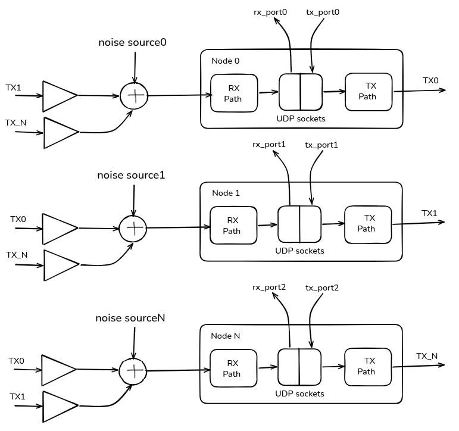

Рисунок 3.1 — SITL архитектура с N узлами приемопередатчиков

Связь между выходом передатчика n и входом приемника m эмулируется с
учетом затухания, зависящего от расстояния между узлами. (Рисунок 3.2)

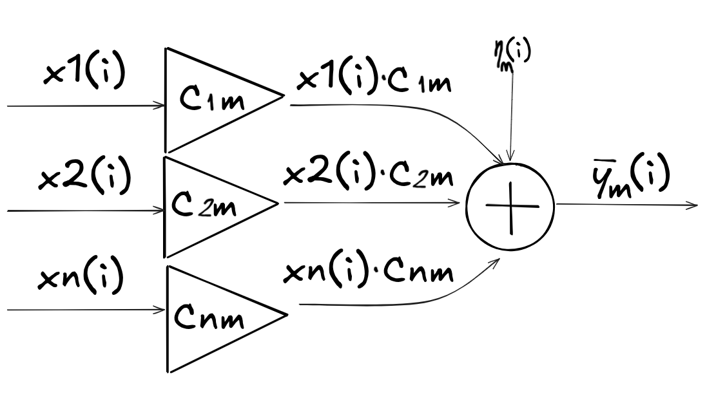

Рисунок 3.2 — Модель работы канала связи

Модель адаптирована из эмулятора канала RF-SITL \[15\].

Коэффициенты затухания канала рассчитываются по формулам:

$$\begin{array}{r}
C\_{nm} = \frac{\left( d\_{nm} + 1 \right)^{- 3}}{\sqrt{2}}\\,\\\\(3.1)
\end{array}$$

где *d**n**m* — расстояние между узлами *n* и *m* в условных
единицах.

Расстояние для двухмерного пространства:

$$\begin{array}{r}
d\_{nm} = \sqrt{\left( x\_{n} - \\x\_{m} \right)^{2} + \\\left( y\_{n} - \\y\_{m} \right)^{2}},\\\\(3.2)
\end{array}$$

Тогда принимаемый сигнал на узле *m*:

$$\begin{array}{r}
y\_{m}(i) = \\\sum\_{}^{}{(x\_{n}(i)}C\_{nm\\}) + \eta\_{m}(i)\\\\(3.3)
\end{array}$$

где *x**n*(*i*) — сигнал от узла *n*;

*η**m*(*i*) — аддитивный белый гауссовский шум для узла *m*.

Показатель затухания (*d**n**m* + 1)−3
соответствует между свободным пространством
(*d**n**m* + 1)−2 и городской застройкой
(*d**n**m* + 1)−4. При *d* = 0 сигнал не
суммируется.

**Свойство ортогональности**

Отдельно стоит отметить свойство ортогональности. Сигналы LoRa,
настроенные на разные коэффициенты расширения спектра (SF), теоретически
ортогональны: их чирпы слабо коррелируют между собой. Поэтому, если
такие сигналы будут сложены в одной полосе, приемник настроенный на свой
SF, выделит нужный сигнал, а передачи с другим SF воспримет как шум.
Теоретически это значит, что несколько передач с разными SF могут
сосуществовать в одном частотном канале.

Но на практике ортогональность не идеальна. При большой разнице
мощностей более сильный сигнал может подавить слабый.

Модель канала может быть расширена: изменением показателя затухания,
добавлением многолучевого распространения, учетом направленния антенн и
другими эффектами.

## Архитектура эмулятора

На основе теоретической схемы реализована многоуровневая архитектура
эмулятора. Пользовательские настройки приемопередатчиков и отправляемых
сообщений передаются в запущенный процесс meshtastic через TCP сокет в
meshtastic python API. После этого переданные параметры или сообщения
передаются на виртуальные физические узлы через реализованный
виртуальный драйвер (KISS over UDP). Виртуальные физические узлы
взаимодействуют между собой через эмулятор канала связи, принятые
сообщения передаются обратно на уровень выше до пользовательского уровня
приложений. (Рисунок 3.3).

Рисунок 3.3 — Архитектура эмулятора

Архитектура состоит из следующих компонентов:

\- User Application: Уровень пользовательского приложения

\- Meshtastic python API: Клиент для TCP сервера в процессе meshtastic.

\- TCP API: Сервер, реализующий управление процессом meshtastic.

\- Meshtastic daemon: Процесс meshtastic, та же самая программа, что
работает на реальных устройствах.

\- KISS over UDP: Компонент реализующий управление узлом и принятие
данных и событий с узла с помощью KISS команд, отправляемых через UDP
сокеты.

\- Node 1..N: Узлы приемопередатчиков описываемые с помощью графов в
FutureSDR.

\- Channel Emulator: Эмулятор канала связи (среда). Данный компонент
связывает все узлы между собой.

## Физический уровень

Физический уровень эмулятора реализован в виде отдельного
компонента LoRaSDR на языке Rust с использованием инструмента FutureSDR.
Компонент реализует DSP-цепочку модуляции и демодуляции ЛЧМ с
расширением спектра в LoRa, включая все этапы кодирования и
декодирования в соответствии со стандартом.

### Реализация модели канала

Канал связи реализован в виде отдельного потока. Поток обеспечивает
обработку IQ-кадров между виртуальными узлами эмулируемой сети.

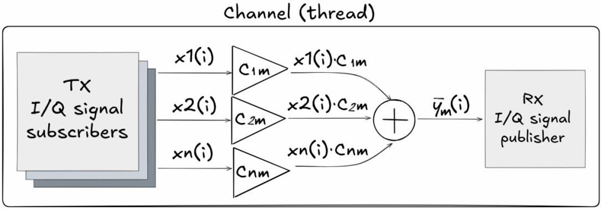

Рисунок 3.4 — Реализация потока канала связи

Для межпоточного обмена данными используются каналы библиотеки
crossbeam:

\- I/Q signal subscriber (tx\_out) — принимает IQ-кадры от передающих
узлов.

\- I/Q signal publisher (rx\_in) — отправляет результирующий сигнал
приемному узлу.

> По каналам crossbeam передаются объекты вида:

IqFrame {

> start\_index: u64, // номер кадра
>
> samples: \[Complex32; 1024\], // буфер отсчетов
>
> fc : f32, // центральная частота передатчика
>
> bw: f32, // ширина полосы пропускания
>
> }

Где start\_index — метка кадра для синхронизации между узлами
комплексных отсчетов, samples — буфер комплексных отсчетов, fc и bw —
центральная частота и ширина полосы пропускания передатчика.

В случае отсутствия данных на передачу буфер заполняется нулями для
обеспечения синхронизации меток. *C**n**m* — Матрица
коэффициентов канала.

Каждый сигнал умножается на коэффициент затухания канала, перед тем как
сложить сигналы для приемника *m*. (Рисунок 3.4) Передаваемые отсчеты в
объектах IqFrame будут суммироваться только при условии, что их метки
кадров одинаковы. При отправке нового объекта IqFrame значение метки
инкрементируется.

Все узлы формируют отсчеты с единой частотой дискретизации 1 МГц
независимо от выбранной преднастройки.

Это достигается за счет коэффициента интерполяции, который подбирается
так, чтобы выполнялось равенство:

$$\begin{array}{r}
F\_{d} = BW \times I\\\\(3.4)
\end{array}$$

где *I* — коэффициент интерполяции;

*BW* — ширина полосы пропускания;

*F**d* — частота дискретизации равная 1 МГц.

**Допущения**

В текущей реализации модель канала суммирует сигналы всех передатчиков в
общий буфер без учета несущей частоты и полосы ширины пропускания. Поля
fc, bw присутствуют в структуре IqFrame, но при формировании
результирующего кадра не используются. Это означает, что частотная
избирательность канала не реализована — узлы, настроенные на разные
частотные слоты или пресеты (разные fc, bw не изолированы по частоте, и
их сигналы будут складываться в один широкополосный сигнал).

### Структура узла

Процесс meshtastic обменивается кадрами с KISS-драйвером через UDP
сокеты. KISS драйвер связан с графами приема и передачи FutureSDR.

Перед приемом суммы всех сигналов для данного узла m добавляется
аддитивный белый гауссовский шум. Значение среднеквадратичного
отклонения белого шума можно задать отдельно для каждого узла. После
добавления шума, приемник попытается извлечь байты из результирующего
сигнала *y**m*, которые будут отправлены на сетевой стек.
Путь передачи отвечает за преобразование данных, поступающих от уровня
сети в физический уровень.

Обмен кадрами с потоком канала связи происходит через блоки I/Q signal
subscriber и I/Q signal publisher. (Рисунок 3.4, Рисунок 3.5)

Рисунок 3.5 — Иллюстрация взаимодействия узлов FutureSDR с потоком
эмуляции канала связи

Каждый виртуальный узел при создании строит набор отдельных путей
передачи и путей приема (Приложение А). Это необходимо для каждой
поддерживаемой преднастройки с помощью блоков FutureSDR. Это обусловлено
тем что графы FutureSDR и не могут быть изменены в процессе выполнения
программы. Проще говоря, параметры модуляции и демодуляции (SF, BW, CR,
LDRO) описываются кодом и не могут быть перенастроены на лету, без
перекомпиляции.

### Граф приема и передачи сигнала

DSP-блоки кодирования, модуляции, декодирования и демодуляции не
разрабатывались в данной работе, а были использованы из готового проекта
LoRa для FutureSDR \[16\]. В настоящей работе эти блоки используются для
построения путей приема и передачи каждого узла.

**Прием сигнала**

Путь приема строится и работает сразу для всех пресетов. Принимаемый
сигнал подается на вход всех приемных цепочек одновременно. Какой
приемник обнаружит преамбулу и успешно декодирует кадр, тот и отдаст
байты на сетевой стек. На рисунке 3.6 изображен граф приема для одной
преднастройки, построенный с использованием инструмента FutureSDR.
Сигнал из модели аддитивный белый гауссовский шум, формируя
результирующий сигнал *y**m* (Раздел 3.4.2 Структура узла).
Результирующий сигнал передается одновременно в цепочку демодуляции и
декодирования и на WebSocket для отрисовки спектра и водопада (раздел
3.6.6 ).

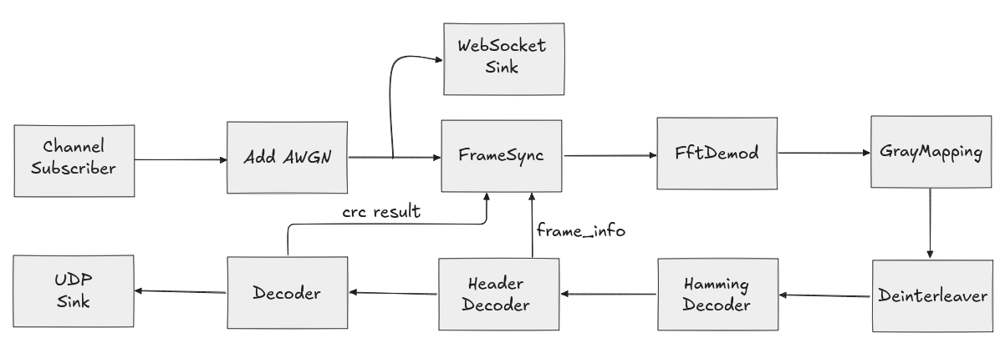

Рисунок 3.6 — Граф приема сигнала для одной пред настройки

Назначение блоков графа приема:

\- FrameSync — обнаружение преамбулы и синхронизация приемника: блок
находит восходящие чирпы, проверяет сетевой идентификатор и определяет
границу начала кадра.

\- FftDemod — определяет значение каждого символа. Принятый символ
умножается на опорный нисходящий чирп, после чего частота чирпа
переводится в постоянную частоту. Данную частоту определяют при помощи
быстрого преобразования Фурье.

\- GrayMapping —преобразование символов в код Грея.

\- Deinterleaver — обратное диагональное перемежение.

\- HammingDecoder — декодирование кода Хэмминга и исправление ошибок в
кодовых словах в соответствии с используемой скоростью кода.

\- HeaderDecoder — декодирование заголовка кадра. Проверка контрольной
суммы заголовка, извлечение длины полезной нагрузки, кодовой скорости.

\- Decoder — Обратное взбалтывание и проверка контрольной суммы данных.
После извлеченные байты передаются на сетевой стек через UDP (блок UDP
Sink).

Обратные связи на графе: HeaderDecoder и Decoder возвращают блоку
FrameSync параметры кадра и результат проверки контрольной суммы
полезной нагрузки.

**Передача сигнала**

Байты данных, поступившие от сетевого стека через KISS протокол (Раздел
3.5.1 KISS команды) передаются сообщением блоку Transmitter, который
выполняет кодирование байтов и модуляцию в радиосигнал. Сформированные
I/Q-отсчеты передаются блоку I/Q signal publisher, который передает их в
модель канала через связь с I/Q signal subscriber. (Рисунок 3.7)

Передача выполняется только по выбранной преднастройки. Активный
передатчик задается индексом selected\_tx, данные пришедшие от сетевого
стека, направляются именно том блоку передатчика, который соответствует
выбранному индексу (каждый передатчик пронумерован). Сменить настройку
на лету означает не перестроить граф, а поменять значение selected\_tx
на другое.

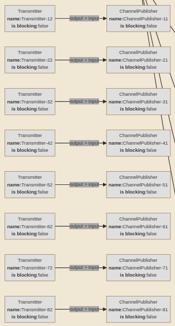

Рисунок 3.7 — Набор путей передачи сигнала

Блок Transmitter в свою очередь можно представить в виде других блоков
как показано на рисунке 3.8 \[17\]:

\- Whitening — выравнивание полезной нагрузки

\- Add header — добавляет заголовок с контрольной суммой заголовка и
параметрами, такими как тип заголовка и наличие контрольной суммы для
полезной нагрузки.

\- Add crc — вычисление и добавление контрольной суммы для полезной
нагрузки в случае использования параметра наличия контрольной суммы
(has\_crc).

\- Hamming enc — кодирование кодом Хэмминга с выбранной кодовой
скоростью.

\- Interleaver — диагональное перемежение,с принимаемым
параметром,оптимизации низкоскоростной передачи данных (LDRO).

\- Gray demapping — обратное преобразование Грея, переводящее кодовые
слова в значения символов.

Modulate — блок модуляции формирует отсчеты с заданными параметрами
модуляции такими как коэффициент расширения спектра, ширина полосы
пропускания.

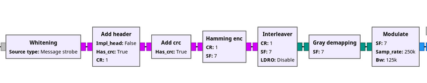

Рисунок 3.8 — Строение блока Transmitter

### Пользовательские блоки

Для того, чтобы связать независимые графы узлов с моделью канала и
воспроизвести условия приема, были добавлены три пользовательских блока
FutureSDR.

I/Q signal publisher — Блок для передачи комплексного сигнала связанному
с ним блоку I/Q signal subscriber. Эти два блока образуют пару,
соединенную каналом crossbeam, и служат точкой стыковки графа узла с
моделью канала. Publisher накапливает входящие отсчеты во внутренний
буфер длиной 1024 отсчета и оформляет буфер в кадр IqFrame (раздел 3.4.1
Реализация модели канала). Если входящих данных нет, то буфер
дополняется нулевыми отсчетами. Оформленный IqFrame отправляется при
каждом заполнении буфера до 1024.

I/Q signal subscriber — Блок для приема IqFrame от связанного блока I/Q
signal publisher. Используется для возможности работы с комплексными
отсчетами вне инструмента FutureSDR, а именно для интеграции с задачей
модели канала.

AddAWGN — блок добавления аддитивного белого гауссовского шума. К
каждому приходящему отсчету добавляется шум. Среднеквадратичное
отклонение шума (СКО), задается входным параметром, что позволяет задать
каждому приемнику собственный уровень шума.

### Обновление позиций узлов

Расстояние между узлами задается координатами на карте и от расстояния
зависит затухание сигнала. Чтобы менять условия связи во время работы,
реализовано обновление позиции узла на лету (Приложение B). Пользователь
перетаскивает узел мышью, и новые координаты отправляются в запущенный
эмулятор канала.

Эмулятор канала хранит координаты всех узлов в общей структуре и слушает
отдельный управляющий UDP порт. При перетаскивании узла графический
интерфейс отправляет на этот порт данные с идентификатором узла (его
локальный порт) и новые координаты. Управляющая задача в свою очередь
обновляет координаты узла.

### Расширяемость физического уровня

Эмулятор не привязан именно к LoRa. Пути приема и передачи собираются из
отдельных DSP-блоков FutureSDR, а модель канала работает не с символами
LoRa, а с комплексными отсчетами. Канал складывает сигналы с учетом
затухания и ничего не знает о том, как именно эти отсчеты были
сформированы.

Поэтому, чтобы смоделировать любой другой физический уровень, достаточно
модифицировать или заменить блоки модуляции и демодуляции или
кодирования и декодирования в путях приема и передачи, не изменяя модель
канала и блоки стыковки I/Q signal publisher и I/Q signal subscriber.
Единственное требование принимать и передавать отсчеты с той же частотой
дискретизации, чтобы кадры разных узлов по-прежнему складывались отсчет
в отсчет.

Таким образом блочная организация физического уровня позволяет развивать
эмулятор не только в сторону LoRa, но и в сторону других технологий
радиосвязи.

## Сетевой уровень

Для работы в виртуальной среде потребовались следующие изменения в
прошивке meshtastic (Приложение C):

\- Замену аппаратного SPI-драйвера на виртуальный драйвер KISS.

\- Добавление реализации TCP сервера для linux платформы.

Для эмуляции прошивка собирается под платформу native\_virtual, которая
компилируется под x86\_64 и запускается как процесс Linux.

Процесс запускается командой со следующими обязательными параметрами:

./meshtasticd –*s* –*p* {tcp\_port} –*l* {local\_port} –*r*
{remote\_port} –*w* {web\_port} –*h* {MAC\_address}

где -*p* — TCP порт для управления через meshtastic python API;

\-*l* / -*r* — UDP порты обмена с LoRaSDR (прием/передача);

\-*w* — порт веб-интерфейса, *h* — MAC-адрес узла;

\-*s* — наличие включает режим симуляции;

\-*v* — наличие включает verbose логирование.

### KISS команды

KISS (Keep It Simple, Stupid) — это упрощенный протокол передачи
сообщений \[18\]. Все фреймы начинаются и заканчиваются управляющим
байтом FEND (0xC0). Сразу после него идет байт команды и данные. Чтобы
байты 0xC0, которые оказались в данных не приняли за конец фрейма,
применяется экранирование. Экранирование — это преобразование 0xC0 в
0xDBDC, и сам экранирующий байт 0xDB в 0xDBDD). При приеме происходит
обратное преобразование.

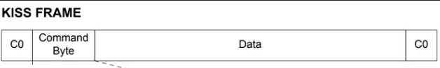

Рисунок 3.9 — формат кадра KISS

### Передача данных на физический уровень

При передаче данных на физический уровень, прошивка отправляет данные
(DATA) при условии, что эфир свободный. После отправки данных ожидает
команду готовности (READY) от физического уровня данного узла. Лишь
после получения команды готовности будет вызвано прерывание о передачи
данных и проверки отправки стеком. (Рисунок 3.7)

Рисунок 3.10 — Последовательность KISS-команд при передаче кадра на
физический уровень

### Прием данных с физического уровня

При приеме данных с физического уровня, драйвер прошивки ожидает команду
детектирования преамбулы и заголовка (DETECT), после записывается
значение проверки заголовка (при валидном заголовке поднимается 4 бит
для флага прерываний, при не валидном поднимается 5 бит). После
ожидаются команды метрик SNR и RSSI, данных (DATA) и команды готовности
(READY).

После считывается результат проверки данных CRC, в случае несовпадения
поднимается 6 бит флага прерываний. Дальше вызывается прерывание о
приеме данных где будет проверка битов флага прерываний и их очистка.
(Рисунок 3.11)

Команды DETECT и READY всегда несут в себе один байт которые в себе
несут информацию о наличии поднятых битов ошибки или валидности для
флагов прерываний.

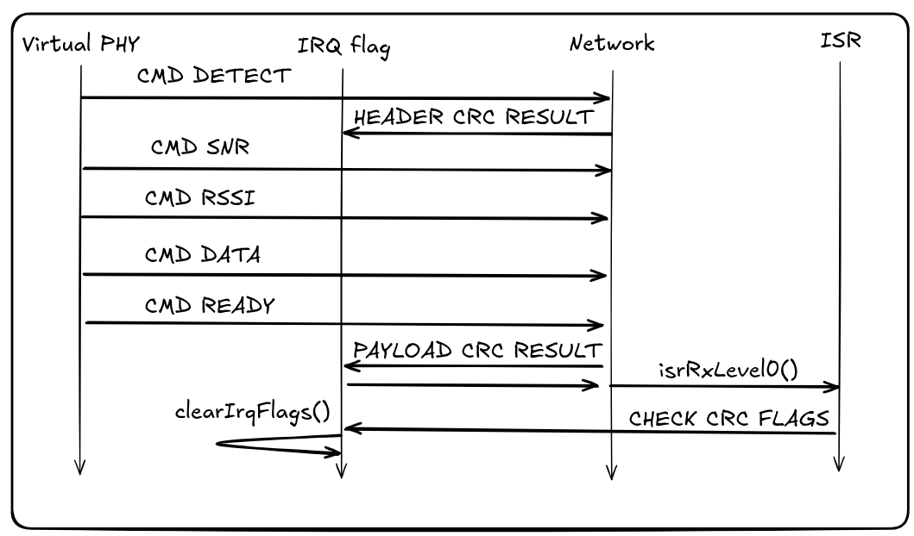

Рисунок 3.11 — Последовательность KISS-команд при приеме кадра с
физического уровня

### Прием данных с сетевого уровень

Каждый виртуальный физический узел прослушивает UDP сокеты в отдельной
задаче. При получении данных с сетевого стека они сразу уходят через
граф передатчика и радиоканал на другие узлы (кроме команд изменения

настроек радиоканала), и в ответ на любые данные отправляет сетевому
стеку

сообщение о готовности (READY). Прием данных (DATA) и возврат (READY)
изображен на рисунке 3.10 в разделе 3.5.2 Передача данных на физический
уровень.

### Передача данных на сетевой уровень

Физический узел сам не управляет сетевым стеком, а только сообщает о
событиях в эфире через KISS команды. Эти команды узел отправляет по
случаю приема: как только демодулятор успешно принял кадр, узел
формирует для пошивки ту же последовательность, которая ожидается
драйвером. (раздел 3.5.3 Прием данных с физического уровня, Рисунок
3.11)

Сначала отправляется команда детектирования (DETECT) — она сообщает, что
обнаружены преамбула и заголовок и в своем байте несет результат
проверки заголовка. Затем узел передает метрики кадра SNR и RSSI, после
них полезную нагрузку командой DATA, и завершает обмен команда
готовности (READY), в байте которой передается результат проверки CRC.
Набор доступных команд показан на рисунке 3.12.

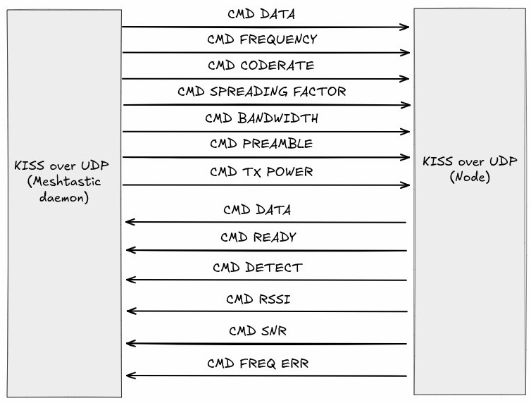

Рисунок 3.12 — Доступные KISS-команды драйвера

### Расширяемость работы с другими сетевыми стеками

Архитектура эмулятора не привязана для работы с именно meshtastic.
Физический уровень не зависят от конкретного протокола mesh-сети.
Поэтому поверх того же виртуального радиоканала можно дополнять
реализацию для работы с другими сетевыми стеками, например, как MeshCore
или Reticulum.

## Графический интерфейс

Графический интерфейс реализован на PyQt6 и построен по паттерну
модель-представление-контроллер (MVC), что разделяет модели узлов,
логику управления и их отображение.

Основа интерфейса — карта топологии, на котором узлы показаны кружками.
Узлы можно перетаскивать и их координаты используются моделью канала для
получения расстояния и коэффициента затухания сигнала (раздел 3.4.1 —
Реализация модели канала). Модели узлов хранят конфигурацию и могут быть
сохранены в виде файла проекта, что позволяет повторять сценарии
тестирования и эмуляции.

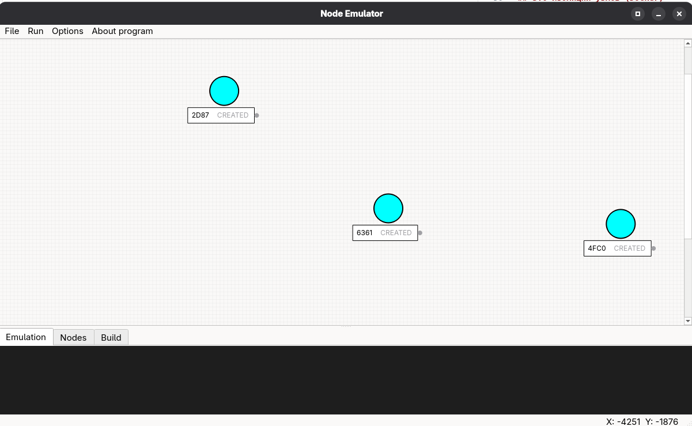

Рисунок 3.13 — Главное окно эмулятора с картой топологии

### Конфигурация и состояние узлов

Узел настраивается через диалог: можно выбрать регион и пресет радио,
задать сетевые порты и среднеквадратичное отклонение белого шума.

Запуск, остановка и прочие действия с узлами доступны через контекстное
меню узла через правую кнопку мыши.  
Также отображается таблица доступных слотов для данного пресета в
выбранном регионе.

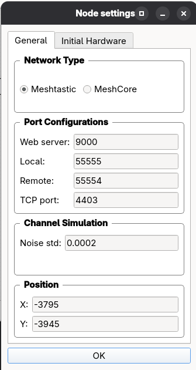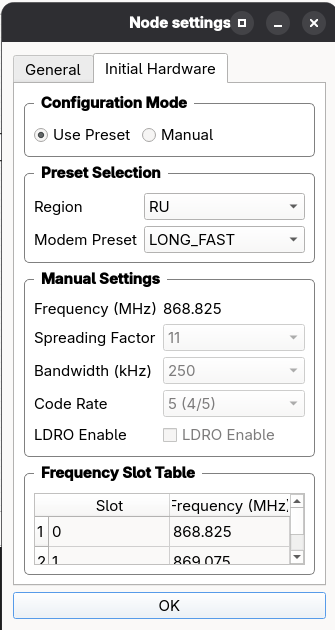

Рисунок 3.14 — Диалог конфигурации узла

Текущее состояние узла отображается подписью статуса и цветом
(Приложение D).

Доступные состояния узла:

\- CREATED обозначается серым цветом и надписью.

\- STARTING обозначается желтым цветом и надписью.

\- RUNNING обозначается зеленым цветом и надписью.

\- STOPPING обозначается желтым цветом и надписью.

\- STOPPED обозначается синим цветом и надписью.

\- ERROR обозначается красным цветом и надписью.

### Изоляция узлов

Каждый виртуальный узел (процесс сетевого стека) запускается в отдельном
Docker-контейнере. Это дает изоляцию процессов и файловых систем, и
окружение готовое к работе. Жизненный цикл контейнера автоматизирован:
при запуске узла проверяется наличие образа и собранного бинарного файла
прошивки (при отсутствии собирается бинарный файл), затем контейнер
запускается с выбранными настройками узла и с генерированным
MAC-адресом. Если процесс неожиданно завершился узел переходит в
состояние ошибки с отображением последних логов при выполнении процесса
сетевого стека. При остановке контейнер автоматически будет удален.

### Мониторинг пакетов

Чтобы видеть, как сообщения ходят по сети, реализована возможность
мониторинга. Она подписывается на события приема и передачи каждого узла
и по ним рисует анимацию поверх карты. Источник событий — подписка к
обратным вызовам через meshtastic client api.

Отображение событий на карте:

\- TX — отправка от источника.

\- RX — прием у получателя.

\- RETX — ретрансляция полученного пакета.

\- ACK — получение подтверждения.

\- Packet Missed — если пакет не дошел по таймауту.

Стрелка между узлами меняет цвет и направление по ходу пересылки:
оранжевым обозначаются события TX, синим события RX, зеленым события
RETX, фиолетовым события ACK. События потери пакета отображается красным
цветом.

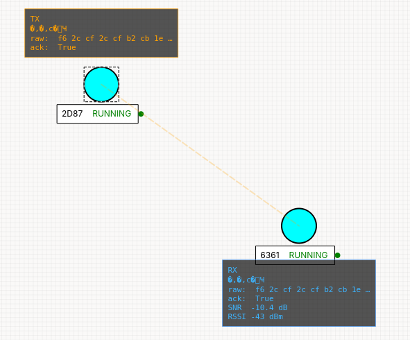

Рисунок 3.15 — Отображение мониторинга пакетов

### Реконструкция пути ретрансляции

При отображении маршрутизации через ретранслятор (A – R – B) где A
источник, B приемник и R ретранслирующий узел есть тонкость: прошивка
meshtastic отдает своему клиенту только пакеты, адресованные ему, или
широковещательные. Транзитные пакеты, который узел лишь ретранслирует,
до клиента не доходят. То есть, напрямую увидеть факт ретрансляции
нельзя, не меняя логику стека meshtastic. Поэтому путь восстанавливается
косвенно. В каждом принятом пакете есть поле с адресом последнего
ретранслятора. По

нему можно определить, через какой узел пришел пакет. Так отображается
путь без прямого события ретранслятора. Поэтому, цепочки глубже одного
хопа будут отображать маршрут только через последний ретранслирующий
узел.

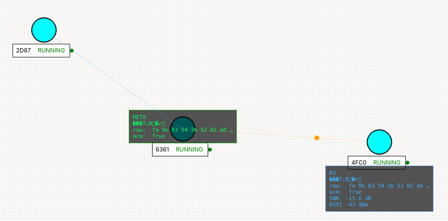

Рисунок 3.16 — Визуализация маршрута через ретранслятор

### Визуализация широковещательных пакетов и подтверждений

Широковещательные пакеты прошивка отдает клиенту каждого узла, поэтому
здесь реконструкция не нужна. Каждый получатель будет ретранслировать
полученный пакет.

Для адресных сообщений учитывается состояние wantAck, то есть требуется
ли подтверждение для данного полученного пакета. Если подтверждение
требуется линия стрелки остается оранжевой до возврата ACK к источнику и
только потом станет синей. Если подтверждение не требуется стрелка
станет синей сразу. Сам возврат ACK отображается отдельной стрелкой в
обратную сторону.

### Ограничения визуализации

Имеется ограничение с реконструкцией ретрансляции при большем количестве
ретрансляций (больше 1), отображение маршрута будет с последнего
ретранслируемого узла и первого узла при принятии ACK. Причина пояснена
в разделе 3.6.4 Реконструкция пути ретрансляции.

Второе ограничение визуализации, то что если будет подключен meshtastic
client api и веб-интерфейс одновременно, то сообщения не будут
отображаться на веб-интерфейсе. Из-за общей очереди сообщений для
клиентов возникают логические гонки при включении сразу нескольких
клиентов к одному узлу.

Визуализация и автоматизация была протестирована только для операционных
систем на Linux.

### Отображение частотного спектра и водопада

Для того чтобы видеть не только пакеты, но и сам радиосигнал у узла есть
возможность просмотра частотного спектра и водопада. Окно просмотра
открывается из контекстного меню работающего узла и показывает сигнал,
приходящий на приемник данного узла с учетом затухания и шума.

> **Логика отображения**

В графе приема (в разделе 3.4.3 Граф приема и отправки сигнала) есть
ответвление передачи результирующего принимаемого сигнала на WebSocket.
При вызове окна запускается отдельная программа и начинает принимать
поток отсчетов сигнала через WebSocket. Отсчеты накапливаются в буфер.
Если буфер превышает лимит (размер окна быстрого преобразования Фурье ×
1032), то начальные отсчеты отбрасываются. Для каждого размера окна
выполняется БПФ с оконной функцией Ханна. Модуль полученного спектра
преобразуется в дБ с учетом установленного смещения. Водопад формируется
из максимальной амплитуды в каждой частотной точке. Водопад содержит
историю из 4096

строк, в окне отображается 256. Окно водопада прокручивается энкодером
мыши. Окно открывается для выбранного узла и показывает два графика: в
верхней части окна частотный спектр, в нижней части окна водопад.

Если программа отображения (spectrum\_viewer.rs) еще не была собрана,
интерфейс вызовет сборку автоматически при первом открытии.

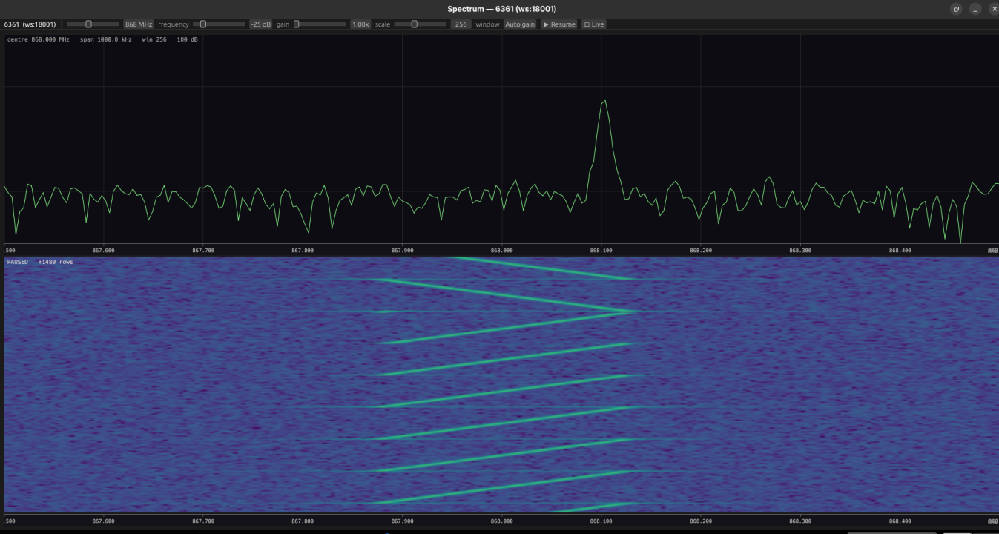

Рисунок 3.17 — Отображение частотного спектра и водопада принимаемого
сигнала для выбранного узла

Элементы управления:

\- Ползунок управления частотной развертки на экране в диапазоне от 100
МГц до 2000 МГц.

\- Ползунок управления масштабом частотной оси. Регулируется в диапазоне
от 15.6 кГц до 1 МГц.

\- Ползунок управления смещением отображения. Регулируется в диапазоне
от -60 дБ до 160 дБ. Автоматически подстраивается при первом открытии
окна. Позволяет выровнять яркость отображения на водопаде.

\- Ползунок размера окна быстрого преобразования Фурье. Выборка
регулируется в диапазоне от 32 до 8192 отсчетов.

\- Кнопка приостановки обработки отсчетов. Замораживает текущее
изображение на частотном спектре и на водопаде.

\- Кнопка возобновления обработки отсчетов. Обновление текущего
изображения.

\- Кнопка Live прокрутит водопад к самой новой строке.

### Управление узлами через контекстное меню

Большинство действий с узлом доступно через контекстное меню по правому
клику мыши на узел. Меню вызывается для выбранного узла: пункты, которые
показаны не активными зависят от текущего статуса у выбранного узла.

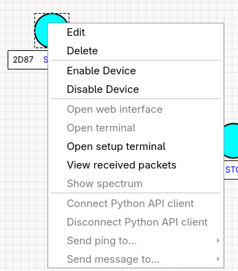

Рисунок 3.18 — Контекстное меню узла

**Управление узлом**

Из меню узел можно изменить, запустить, остановить или удалить. Для того
чтобы создать новый узел нужно нажать правой кнопкой мыши по карте.
Запуск узла и остановка — это управление соответствующим
Docker-контейнером с прошивкой (Раздел 3.6.2 — Изоляция узлов).  
Длительные процессы такие как, запуск или остановка узла выполняются в
фоновом потоке, чтобы интерфейс не зависал.

**Использование web или терминалов узла**

Так как внутри контейнера работает прошивка meshtastic, у узла есть свой
web-интерфейс. Через контекстное меню узла можно перейти на
веб-интерфейс, там доступны чаты, список соседей и настройки, как на
реальном устройстве.

Также можно смотреть живой лог выполнения процесса прошивки или открыть
терминал внутри контейнера.

**Обмен сообщениями**

Между запущенными узлами можно отправлять сообщения и пинги из меню
“Send ping to…” или “Send message to…” где перечислены остальные
работающие узлы. Сообщения отправляются через meshtastic python API. Оно
проходит все уровни — шифрование, упаковку, физический уровень,
радиоканал и приходит получателю как настоящее. Пинг устроен похоже, но
дополнительно измеряет время до ответа: узел отправляет пакет, требующий
ACK, и ждет его, после чего в лог выводится время прохождения туда и
обратно. Если ответа нет в течение таймаута, фиксируется тайм-аут. Эти
функции доступны только если узлов включен python API клиент.

**Подключение Python API клиента**

Управление прошивкой (конфигурация, пинг, мониторинг) идет через python
API по TCP. Пункты “Connect / Disconnect Python API client” позволяют
вручную подключить или отключить соединение.

Важно помнить про обратную сторону, пока python API подключен, он
забирает все входящие пакеты и web-интерфейс узла их не увидит. Причина
описана в разделе 3.6.6 — Ограничения визуализации

**Просмотр принятых пакетов**

Пункт “View received packets” открывает окно с историей принятых пакетов
для данного узла. Отображение типа пакета, метрик радиоканала,
отправителя или получателя, сырых байтов или просмотр protobuf структуры
пакета. (Рисунок 3.19)

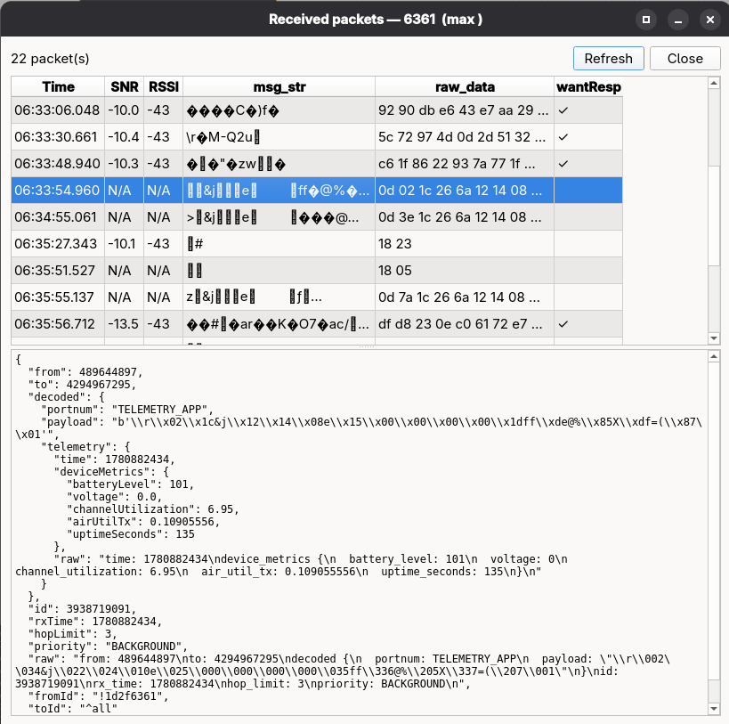

Рисунок 3.19 — Окно просмотра принятых пакетов узла

### Пересборка компонентов через UI

Эмулятор состоит из нескольких собираемых частей, и все они
пересобираются прямо из интерфейса, без ручного запуска команд, что
удобно при разработке.

**LoRaSDR**

Эмуляция физического интерфейса — отдельная программа на rust, которая
поднимает все узлы и модель канала. Пункт меню “Rebuild channel
emulator” пересобирает ее средствами сборки Rust. Если запустить
эмуляцию, а собранной программы еще нет, интерфейс соберет ее
автоматически перед стартом. Если в системе не установлен rust,
вызовется окно с просьбой установить rust.

**Прошивка Meshtastic**

Пункт “Rebuild Meshtastic firmware” пересобирает прошивку под платформу
native\_virtual. Сборка идет внутри Docker-образа.

**Консоли вывода**

Для того, чтобы видеть, что происходит при работе и сборке, в нижней
части окна есть три вкладки консоли:

\- Emulation— вывод логирования эмуляции канала.

\- Nodes— минимальный вывод сетевой части.

\- Build — вывод логирования при сборке.

## Технические детали реализации

В этом разделе собраны уточнения, которые не вошли в предыдущие разделы.

**Запуск эмуляции и передача конфигурации**

Графический интерфейс и эмулятор канала и обозреватель частотного
спектра — это разные процессы. При старте эмуляции интерфейс собирает
настройки всех узлов (порты обмена, координаты, регионы и пресеты,
уровни

шума) и передает их программе эмуляции через временный файл в формате
JSON. Программа эмуляции по этим данным поднимает узлы и канал.

**Распределение портов**

Каждому узлу выделяется свой номер портов, чтобы несколько узлов не
мешали друг другу на одном хосте. Порт приема от прошивки, порт отправки
в прошивку, порт управления через TCP и порт веб-интерфейса. Они
назначаются пользователем вручную и ему необходимо следить чтобы порты
не пересекались между собой или уже с существующими портами на его
компьютере.

**Необходимое окружение**

Эмулятор проверен на операционной системе Linux. Необходимое окружение
для запуска:

\- python версией 3.10 и выше. Необходимые зависимости устанавливаются
из файла requirements.txt (pip install –r requirements.txt).

\- Rust необходим для сборки эмулятора канала и окна отображения
спектра. FutureSDR использует возможности, которые доступны только для
тестовой сборки компилятора.

> rustup toolchain install nightly --component rustfmt clippy  
> rustup default nightly

Дополнительно для работы веб-интерфейса отображения графов и веб-сокетов
необходимо добавить цель компиляции WebAssembly и установить сборщик
Trunk (из инструкции FutureSDR \[10\])

rustup target add wasm32-unknown-unknown --toolchain nightly

cargo install --locked trunk

\- Docker необходим для запуска сетевой части в отдельном контейнере для
каждого узла. Образ и прошивка при первом запуске собираются
автоматически.

**  
**

# ТЕСТИРОВАНИЕ И ОЦЕНКА ПОТРЕБЛЕНИЯ РЕСУРСОВ

В этой главе приведены результаты проверки разработанного эмулятора.
Была выполнена проверка работы канала для двух узлов, как зависит
качество сигнала от расстояния, настройки радио и уровня шума. Приведена
оценка потребления ресурсов.

## Методика проверки

Все измерения были автоматизированы с помощью python скрипта. На вход он
принимает файл проекта (тот же, что сохраняет графический интерфейс).
Скрипт поднимает узлы и канал, и в процессе перемещает узлы и меняет
настройки радио или уровня шума. Результат записывается в CSV-файл.

Доставку и задержку скрипт измеряет пакетами с подтверждениями (ping +
ACK). Отправляется заданная серия тестовых сообщений, и для каждого
ожидается ACK.

Значения столбцов таблиц проверки канала:

\- d — расстояние между узлами в условных единицах карты;

\- pings — число отправленных сообщений;

\- ACKs — число принятых подтверждений;

\- PDR — доля доставленных пакетов, отношение ACKs к pings;

\- RTT — среднее время получения подтверждения с момента отправки;

\- SNR — среднее значение метрики соотношения сигнала к шуму;

\- RSSI — среднее значение метрика уровня мощности сигнала;

Метрики SNR и RSSI вычисляет приемник по преамбуле принятого кадра и
передает их сетевому стеку KISS-командами (раздел 3.5.3 Прием данных с
физического уровня). Граничный уровень доли доставленных пакетов PDR ≤
0,25. Падение значения в данный порог интерпретируется как граница
устойчивой связи между узлами.

SNR определяется как отношение энергии пика синхронизации (максимального
элемента БПФ свернутой с опорным чирпом) к остальной части спектра
преамбулы.

$$\begin{array}{r}
SNR = 10\lg\left( \frac{E\_{пик}}{E\_{шум}} \right)\mathbf{,\\}\\(4.1)
\end{array}$$

где *E**п**и**к* — пиковая энергия сигнала синхронизации;

*E**ш**у**м* — средняя энергия шума в спектре преамбулы.

RSSI вычисляется как усредненная по отсчетам преамбулы мощность
относительно опорного уровня:

$$\begin{array}{r}
RSSI = 10\lg\left( \frac{\\|s|^{2}}{P\_{оп}} \right)\mathbf{,\\}\\(4.2)
\end{array}$$

где  |*s*|2 — квадрат модуля комплексного отсчета;

*P**о**п* — опорный уровень соответствующий мощность 1 мВт.

Таким образом RSSI выражается относительно этого уровня.

Амплитуда передаваемого сигнала в эмуляторе нормирована и не призвана к
реальной мощности в милливаттах и приемник не имеет блока автоматической
регулировки усиления. Это приводит к получению положительных значений
RSSI.

## Проверка модели канала

В данном подразделе приведены результаты проверки модели радиоканала.
Проверка проводилась для двух узлов. Один узел стоит на месте,

второй пошагово отодвигается. На каждом расстоянии измеряется доля
доставленных пакетов, среднее значение времени получения подтверждения и
метрик SNR и RSSI. Для каждого сценария использовалась выборка из 12
тестовых пакетов. Результаты сведены в таблицах 4.1 – 4.4.

При рассмотрении таблицы 4.1, видно что при условии СКО *σ*= 0,03,
настройка Long Fast обеспечивает устойчивое соединение на дистанции от
100 до 460 условных единиц. Модель канала относительная и не
откалибрована в метрах. На расстоянии *d* = 480, начинает снижаться доля
доставленных пакетов. А при расстоянии 500 условных единиц доля доставки
снижается до уровня порога границы устойчивой связи.

SNR убывает с расстоянием и связь сохраняется до отрицательных значений
-21,1 дБ. У границы дальности резко возрастает среднее время до принятия
подтверждения с момента отправки, что обусловлено повторными передачами.

Таблица 4.1 — Настройка Long Fast (SF11, BW=250кГц, CR=4/5, LDRO
выключен) СКО белого шума *σ*= 0,03

<table style="width:100%;">
<colgroup>
<col style="width: 14%" />
<col style="width: 14%" />
<col style="width: 14%" />
<col style="width: 14%" />
<col style="width: 14%" />
<col style="width: 14%" />
<col style="width: 14%" />
</colgroup>
<thead>
<tr>
<th style="text-align: center;">d</th>
<th style="text-align: center;">pings (кол-во)</th>
<th style="text-align: center;">
ACKs

(кол-во)
</th>
<th style="text-align: center;">PDR</th>
<th style="text-align: center;">
RTT

(мс)
</th>
<th style="text-align: center;">
SNR

(дБ)
</th>
<th style="text-align: center;">
RSSI

(дБм)
</th>
</tr>
</thead>
<tbody>
<tr>
<td style="text-align: center;">300</td>
<td style="text-align: center;">12</td>
<td style="text-align: center;">12</td>
<td style="text-align: center;">1</td>
<td style="text-align: center;">1758</td>
<td style="text-align: center;">-8,7</td>
<td style="text-align: center;">12</td>
</tr>
<tr>
<td style="text-align: center;">320</td>
<td style="text-align: center;">12</td>
<td style="text-align: center;">12</td>
<td style="text-align: center;">1</td>
<td style="text-align: center;">1771</td>
<td style="text-align: center;">-10</td>
<td style="text-align: center;">9,1</td>
</tr>
<tr>
<td style="text-align: center;">340</td>
<td style="text-align: center;">12</td>
<td style="text-align: center;">12</td>
<td style="text-align: center;">1</td>
<td style="text-align: center;">1721</td>
<td style="text-align: center;">-11</td>
<td style="text-align: center;">7</td>
</tr>
<tr>
<td style="text-align: center;">360</td>
<td style="text-align: center;">12</td>
<td style="text-align: center;">12</td>
<td style="text-align: center;">1</td>
<td style="text-align: center;">1718</td>
<td style="text-align: center;">-12,4</td>
<td style="text-align: center;">5</td>
</tr>
<tr>
<td style="text-align: center;">380</td>
<td style="text-align: center;">12</td>
<td style="text-align: center;">12</td>
<td style="text-align: center;">1</td>
<td style="text-align: center;">1724</td>
<td style="text-align: center;">-13,3</td>
<td style="text-align: center;">7</td>
</tr>
<tr>
<td style="text-align: center;">400</td>
<td style="text-align: center;">12</td>
<td style="text-align: center;">12</td>
<td style="text-align: center;">1</td>
<td style="text-align: center;">1675</td>
<td style="text-align: center;">-14,6</td>
<td style="text-align: center;">7</td>
</tr>
<tr>
<td style="text-align: center;">420</td>
<td style="text-align: center;">12</td>
<td style="text-align: center;">12</td>
<td style="text-align: center;">1</td>
<td style="text-align: center;">1873</td>
<td style="text-align: center;">-15,3</td>
<td style="text-align: center;">6</td>
</tr>
<tr>
<td style="text-align: center;">440</td>
<td style="text-align: center;">12</td>
<td style="text-align: center;">12</td>
<td style="text-align: center;">1</td>
<td style="text-align: center;">2342</td>
<td style="text-align: center;">-16,4</td>
<td style="text-align: center;">5</td>
</tr>
<tr>
<td style="text-align: center;">460</td>
<td style="text-align: center;">12</td>
<td style="text-align: center;">12</td>
<td style="text-align: center;">1</td>
<td style="text-align: center;">2378</td>
<td style="text-align: center;">-17,8</td>
<td style="text-align: center;">5</td>
</tr>
<tr>
<td style="text-align: center;">480</td>
<td style="text-align: center;">12</td>
<td style="text-align: center;">11</td>
<td style="text-align: center;">0,917</td>
<td style="text-align: center;">4067</td>
<td style="text-align: center;">-18,1</td>
<td style="text-align: center;">5</td>
</tr>
<tr>
<td style="text-align: center;">500</td>
<td style="text-align: center;">12</td>
<td style="text-align: center;">3</td>
<td style="text-align: center;">0,25</td>
<td style="text-align: center;">8131</td>
<td style="text-align: center;">-21,1</td>
<td style="text-align: center;">5</td>
</tr>
</tbody>
</table>

При большем значении СКО *σ*= 0,05 при той же настройки радио (Таблица
4.2). Удерживается устойчивое соединение на дистанции от 100 до 340
условных единиц. На расстоянии 400 условных единиц доля доставки
снижается до уровня порога границы устойчивой связи.

SNR убывает с расстоянием и связь сохраняется до отрицательных значений
-19,3 дБ. У границы дальности также резко возрастает среднее время до
принятия подтверждения с момента отправки.

Таблица 4.2 — настройка Long Fast (SF11, BW=250кГц, CR=4/5, LDRO
выключен) СКО белого шума *σ*= 0,05

<table style="width:100%;">
<colgroup>
<col style="width: 14%" />
<col style="width: 14%" />
<col style="width: 14%" />
<col style="width: 14%" />
<col style="width: 14%" />
<col style="width: 14%" />
<col style="width: 14%" />
</colgroup>
<thead>
<tr>
<th style="text-align: center;">d</th>
<th style="text-align: center;">pings (кол-во)</th>
<th style="text-align: center;">
ACKs

(кол-во)
</th>
<th style="text-align: center;">PDR</th>
<th style="text-align: center;">
RTT

(мс)
</th>
<th style="text-align: center;">
SNR

(дБ)
</th>
<th style="text-align: center;">
RSSI

(дБм)
</th>
</tr>
</thead>
<tbody>
<tr>
<td style="text-align: center;">100</td>
<td style="text-align: center;">12</td>
<td style="text-align: center;">12</td>
<td style="text-align: center;">1</td>
<td style="text-align: center;">1980</td>
<td style="text-align: center;">4,9</td>
<td style="text-align: center;">11,2</td>
</tr>
<tr>
<td style="text-align: center;">120</td>
<td style="text-align: center;">12</td>
<td style="text-align: center;">12</td>
<td style="text-align: center;">1</td>
<td style="text-align: center;">1944</td>
<td style="text-align: center;">2,5</td>
<td style="text-align: center;">10</td>
</tr>
<tr>
<td style="text-align: center;">140</td>
<td style="text-align: center;">12</td>
<td style="text-align: center;">12</td>
<td style="text-align: center;">1</td>
<td style="text-align: center;">1940</td>
<td style="text-align: center;">0,2</td>
<td style="text-align: center;">8</td>
</tr>
<tr>
<td style="text-align: center;">160</td>
<td style="text-align: center;">12</td>
<td style="text-align: center;">12</td>
<td style="text-align: center;">1</td>
<td style="text-align: center;">2002</td>
<td style="text-align: center;">-0,3</td>
<td style="text-align: center;">7</td>
</tr>
<tr>
<td style="text-align: center;">180</td>
<td style="text-align: center;">12</td>
<td style="text-align: center;">12</td>
<td style="text-align: center;">1</td>
<td style="text-align: center;">2041</td>
<td style="text-align: center;">-3,9</td>
<td style="text-align: center;">7</td>
</tr>
<tr>
<td style="text-align: center;">200</td>
<td style="text-align: center;">12</td>
<td style="text-align: center;">12</td>
<td style="text-align: center;">1</td>
<td style="text-align: center;">2130</td>
<td style="text-align: center;">-5,6</td>
<td style="text-align: center;">7</td>
</tr>
<tr>
<td style="text-align: center;">220</td>
<td style="text-align: center;">12</td>
<td style="text-align: center;">12</td>
<td style="text-align: center;">1</td>
<td style="text-align: center;">2011</td>
<td style="text-align: center;">-6,7</td>
<td style="text-align: center;">6</td>
</tr>
<tr>
<td style="text-align: center;">240</td>
<td style="text-align: center;">12</td>
<td style="text-align: center;">12</td>
<td style="text-align: center;">1</td>
<td style="text-align: center;">3571</td>
<td style="text-align: center;">-8,9</td>
<td style="text-align: center;">5</td>
</tr>
<tr>
<td style="text-align: center;">260</td>
<td style="text-align: center;">12</td>
<td style="text-align: center;">12</td>
<td style="text-align: center;">1</td>
<td style="text-align: center;">3498</td>
<td style="text-align: center;">-10,5</td>
<td style="text-align: center;">5</td>
</tr>
<tr>
<td style="text-align: center;">280</td>
<td style="text-align: center;">12</td>
<td style="text-align: center;">12</td>
<td style="text-align: center;">1</td>
<td style="text-align: center;">3844</td>
<td style="text-align: center;">-11,7</td>
<td style="text-align: center;">5</td>
</tr>
<tr>
<td style="text-align: center;">300</td>
<td style="text-align: center;">12</td>
<td style="text-align: center;">12</td>
<td style="text-align: center;">1</td>
<td style="text-align: center;">4176</td>
<td style="text-align: center;">-13,1</td>
<td style="text-align: center;">5</td>
</tr>
<tr>
<td style="text-align: center;">320</td>
<td style="text-align: center;">12</td>
<td style="text-align: center;">12</td>
<td style="text-align: center;">1</td>
<td style="text-align: center;">3985</td>
<td style="text-align: center;">-14,4</td>
<td style="text-align: center;">4,9</td>
</tr>
<tr>
<td style="text-align: center;">340</td>
<td style="text-align: center;">12</td>
<td style="text-align: center;">12</td>
<td style="text-align: center;">1</td>
<td style="text-align: center;">3958</td>
<td style="text-align: center;">-15,8</td>
<td style="text-align: center;">4,9</td>
</tr>
<tr>
<td style="text-align: center;">360</td>
<td style="text-align: center;">12</td>
<td style="text-align: center;">10</td>
<td style="text-align: center;">0,833</td>
<td style="text-align: center;">4056</td>
<td style="text-align: center;">-15,1</td>
<td style="text-align: center;">4,8</td>
</tr>
<tr>
<td style="text-align: center;">380</td>
<td style="text-align: center;">12</td>
<td style="text-align: center;">11</td>
<td style="text-align: center;">0,917</td>
<td style="text-align: center;">5664</td>
<td style="text-align: center;">-17,6</td>
<td style="text-align: center;">4,8</td>
</tr>
<tr>
<td style="text-align: center;">400</td>
<td style="text-align: center;">12</td>
<td style="text-align: center;">3</td>
<td style="text-align: center;">0,25</td>
<td style="text-align: center;">8136</td>
<td style="text-align: center;">-19,3</td>
<td style="text-align: center;">4,7</td>
</tr>
</tbody>
</table>

При смене настройки на Short Fast (снижение коэффициента расширения
спектра до SF7) и при условии СКО *σ*= 0,03 (Таблица 4.3). На расстоянии
260 условных единиц доля доставки снижается до порога границы устойчивой
связи и PDR не достигает единичного значения даже при положительном SNR.

Но при этом задержка RTT составляет на порядок меньше, чем для настройки
Long Fast.

SNR убывает с расстоянием и связь сохраняется до отрицательных значений
-2 дБ. У границы дальности также резко возрастает среднее время до
принятия подтверждения с момента отправки.

Таблица 4.3 — настройка Short Fast (SF7, BW=250кГц, CR=4/5, LDRO
выключен) СКО белого шума *σ*= 0,03

<table style="width:100%;">
<colgroup>
<col style="width: 14%" />
<col style="width: 14%" />
<col style="width: 14%" />
<col style="width: 14%" />
<col style="width: 14%" />
<col style="width: 14%" />
<col style="width: 14%" />
</colgroup>
<thead>
<tr>
<th style="text-align: center;">d</th>
<th style="text-align: center;">pings (кол-во)</th>
<th style="text-align: center;">
ACKs

(кол-во)
</th>
<th style="text-align: center;">PDR</th>
<th style="text-align: center;">
RTT

(мс)
</th>
<th style="text-align: center;">
SNR

(дБ)
</th>
<th style="text-align: center;">
RSSI

(дБм)
</th>
</tr>
</thead>
<tbody>
<tr>
<td style="text-align: center;">100</td>
<td style="text-align: center;">12</td>
<td style="text-align: center;">7</td>
<td style="text-align: center;">0,583</td>
<td style="text-align: center;">481</td>
<td style="text-align: center;">9,4</td>
<td style="text-align: center;">12</td>
</tr>
<tr>
<td style="text-align: center;">120</td>
<td style="text-align: center;">12</td>
<td style="text-align: center;">6</td>
<td style="text-align: center;">0,5</td>
<td style="text-align: center;">469</td>
<td style="text-align: center;">6,9</td>
<td style="text-align: center;">9,2</td>
</tr>
<tr>
<td style="text-align: center;">140</td>
<td style="text-align: center;">12</td>
<td style="text-align: center;">7</td>
<td style="text-align: center;">0,583</td>
<td style="text-align: center;">491</td>
<td style="text-align: center;">4,6</td>
<td style="text-align: center;">7</td>
</tr>
<tr>
<td style="text-align: center;">160</td>
<td style="text-align: center;">12</td>
<td style="text-align: center;">6</td>
<td style="text-align: center;">0,5</td>
<td style="text-align: center;">456</td>
<td style="text-align: center;">2,6</td>
<td style="text-align: center;">5,2</td>
</tr>
<tr>
<td style="text-align: center;">180</td>
<td style="text-align: center;">12</td>
<td style="text-align: center;">6</td>
<td style="text-align: center;">0,5</td>
<td style="text-align: center;">493</td>
<td style="text-align: center;">0,9</td>
<td style="text-align: center;">4</td>
</tr>
<tr>
<td style="text-align: center;">200</td>
<td style="text-align: center;">12</td>
<td style="text-align: center;">7</td>
<td style="text-align: center;">0,583</td>
<td style="text-align: center;">595</td>
<td style="text-align: center;">-1,2</td>
<td style="text-align: center;">3</td>
</tr>
<tr>
<td style="text-align: center;">220</td>
<td style="text-align: center;">12</td>
<td style="text-align: center;">7</td>
<td style="text-align: center;">0,583</td>
<td style="text-align: center;">591</td>
<td style="text-align: center;">-1,8</td>
<td style="text-align: center;">2</td>
</tr>
<tr>
<td style="text-align: center;">240</td>
<td style="text-align: center;">12</td>
<td style="text-align: center;">7</td>
<td style="text-align: center;">0,583</td>
<td style="text-align: center;">560</td>
<td style="text-align: center;">-2</td>
<td style="text-align: center;">2</td>
</tr>
<tr>
<td style="text-align: center;">260</td>
<td style="text-align: center;">12</td>
<td style="text-align: center;">2</td>
<td style="text-align: center;">0,167</td>
<td style="text-align: center;">1491</td>
<td style="text-align: center;">-2</td>
<td style="text-align: center;">2</td>
</tr>
</tbody>
</table>

На настройке Short Fast и при условии СКО *σ*= 0,05 (Таблица 4.4). На
расстоянии 220 условных единиц доля доставки снижается до порога границы
устойчивой связи. Потери пакетов сохраняют свой характер, как и для
меньшего СКО *σ*= 0,03, при такой же настройке. Задержка RTT также
составляет на порядок меньше, чем для настройки Long Fast.

SNR убывает с расстоянием и связь сохраняется до отрицательных значений
-2 дБ. У границы дальности также резко возрастает среднее время до
принятия подтверждения с момента отправки.

Таблица 4.4 — настройка Short Fast (SF7, BW=250кГц, CR=4/5, LDRO
выключен) СКО белого шума *σ*= 0,05

<table style="width:100%;">
<colgroup>
<col style="width: 14%" />
<col style="width: 14%" />
<col style="width: 14%" />
<col style="width: 14%" />
<col style="width: 14%" />
<col style="width: 14%" />
<col style="width: 14%" />
</colgroup>
<thead>
<tr>
<th style="text-align: center;">d</th>
<th style="text-align: center;">pings (кол-во)</th>
<th style="text-align: center;">
ACKs

(кол-во)
</th>
<th style="text-align: center;">PDR</th>
<th style="text-align: center;">
RTT

(мс)
</th>
<th style="text-align: center;">
SNR

(дБ)
</th>
<th style="text-align: center;">
RSSI

(дБм)
</th>
</tr>
</thead>
<tbody>
<tr>
<td style="text-align: center;">100</td>
<td style="text-align: center;">12</td>
<td style="text-align: center;">6</td>
<td style="text-align: center;">0,5</td>
<td style="text-align: center;">897</td>
<td style="text-align: center;">5</td>
<td style="text-align: center;">12</td>
</tr>
<tr>
<td style="text-align: center;">120</td>
<td style="text-align: center;">12</td>
<td style="text-align: center;">6</td>
<td style="text-align: center;">0,5</td>
<td style="text-align: center;">861</td>
<td style="text-align: center;">2,4</td>
<td style="text-align: center;">10</td>
</tr>
<tr>
<td style="text-align: center;">140</td>
<td style="text-align: center;">12</td>
<td style="text-align: center;">6</td>
<td style="text-align: center;">0,5</td>
<td style="text-align: center;">473</td>
<td style="text-align: center;">0,4</td>
<td style="text-align: center;">8</td>
</tr>
<tr>
<td style="text-align: center;">160</td>
<td style="text-align: center;">12</td>
<td style="text-align: center;">6</td>
<td style="text-align: center;">0,5</td>
<td style="text-align: center;">558</td>
<td style="text-align: center;">-1,6</td>
<td style="text-align: center;">7</td>
</tr>
<tr>
<td style="text-align: center;">180</td>
<td style="text-align: center;">12</td>
<td style="text-align: center;">4</td>
<td style="text-align: center;">0,333</td>
<td style="text-align: center;">524</td>
<td style="text-align: center;">-4,9</td>
<td style="text-align: center;">7</td>
</tr>
<tr>
<td style="text-align: center;">200</td>
<td style="text-align: center;">12</td>
<td style="text-align: center;">7</td>
<td style="text-align: center;">0,583</td>
<td style="text-align: center;">621</td>
<td style="text-align: center;">-6,6</td>
<td style="text-align: center;">0</td>
</tr>
<tr>
<td style="text-align: center;">220</td>
<td style="text-align: center;">12</td>
<td style="text-align: center;">3</td>
<td style="text-align: center;">0,25</td>
<td style="text-align: center;">1033</td>
<td style="text-align: center;">-6,8</td>
<td style="text-align: center;">0</td>
</tr>
</tbody>
</table>

**Результат**

Полученные данные позволяют сделать выводы о модели канала и влияния
настроек радио и шума. Метрики SNR и RSSI во всех сценариях показывают
убывание при удалении узлов или при увеличении уровня СКО белого шума.
Настройка Long Fast показал вдвое большую дальность связи. Но Short Fast
работает в 4 раза быстрее за счет меньшего времени нахождения кадра в
эфире.

## Оценка потребления системных ресурсов

В этом подразделе оценивается потребление вычислительных ресурсов
эмулятором.

Потребление оценивается отдельно по уровням для каждого компонента:

\- процесс выполнения физического уровня (channel\_process);

\- процесс выполнения сетевого уровня (meshtasticd);

\- процесс выполнения просмотра спектра и водопада (spectrum\_viewer);

> **Методика проведения измерений**

Нагрузка на ЦП: Фиксируется в относительных процентах от мощности одного
логического ядра. За 100% принимается полная загрузка одного ядра.

Потребление памяти ОЗУ: Оценивается объемом резидентной оперативной
памяти, выраженная в мегабайтах.

Для процессов channel\_process и spectrum\_viewer показатели считывались
через чтение псевдофайловой системы /proc. Для сетевого уровня сбор
выполнялся через вызов docker stats. Снятие показаний выполнялось в
режиме установившейся нагрузки.

**Результаты измерений**

С целью проверки масштабируемости замеры потребления системных ресурсов
проводились в диапазоне от 1 до 3 узлов. Результаты запусков
представлены в таблице 4.5 и на рисунке 4.1.

Таблица 4.5 — Потребление системных ресурсов каждого компонента и
зависимость от числа узлов

<table>
<colgroup>
<col style="width: 12%" />
<col style="width: 11%" />
<col style="width: 11%" />
<col style="width: 10%" />
<col style="width: 11%" />
<col style="width: 10%" />
<col style="width: 11%" />
<col style="width: 10%" />
<col style="width: 11%" />
</colgroup>
<thead>
<tr>
<th rowspan="2" style="text-align: center;">
Число

узлов,

шт
</th>
<th colspan="2" style="text-align: left;">channel_proccess</th>
<th colspan="2" style="text-align: center;">meshtasticd</th>
<th colspan="2" style="text-align: left;">spectrum_viewer</th>
<th colspan="2" style="text-align: center;">Всего</th>
</tr>
<tr>
<th style="text-align: center;">ЦП, %</th>
<th style="text-align: center;">ОЗУ,МБ</th>
<th style="text-align: center;">ЦП, %</th>
<th style="text-align: center;">ОЗУ,МБ</th>
<th style="text-align: center;">ЦП, %</th>
<th style="text-align: center;">ОЗУ,МБ</th>
<th style="text-align: center;">ЦП, %</th>
<th style="text-align: center;">ОЗУ,МБ</th>
</tr>
</thead>
<tbody>
<tr>
<td style="text-align: center;">1</td>
<td style="text-align: center;">358,2</td>
<td style="text-align: center;">46,9</td>
<td style="text-align: center;">105,3</td>
<td style="text-align: center;">3,1</td>
<td style="text-align: center;">36</td>
<td style="text-align: center;">120,5</td>
<td style="text-align: center;">499,5</td>
<td style="text-align: center;">170,5</td>
</tr>
<tr>
<td style="text-align: center;">2</td>
<td style="text-align: center;">521,3</td>
<td style="text-align: center;">82,6</td>
<td style="text-align: center;">209,1</td>
<td style="text-align: center;">6,2</td>
<td style="text-align: center;">36</td>
<td style="text-align: center;">120,5</td>
<td style="text-align: center;">766,4</td>
<td style="text-align: center;">209,3</td>
</tr>
<tr>
<td style="text-align: center;">3</td>
<td style="text-align: center;">654,6</td>
<td style="text-align: center;">110,2</td>
<td style="text-align: center;">311,9</td>
<td style="text-align: center;">9,3</td>
<td style="text-align: center;">36</td>
<td style="text-align: center;">120,5</td>
<td style="text-align: center;">1002,5</td>
<td style="text-align: center;">240</td>
</tr>
</tbody>
</table>

Загрузка процессора растет практически линейно с числом узлов. Прирост
на один узел составляет около 148% для channel\_process и около 104% для
сетевой части, что в сумме дает около 250% (2.5 ядра) на каждый
добавленный узел. Процесс spectrum\_viewer создает дополнительную
нагрузку на ЦП около 40%. Потребление памяти ОЗУ невысокое, около 40 МБ
на узел.

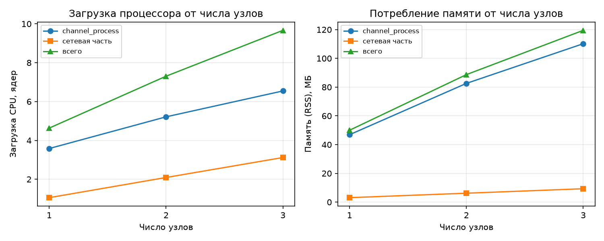

Рисунок 4.1 — Зависимость загрузки ЦП и памяти ОЗУ от числа узлов

Высокая нагрузка обусловлена тем, что поток модели канала и цикл
обработки входящих команд для прошивки сетевой части (meshtasticd)
реализованы опросом, поэтому процессорное время расходуется даже при
отсутствии передач. Это основная причина высокого потребления
процессорного времени.

## Минимальные и рекомендуемые требования

На основе проведенного анализа, сформулированы требования к системе для
запуска эмулятора (Таблица 4.6).

Таблица 4.6 — Минимальные и рекомендуемые параметры системы

<table>
<colgroup>
<col style="width: 20%" />
<col style="width: 39%" />
<col style="width: 40%" />
</colgroup>
<thead>
<tr>
<th style="text-align: center;"></th>
<th style="text-align: center;">Минимальные (до 3 узлов)</th>
<th style="text-align: center;">Рекомендуемые</th>
</tr>
</thead>
<tbody>
<tr>
<td style="text-align: center;">ЦП</td>
<td style="text-align: center;">Не менее 4 логических ядер</td>
<td style="text-align: center;">16 и более логических ядер</td>
</tr>
<tr>
<td style="text-align: center;">ОЗУ</td>
<td style="text-align: center;">8 ГБ</td>
<td style="text-align: center;">16 ГБ</td>
</tr>
<tr>
<td style="text-align: center;">Видеоадаптер</td>
<td style="text-align: center;">Поддержка OpenGL</td>
<td style="text-align: center;">Поддержка OpenGL</td>
</tr>
</tbody>
</table>

ЗАКЛЮЧЕНИЕ

В ходе выполнения данной работы были выполнены все поставленные задачи:

1.  Разработать модель канала связи, реализующую распространение

квадратурных сигналов между виртуальными узлами с учетом затухания и
шума.

1.  Реализовать описание узлов в виде двух независимых графов обработки
    сигналов (путь приема и передачи) на базе инструмента FutureSDR.

2.  Разработать механизм, связывающий узлы FutureSDR с моделью канала
    связи (блоки Signal Subscriber и Signal Publisher через каналы
    crossbeam)

3.  Реализовать виртуальный драйвер для эмуляции физического интерфейса
    Meshtastic

4.  Реализовать базовый графический интерфейс для управления
    виртуальными узлами и конфигурацией сети.

Разработан программный SITL-эмулятор LoRa-mesh сети на базе реальной
прошивки meshtastic, позволяющий исследовать поведение сети на всех
уровнях без использования физических устройств. В отличие от
рассмотренных аналогов, разработанное решение совмещает DSP-модельы
физического уровня с запуском реальной прошивки конечного устройства.

Исходный код проекта выложен в открытый доступ в репозитории, который
доступен по ссылке: <u>https://github.com/Emile1154/LoRaEmulator</u>

Я подтверждаю, что настоящая работа написано мною лично, не нарушает
интеллектуальные права третьих лиц и не содержит сведения, составляющие
государственную тайну. \_\_\_\_\_/Багманов Э.Р.

СПИСОК ИСПОЛЬЗОВАННЫХ
ИСТОЧНИКОВ

1.  Low power long range transmitter: пат. 9252834 США / O. B. A.
    Seller, N. Sornin; заявитель и патентообладатель Semtech Corp. -
    Опубл. 2016.

2.  Robyns P., Quax P., Lamotte W., Thenkels W. A Multi-Channel Software
    Decoder for the LoRa Modulation Scheme // Proceedings of the 3rd
    International Conference on Internet of Things, Big Data and
    Security (IoTBDS). - SciTePress, 2018.

3.  An Open-Source LoRa Physical Layer Prototype on GNU Radio / J.
    Tapparel, O. Afisiadis, P. Mayoraz, A. Balatsoukas-Stimming, A. Burg
    // 2020 IEEE 21st International Workshop on Signal Processing
    Advances in Wireless Communications (SPAWC). - IEEE, 2020. - P. 1-5.

4.  LoRa Modulation Basics : Application Note AN1200.22 / Semtech
    Corporation. - Camarillo, CA : Semtech, 2015.

5.  LoRaWAN Specification. Version 1.0.4 / LoRa Alliance. - Fremont, CA
    : LoRa Alliance, 2020.

6.  Meshtastic documentation \[Электронный ресурс\]. - URL:
    <https://meshtastic.org/docs/introduction/> (дата обращения:
    08.01.2026).

7.  Meshtastic python API documentation \[Электронный ресурс\]. - URL:
    <https://python.meshtastic.org> (дата обращения: 01.06.2026 )

8.  MeshCore documentation \[Электронный ресурс\]. - URL:
    <https://meshcore.co.uk/> (дата обращения: 09.01.2026).

9.  Reticulum Network Stack Manual \[Электронный ресурс\]. - URL:
    <https://reticulum.network/manual/index.html> (дата обращения:
    09.01.2026).

10. FutureSDR documentation \[Электронный ресурс\]. - URL:
    <https://www.futuresdr.org/learn/introduction.html> (дата обращения:
    07.01.2026).

11. GNU Radio documentation \[Электронный ресурс\]. - URL:
    <https://wiki.gnuradio.org/index.php?title=Category:Block_Docs>
    (дата обращения: 07.01.2026).

12. Crossbeam: Tools for concurrent programming in Rust \[Электронный
    ресурс\]. - URL: <https://docs.rs/crossbeam> (дата обращения:
    07.01.2026).

13. Docker documentation \[Электронный ресурс\]. - URL:
    <https://docs.docker.com/> (дата обращения: 07.01.2026).

14. Qt for Python (PyQt6) documentation \[Электронный ресурс\]. - URL:
    <https://doc.qt.io/qtforpython/> (дата обращения: 07.01.2026).

15. RF-SITL: A Software-in-the-Loop Channel Emulator for UAV Swarm
    Networks / N. Mastronarde, D. Russell, Z. Guan. - 2022.

16. LoRa for FutureSDR \[Электронный ресурс\]. - URL:
    <https://www.futuresdr.org/blog/are-we-lora/> (дата обращения:
    07.01.2026).

17. GNU Radio LoRa \[Электронный ресурс\]. - URL:
    <https://github.com/tapparelj/gr-lora_sdr> (дата обращения:
    08.01.2026).

18. KISS Protocol \[Электронный ресурс\]. - URL:
    <https://m17-protocol-specification.readthedocs.io/en/latest/kiss_protocol.html>
    (дата обращsения: 08.01.2026).

# 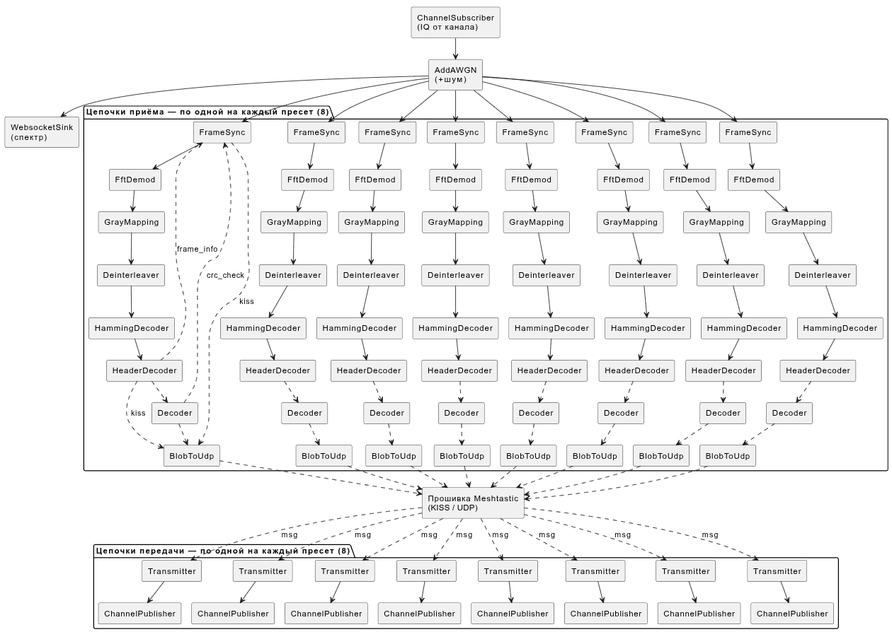Приложение A

Рисунок A.1 — Граф приема и передачи для одного узла FutureSDR

# Приложение B

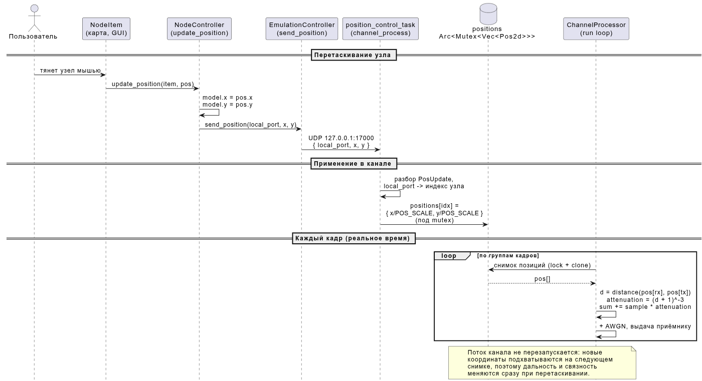

Рисунок B.1 — Диаграмма реализации обновления позиции узлов на лету

# Приложение C

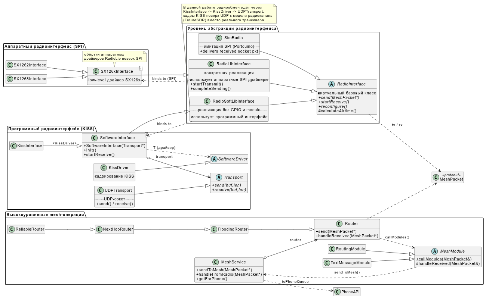

Рисунок C.1 — Модифицированная объектно-ориентированная архитектура
Meshtastic

# Приложение D

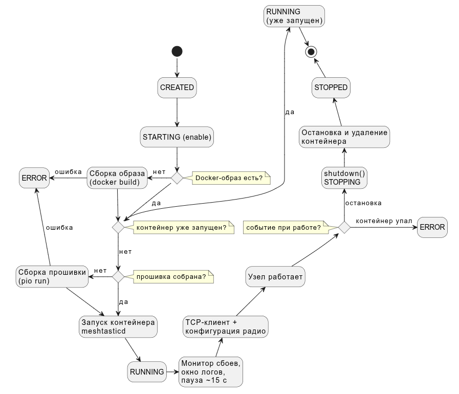

Рисунок D.1 — Граф состояний узла
