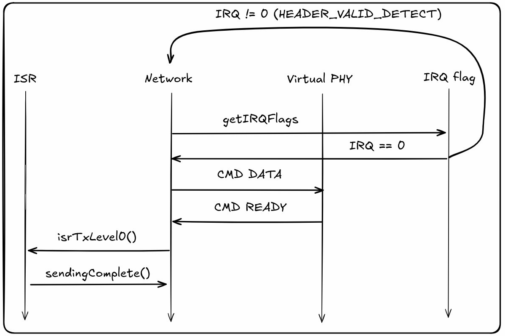
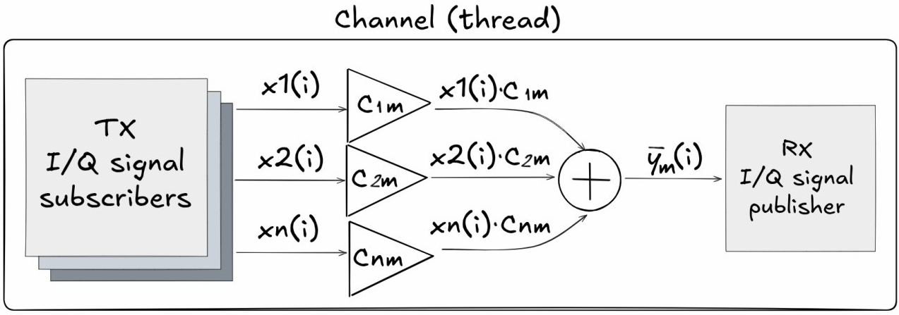
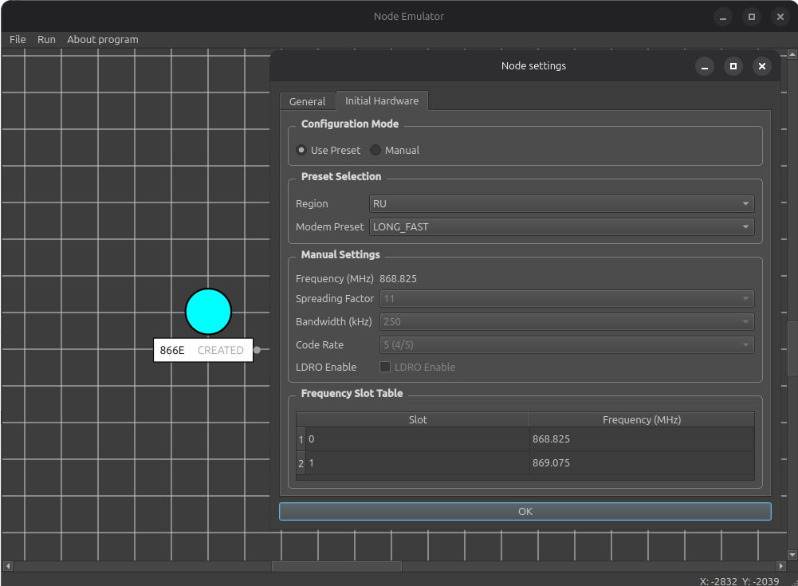
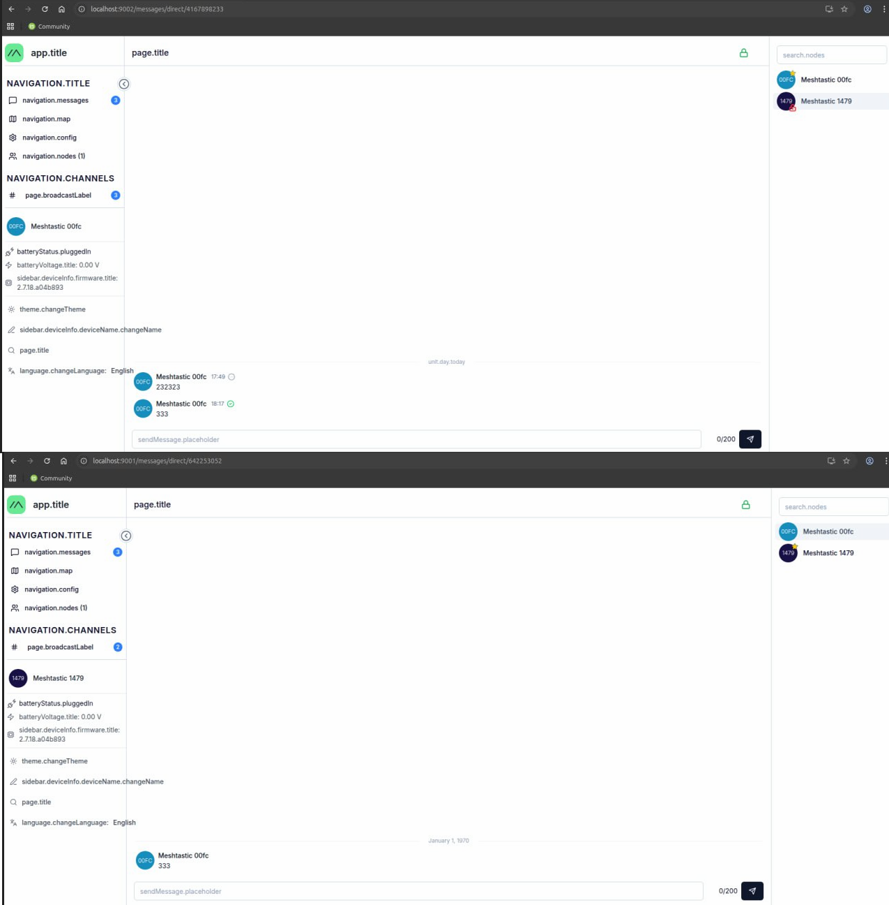

СОДЕРЖАНИЕ

# Оглавление

[Введение [5](#_Toc219672752)](#_Toc219672752)

[1 Постановка задачи [7](#постановка-задачи)](#постановка-задачи)

[1.1. Определение задач [7](#определение-задач)](#определение-задач)

[2 Обзорная часть [8](#обзорная-часть)](#обзорная-часть)

[2.1. Физический уровень LoRa
[8](#физический-уровень-lora)](#физический-уровень-lora)

[2.1.1. Модуляция с расширением спектра методом линейной частотной
модуляции
[8](#модуляция-с-расширением-спектра-методом-линейной-частотной-модуляции)](#модуляция-с-расширением-спектра-методом-линейной-частотной-модуляции)

[2.1.2. Структура кадра LoRa
[9](#структура-кадра-lora)](#структура-кадра-lora)

[2.1.3. Взбалтывание [11](#взбалтывание)](#взбалтывание)

[2.1.4. Заголовок [11](#заголовок)](#заголовок)

[2.1.5. Перемежение [12](#перемежение)](#перемежение)

[2.1.6. Преобразование в код Грея
[14](#преобразование-в-код-грея)](#преобразование-в-код-грея)

[2.1.7. Преамбула [14](#преамбула)](#преамбула)

[2.1.8. Параметры модуляции LoRa
[15](#параметры-модуляции-lora)](#параметры-модуляции-lora)

[2.2 LoRaWAN [16](#lorawan)](#lorawan)

[2.2.1. Модель сети [16](#модель-сети)](#модель-сети)

[2.2.2. Активация конечного устройства
[18](#активация-конечного-устройства)](#активация-конечного-устройства)

[2.2.3. Adaptive Data Rate
[19](#adaptive-data-rate)](#adaptive-data-rate)

[2.3. Meshtastic [20](#meshtastic)](#meshtastic)

[2.3.1. Модель сети [20](#модель-сети-1)](#модель-сети-1)

[2.3.2. Стек протоколов [21](#стек-протоколов)](#стек-протоколов)

[2.3.3. Пресеты модема и частотные планы
[22](#пресеты-модема-и-частотные-планы)](#пресеты-модема-и-частотные-планы)

[2.3.4. Интерфейсы управления
[22](#интерфейсы-управления)](#интерфейсы-управления)

[2.4. MeshCore [23](#meshcore)](#meshcore)

[2.4.1. Модель сети [23](#модель-сети-2)](#модель-сети-2)

[2.4.2. Стек протоколов и особенности
[23](#стек-протоколов-и-особенности)](#стек-протоколов-и-особенности)

[2.4.3. Интерфейсы и управление
[24](#интерфейсы-и-управление)](#интерфейсы-и-управление)

[2.5. Reticulum [24](#reticulum)](#reticulum)

[2.5.1. Модель сети [24](#модель-сети-3)](#модель-сети-3)

[2.5.2. Стек протоколов и особенности
[25](#стек-протоколов-и-особенности-1)](#стек-протоколов-и-особенности-1)

[2.6. Сравнение сетевых стеков
[26](#сравнение-сетевых-стеков)](#сравнение-сетевых-стеков)

[2.7. Обзор существующих решений эмуляции и симуляции LoRa-сетей
[27](#обзор-существующих-решений-эмуляции-и-симуляции-lora-сетей)](#обзор-существующих-решений-эмуляции-и-симуляции-lora-сетей)

[3 Программное обеспечение [28](#программное-обеспечение)](#программное-обеспечение)

[3.1 Архитектура системы [28](#архитектура-системы)](#архитектура-системы)

[3.2 Реализация физического уровня (LoRaSDR) [30](#реализация-физического-уровня-lorasdr)](#реализация-физического-уровня-lorasdr)

[3.2.1 Модель канала связи [30](#модель-канала-связи)](#модель-канала-связи)

[3.2.2 Модель узла в FutureSDR [31](#модель-узла-в-futuresdr)](#модель-узла-в-futuresdr)

[3.2.3 UDP-сервер узла [33](#udp-сервер-узла)](#udp-сервер-узла)

[3.3 Сетевой уровень: адаптация Meshtastic [34](#сетевой-уровень-адаптация-meshtastic)](#сетевой-уровень-адаптация-meshtastic)

[3.3.1 Платформа native\_virtual [34](#платформа-native_virtual)](#платформа-native_virtual)

[3.3.2 KISS-протокол как интерфейс SDR — прошивка [35](#kiss-протокол-как-интерфейс-sdr-прошивка)](#kiss-протокол-как-интерфейс-sdr-прошивка)

[3.3.3 Программная конфигурация узлов через TCP [36](#программная-конфигурация-узлов-через-tcp)](#программная-конфигурация-узлов-через-tcp)

[3.4 Изоляция узлов на базе Docker [37](#изоляция-узлов-на-базе-docker)](#изоляция-узлов-на-базе-docker)

[3.5 Графический интерфейс [38](#графический-интерфейс)](#графический-интерфейс)

[3.6 Результаты [40](#результаты)](#результаты)

[ЗАКЛЮЧЕНИЕ [41](#заключение)](#заключение)

[СПИСОК ЛИТЕРАТУРЫ [42](#_Toc230910473)](#_Toc230910473)

<span id="_Toc219672752" class="anchor"></span>Введение

В современных условиях возрастающей зависимости от централизованных
систем связи (сотовых сетей, интернета) особую актуальность приобретают
децентрализованные системы связи. Одним из востребованных решений
является технология Meshtastic — открытый проект, реализующий
децентрализованную mesh-сеть для приемо-передатчиков LoRa.

Технология LoRa (Long Range) использует запатентованную модуляцию с
расширением спектра методом линейной частотной модуляции. Данная
модуляция обеспечивает высокую помехоустойчивость и дальность передачи
при минимальном энергопотреблении, что делает её основой большинства
LPWAN-решений. LoRaWAN является стандартным протоколом сетевого уровня
поверх LoRa, а Meshtastic реализует поверх LoRa децентрализованную
mesh-маршрутизацию.

При разработке распределённых беспроводных систем, таких как mesh-сети,
ключевой задачей является корректная оценка поведения радиоканала.
Экспериментальная проверка таких систем в реальных условиях требует
значительных материальных и временных ресурсов: необходимо несколько
физических устройств, возможность их размещения на требуемых
расстояниях, а повторяемость экспериментов существенно ограничена. В
связи с этим особую актуальность приобретают программные методы эмуляции
физического уровня радиоканала.

Одним из подходов является концепция Software-in-the-Loop (SITL), при
которой встроенное программное обеспечение и алгоритмы выполняются на
хост-компьютере путём запуска в виртуальной среде. В отличие от
Hardware-in-the-Loop (HITL), где используются реальные физические
компоненты, SITL позволяет эмулировать все уровни программно, что
снижает затраты и обеспечивает высокую воспроизводимость экспериментов.

Настоящая работа посвящена разработке программного эмулятора LoRa
mesh-сети на базе реальной прошивки Meshtastic с применением подхода
SITL. Документ включает описание физического уровня LoRa, протоколов
LoRaWAN и Meshtastic, архитектуры разработанного программного
обеспечения и результатов его работы.

# Постановка задачи

## Определение задач

Цель работы — разработка программного SITL-эмулятора полного стека
Meshtastic, позволяющего эмулировать поведение сети на всех уровнях без
использования физических устройств.

Для достижения цели были поставлены следующие задачи:

1.  Разработать модель канала связи, реализующую распространение
    IQ-сигналов между виртуальными узлами с учетом затухания и шума.

2.  Реализовать описание узлов в виде двух независимых графов обработки
    сигналов (путь приема и передачи) на базе фреймворка FutureSDR.

3.  Разработать механизм, связывающий узлы FutureSDR с моделью канала
    связи (блоки Signal Subscriber и Signal Publisher через каналы
    crossbeam)

4.  Реализовать виртуальный драйвер для эмуляции физического интерфейса
    Meshtastic

5.  Реализовать базовый графический интерфейс для управления
    виртуальными узлами и конфигурацией сети.

Ограничения и допущения:

> Модель затухания — свободное пространство (d<sup>-3</sup>),
> многолучевое распространение не моделируется.

# Обзорная часть

## Физический уровень LoRa

Среди множества технологий сетей дальнего радиуса действия с низким
энергопотреблением LoRaWAN стал одним из самых популярных и широко
распространённых решений. LoRa является физическим уровнем технологии
маломощных сетей дальнего радиуса (LPWAN).

LoRa использует запатентованную модуляцию с расширением спектра методом
линейной частотной модуляции (или расширение спектра с помощью чирпов).
Данная модуляция используется вместе с помехоустойчивым кодированием и
перемежением.

Протокол LoRaWAN является открытым стандартом, но физический уровень,
называемый LoRa, запатентован (Seller & Sornin U.S. Patent 9 252 834) и
является собственностью компании, что послужило причиной обратного
проектирования для понимания структуры кадров, кодирования и модуляции.

###  Модуляция с расширением спектра методом линейной частотной модуляции 

LoRa использует модуляцию, которая определяется двумя параметрами
передачи: коэффициентом расширения спектра (SF) и шириной пропускания
(BW).

Каждый символ состоит из N = 2<sup>SF</sup> чипов. Каждому значению
символа s соответствует определённый циклический сдвиг начальной
частоты,

где s ∈ {0, ..., N}.

Время передачи одного символа:

$$T\_{s} = \frac{N}{BW}$$

Символ кодируется как chirp-сигнал, в котором частота линейно нарастает
от –BW/2 до +BW/2 за время Ts, после чего циклически повторяется.
Циклический сдвиг, соответствующий значению символа s, определяет
начальную частоту chirp-а.

На приёмной стороне для демодуляции применяется операция умножения
принятого сигнала на down-chirp с последующим FFT — пик FFT
соответствует номеру символа.


Рисунок 2.1 — Спектрограмма c границами символов LoRa

Ключевые свойства CSS-модуляции:

Устойчивость к допплеровскому сдвигу: частотный сдвиг сигнала
проявляется как временной сдвиг в демодуляторе, который компенсируется
алгоритмом синхронизации.

Устойчивость к многолучевому распространению: расширение спектра снижает
влияние интерференции от отражений.

### Структура кадра LoRa

Существуют два вида фрейма, explicit и implicit. Отличие в наличие
заголовка, который присутствует только в explicit-кадрах. Через
заголовок кадр задает скорость помехоустойчивого кодирования (CR 4/5,
4/6, 4/7, 4/8) и наличие 2 байт контрольной суммы (CRC) в конце кадра.

Кадр состоит из преамбулы, заголовка (только для explicit), полезной
нагрузки и контрольной суммы. (Рисунок 2.2)


Рисунок 2.2 — структура кадра LoRa

>  style="width:4.95836in;height:4.94186in" />

Рисунок 2.3 — структура кодирования, взбалтывания и перемежения в кадре
LoRa

###  Взбалтывание

Операция взбалтывания рандомизируют битовые последовательности и
уменьшают вероятность появления длинных серий единиц или нулей на основе
операции суммы по модулю 2, для предотвращения проблем при передаче
данных. Взбалтывается только полезная нагрузка (Рисунок 2).

Псевдослучайная последовательность сгенерирована регистром сдвига с
линейной обратной связью.

Полином обратной связи:
*x*<sup>8</sup> + *x*<sup>6</sup> + *x*<sup>5</sup> + *x*<sup>4</sup> + 1


Рисунок 2.4 — Функциональная схема сбалтывания для одного байта данных

###  Заголовок 

Заголовок используется для передачи информации, которая необходима для
декодирования кадра. Состоит из длины полезной нагрузки, наличия CRC для
полезной нагрузки, скорость кодирования и контрольной суммы для
заголовка.


Рисунок 2.5 — Структура заголовка кадра LoRa ( L - байт для длины
полезной нагрузки, C - используется ли CRC, P - скорость кодирования,
H - CRC для заголовка)

CRC заголовка вычисляется по формуле: $H\_{CRC} = G \cdot \overline{h}$,
где
$\overline{h} = \left\lbrack L\_{7}\\,\\ L\_{6}\\,\\\ldots\\,\\ C\\ \right\rbrack$
является вектором битов, G генераторной матрицей:

$$G = \begin{bmatrix}
1 & 1 & 1 & 1 & 0 & 0 & 0 & 0 & 0 & 0 & 0 & 0 \\
1 & 0 & 0 & 0 & 1 & 1 & 1 & 0 & 0 & 0 & 0 & 1 \\
0 & 1 & 0 & 0 & 1 & 0 & 0 & 1 & 1 & 0 & 1 & 0 \\
0 & 0 & 1 & 0 & 0 & 1 & 0 & 1 & 0 & 1 & 1 & 1 \\
0 & 0 & 0 & 1 & 0 & 0 & 1 & 0 & 1 & 1 & 1 & 1
\end{bmatrix}$$

### Перемежение

Перемежение используется для распределения битов кодового слова для
улучшения возможности исправления ошибок кода.

Размер блока перемежителя задается количеством битов в кодовом слове

4 + P, где P количество битов четности, и используемом коэффициентом
расширения спектра (SF).

Перемежитель берет двоичную матрицу D размером *S**F* ⋅ (4 + *P*), в
которой каждая строка является словом.  
Диагональное перемежение определяется уравнением

*I*<sub>*i*, *j*</sub> = *D*<sub>\[*i* − (*j* + 1)\] *m**o**d* *S**F*, *i* </sub> ,

где *i* ∈ {0, …, 3 + *P*} и *j* ∈ {0, … , *S**F* − 1}

В LoRa eсть оптимизированный режим низкой скорости передачи данных
(LDRO), который уменьшает количество битов в блоке перемежителя до
(*S**F* − 2) ⋅ (4 + *P*). После перемежения к каждому кодовому слову
добавляется бит четности, значение которого определяется:

*P*= *B*<sub>0</sub> ⊕ *B*<sub>1</sub> ⊕ … ⊕ *B*<sub>*S**F* − 2 </sub>


Рисунок 2.6 — Иллюстрация отличия перемежения с оптимизацией (P = 2, CR
= 4/6, SF = 7)

Для полного декодирования кадра приемнику нужно знать длину полезной
нагрузки, наличие CRC и кодовую скорость. Однако приемник не знает
заголовок до декодирования первого блока перемежителя (Рисунок 2.2). Для
этого первый блок перемежителя кодируется с наиболее надежной кодовой
скоростью CR = 4/8, для SF &gt; 6 используется с включенным LDRO.

Важно отметить, что первый блок всегда использует CR = 4/8, даже если
это передача implicit кадра.

### Преобразование в код Грея

Каждая строка перемеженной матрицы интерпретируется как двоичные
значения. Операция преобразования в код Грея используется для
преобразования значений, закодированных кодом Грея, в десятичное число.
После преобразования Грея каждый символ s отличается от соседних
символов только одним битом.

Преобразование, используемое LoRa задается формулой:

*s* = \[*I*<sub>*i*</sub>  ⊕ (*I*<sub>*i*</sub> ≫ 1)  + 1\] *m**o**d* *S**F*,
где *I*<sub>*i*</sub> - i-я строка матрицы

Преобразование Грея используемое LoRa включает произвольное смещение +1
к преобразованным значениям.

###  Преамбула

Для синхронизации кадр LoRa начинается с преамбулы. Преамбула содержит
N<sub>up</sub> восходящих чирпов, затем 2 символа называемых сетевым
идентификатором и в конце 2.25 нисходящих чирпов. (Рисунок 2.7) . Число
N<sub>up</sub>  ∈ {0, … , 65535 } , где 8 является наиболее
распространённым.

Типовое значение сетевого идентификатора 0x34 для LoRaWAN или 0x12 для
частных сетей.

Значение может быть в диапазоне S<sub>w</sub> ∈ {10*h*, … , *F**F**h* }.
Некоторые приемопередатчики определяют сетевой идентификатор как 16
битное значение, которое эквивалентно 8 битному через соотношение:

*X**Y**h* = *X*4*Y*4*h*

Разбивание сетевого идентификатора на слова S<sub>w0</sub> и
S<sub>w1</sub> задаются через соотношения:

*S*<sub>*w*0</sub> = (*S*<sub>*w*</sub> ≫ 4) \* 8

*S*<sub>*w*1</sub> = (*S*<sub>*w*</sub> & 0*x*0*F*) \* 8


Рисунок 2.7 — Спектрограмма преамбулы кадра LoRa

###  Параметры модуляции LoRa

SF (Spreading Factor, 7–12) — коэффициент расширения спектра. Определяет
количество чипов на символ (N = 2^SF). Увеличение SF повышает дальность
и чувствительность, но снижает скорость передачи данных. SF7
обеспечивает наибольшую скорость (~5,47 кбит/с при BW=125кГц), SF12 —
наибольшую дальность (~0,29 кбит/с).

BW (Bandwidth) — ширина полосы пропускания. Поддерживаемые значения:
62,5; 125; 250; 500кГц. Увеличение BW повышает скорость передачи, но
снижает чувствительность приёмника.

CR (Code Rate, 4/5–4/8) — скорость помехоустойчивого кодирования кодом
Хэмминга. CR 4/5 добавляет минимальную избыточность (1 бит на 4), CR 4/8
— максимальную (4 бита на 4). Увеличение избыточности повышает
устойчивость к ошибкам за счёт снижения скорости.

LDRO (Low Data Rate Optimization) — режим оптимизации для низких
скоростей передачи. Уменьшает размер блока перемежителя с SF·(4+P) до
(SF−2)·(4+P).

##  

##  LoRaWAN

LoRaWAN — это MAC-протокол, ориентированный на передачу данных на
большие расстояния при минимальном энергопотреблении. Описывает
организацию сети поверх физического уровня LoRa.

### Модель сети

Основные компоненты сети LoRaWAN:

**Конечное устройство (End-device)** — это датчик, исполнительный
механизм, либо устройство, совмещающее оба типа. Может содержать набор
датчиков и управляемых элементов. Обмен данными происходит через
радиошлюз.

**Радиошлюз (Radio Gateway)** работает полностью на физическом уровне.

Uplink (восходящий канал) – декодирует принятые радиопакеты и передает
их на сетевой сервер без обработки.

Downlink (нисходящий канал) – запросы от сетевого сервера передаются к
конечному устройству.

**Сетевой сервер (Network server)** — Центральный управляющий элемент
LoRaWAN сети. Каждый сетевой сервер имеет один или более ID (IEEE
EUI64). Сетевой сервер выполняет функции:

- Проверки адреса конечного устройства, и кадров.

- Механизм подтверждения.

- Адаптация скорости передачи данных.

- Отправка ответов на MAC-запросы, поступающего от конечного устройства.

- Пересылка полученных сообщений uplink с конечного устройства на
  соответствующий сервер приложения.

- Постановка в очередь сообщений downlink на отправку с любого сервера
  приложений на конечное устройство.

- Пересылка рукопожатий между конечным устройством и сервером активации.

**Сервер активации (Join Server)** — Отвечает за процедуру активации по
воздуху (OTA). Его функции:

- Обработка Join-request кадра от конечных устройств.

- Отправка Join-accept кадра и передача на конечное устройство

- Генерация ключа сеанса сети (Network Session Key) для обмена между
  конечным устройством и сетевым сервером.

- Генерация ключа сеанса приложения (Application Session Key) для обмена
  между сетевым сервером и сервером приложений.

Для генерации ключей Join server должен иметь следующие данные:

- DevEUI , глобальный id конечного устройства.

- AppKey.

- NwkKey (только для конечного устройства LoRaWAN v.1.1)

- ID сетевого сервера и сервера приложений.

- Версия LoRaWAN конечного устройства.

AppKey и NwkKey – root ключи. Объявлены только у конечного устройства и
у сервера активации, и никогда не отправляются ни в сетевой сервер, ни в
сервер приложения.

**Сервер приложений (Application Server)** — обрабатывает все данные
полученные от конечного устройства и отображает пользователю. Также
генерирует на уровне приложений downlink запросы.

>  style="width:5.60069in;height:1.75833in" />
>
> Рисунок 2.8 — Модель частной сети LoRaWAN.

### Активация конечного устройства

Существуют два вида активации конечного устройства в сети LoRaWAN:

1.  ABP (Activation by Personalization) — статическая активация.

В данном случае все ключи и параметры устройства задаются вручную до
подключения к сети, без использования Join-request(JoinEUI).

\- Конечное устройство получает DevAddr, AppSkey, сетевые ключи сессии
(SNwkSIntKey, FNwkSIntKey, NwkSEncKey). Данные параметры заданы
производителем или сконфигурированы пользователем.

\- После включения устройство сразу может передавать данные, не проходя
активацию.

Условия со стороны сервера:

1.  Сетевой сервер должен быть настроен с DevAddr и сетевыми ключами.

2.  Сервер приложений должен иметь одинаковый DevAddr и AppSKey для
    декодирования.

<!-- -->

1.  OTA (Over the Air) – динамическая активация

Процедура включает Join-request(JoinEUI) и получение сгенерированных
ключей от сервера активации (Join Server):

\- Изначально конечное устройство – Generic Device

> \- После привязки к сети (commissioning) оно становится Commissioned
> Device.

\- При успешной активации — OTA Activated Device.

> \- Конечное устройство может быть деактивировано по инициативе сервера
> или пользователя, через процедуру Exit.

\- Повторная активация приведет к созданию нового LoRaWAN сеанса.


Рисунок 2.9 — Два типа активации конечного устройства в сети LoRaWAN.

Generic Device — только DevEUI и корневые ключи (AppKey, NwkKey)

Commissioned Device — устройство связано с сетью.

OTA Activated Device — сервер активации активировал устройство. передав
сгенерированные ключи (Network Session Key) конечному устройству.

### Adaptive Data Rate

ADR (Adaptive data rate) — механизм оптимизации использования
радиоканала, при котором сетевой сервер управляет параметрами передачи
конечного устройства.

> Алгоритм ADR на стороне сервера:

1\. Сервер накапливает историю SNR последних 20 пакетов uplink.

2\. Вычисляется максимальное SNR: SNR\_max.

3\. Запас по линку: Margin = SNR\_max − SNR\_required(DR\_current) − 10
дБ.

4\. Если Margin &gt; 0, сервер снижает SF (повышает DR) на Margin / 3
ступени.

5\. Если устройство не отвечает на несколько последовательных запросов
LinkADRReq, оно увеличивает SF (снижает DR) вплоть до максимального.

## Meshtastic

Meshtastic — открытый проект, реализующий децентрализованную mesh-сеть
для LoRa приёмопередатчиков. В отличие от LoRaWAN, не требует
централизованной инфраструктуры (шлюзов, серверов).

### Модель сети

Meshtastic использует децентрализованную mesh-топологию на основе
управляемого затопления (managed flooding). Каждый узел, получивший
пакет впервые, ретранслирует его (с учётом счётчика hop\_limit).

Роли узлов:

CLIENT — стандартный узел с интерфейсом пользователя
(Bluetooth/WiFi/Serial).

CLIENT\_MUTE — принимает пакеты, но не ретранслирует.

ROUTER — оптимизирован для ретрансляции, не имеет пользовательского
интерфейса.

ROUTER\_CLIENT — совмещает функции ROUTER и CLIENT.

REPEATER — ретранслирует пакеты с максимальным приоритетом.

TRACKER — оптимизирован для периодической отправки данных о
местоположении.

Параметр hop\_limit (по умолчанию 3) ограничивает максимальное число
ретрансляций пакета и предотвращает зацикливание. Уникальный
идентификатор пакета (packet\_id + sender) позволяет каждому узлу
отбросить уже обработанный пакет.

Роли позволяют регулировать частоту передачи и приоритеты ретрансляции,
что важно в плотных сетях или при построении стационарных узлов.

### Стек протоколов

Meshtastic реализиует полный стек уровней:

Таблица 2.1 Уровни в meshtastic

<table style="width:67%;">
<colgroup>
<col style="width: 33%" />
<col style="width: 33%" />
</colgroup>
<thead>
<tr>
<th>Название уровня</th>
<th>Реализация в meshtastic</th>
</tr>
</thead>
<tbody>
<tr>
<td>Уровень приложений</td>
<td>Текстовые сообщения</td>
</tr>
<tr>
<td>Уровень представлений</td>
<td>Protobuf, шифрование</td>
</tr>
<tr>
<td>Транспортный уровень</td>
<td style="text-align: center;">hop-by-hop ACK</td>
</tr>
<tr>
<td>Сетевой уровень</td>
<td>Адресация, hop лимиты</td>
</tr>
<tr>
<td>Канальный уровень</td>
<td>MeshPacket</td>
</tr>
<tr>
<td>Физический уровень</td>
<td>LoRa PHY</td>
</tr>
</tbody>
</table>

Описание уровней:

Физический уровень полностью основан на стандарте LoRa. Используется
CSS-модуляция с настраиваемыми параметрами: BW, SF, CR и LDRO.

Канальный уровень определяет формат кадров — MeshPacket. На этом уровне
обеспечивается доставка только между узлами в пределах видимости.
Выполняются функции:

Сетевой уровень ретранслирует пакеты при hop\_limit &gt; 0, выполняет
адресацию по 32-битными идентификаторами узлов, поддерживает broadcast и
unicast. Meshtastic не делит сеть на логические подсети, а разделяет по
физичиской досягаемости (количество хопов).

На транспортном уровне надежная доставка реализована только между
соседними узлами. Сквозная надежная доставка от отправителя до конечного
получателя на уровне стека отсутствует.

Уровень представлений выполняет обработку данных (сериализация protobuf,
шифрование)

Уровень приложения: мобильное приложение, web-интерфейс, мессенджеры и
т.д.

### Пресеты модема и частотные планы

Meshtastic предлагает набор предопределенных настроек, которые позволяют
балансировать между дальностью связи, скоростью передачи данных и
устойчивостью к помехам. Каждый пресет определяет комбинацию параметров
LoRa: BW, SF, CR и LDRO.

Доступные частоты и слоты берутся из настроек регионов в Meshtastic.


Рисунок 2.10 — Частотные слоты для разных полос пропускания для региона
RU

### Интерфейсы управления

Прошивка Meshtastic поддерживает несколько интерфейсов управления и
конфигурирования устройства.

Основные интерфейсы управления:

Bluetooth, Serial (UART/USB), TCP/IP (Ethernet/Wi-Fi), MQTT.

Вся конфигурация основана на protocol buffers (protobuf), где можно
переопределить имя устройства, роль узла, параметры радио, управление
интерфейсами и другими настройками которые есть в документации \[2\].

Для программного управления рекомендуется использовать Meshtastic python
api библиотеку.

## MeshCore

MeshCore — это новый открытый протокол и прошивка для создания
децентрализованных LoRa mesh-сетей, позиционируемый как более
структурированная и масштабируемая альтернатива Meshtastic. Проект
появился в 2024-2025 годах.

### Модель сети

MeshCore использует гибридный подход к маршрутизации с разделением ролей
устройств. В отличии от meshtastic, где почти все узлы могут
ретранслировать трафик, meshcore строит сеть вокруг выделенных
ретрансляторов.

Основные роли устройств:

Companion — клиентское устройство. Не ретранслирует сообщения других
узлов, только отправляет и получает свои.

Repeater — Инфраструктурный ретранслятор. Основной элемент сети,
отвечает за пересылку сообщений. Станционарный компонент сети.

Room Server — сервер для хранения и распространения сообщений.

Алгоритм маршрутизации:

\- Основной режим — структурированная маршрутизация через известные
Repeaters.

\- При отсутствии маршрута используется flooding или fallback

\- Максимальное количество хопов — до 64.

\- Поддерживается явное указание пути сообщения.

### Стек протоколов и особенности

MeshCore использует собственный легкий протокол. Поддерживает end-to-end
шифрование. В отличие от Meshtastic работает с более жестким контролем
доступа к среде и уменьшенным количеством ретрансляций.

Ключевые отличия от Meshtastic:

- Клиенты (Companion) не ретранслируют трафик других пользователей.

- Pull модель для телеметрии и позиций (данные запрашиваются, а не
  постоянно отправляются)

- Улучшенная аналитика, просмотр маршрутизации пакетов и связей

> Данные отличия позволяют проще и эффективнее расширять инфраструктуру
> на MeshCore в отличие от Meshtastic.

### Интерфейсы и управление

Интерфейсы управления такие же, как и в meshtastic:

\- мобильные приложения;

\- веб-интерфейс

\- Bluetooth, Serial (UART/USB), TCP/IP (Ethernet/Wi-Fi), MQTT.

Или python-клиент или javascript библиотеки для управления и
взаимодействия с сетью.

## Reticulum

Reticulum — это криптографически адресованный сетевой стек. Разработан
как альтернатива традиционным IP-сетям для среды с ненадежными каналами
связи.

### Модель сети

Reticulum не привязан к определенному физическому интерфейсу и может
работать поверх любых интерфейсов: Wi-Fi, Ethernet, LoRa и других.

Ключевые концепции:

\- Destination — вместо традиционных IP-адресов используются
криптографические идентификаторы (128-битный публичный ключ)

\- Самоконфигурирующаяся многохоповая маршрутизация

\- Поддержка высоких задержек и низкой пропускной способности

\- Transport Nodes — узлы, выполняющие ретрансляцию

\- Instances — конечные пользовательские узлы

Reticulum работает в децентрализованном режиме с элементами
инфраструктуры, объединяя разные физические интерфейсы в единую сеть.

### Стек протоколов и особенности

Reticulum реализует полный сетевой стек с акцентом на криптографию.

Типы получателей (Destination):

- Одиночный, шифрование end-to-end

- Групповой

- Plain, без шифрования

- Link, установка зашифрованного канала (PFS)

Отсутствует фиксированная топология, узлы обнаруживают маршруты через
механизм Announce.

Механизм Announce: узлы периодически рассылают объявления со своим
адресом и публичным ключом. Transport Nodes накапливают эти объявления и
строят таблицу маршрутизации, отслеживая количество hop до каждого.

> Типы пакетов:

Announce (объявление), Packet (передача данных без установки
соединения), Link request/proof (установка зашифрованного канала)

Основные характеристики:

\- End-to-end шифрование, анонимность и защита метаданных

> \- Сообщения-ориентированный подход. Каждое сообщение передается как
> целостная единица с гарантией доставки или уведомлением об ошибке.
> Данный принцип лучше подходит для сетей с высокой задержкой.
>
> \- Автоматическая сборка и фрагментация сообщений с поддержкой
> повторной передачи.
>
> \- Многоинтерфейсная работа — стек может одновременно использовать
> несколько физических интерфейсов и динамически выбирать оптимальный
> путь.
>
> \- Динамическая маршрутизация на основе криптографических
> идентификаторов.
>
> \- Устойчивость к длительным задержкам и нестабильным каналам связи.

## Сравнение сетевых стеков

Для объективной оценки технологий, рассмотренных ранее, ниже приведено
сравнение LoRaWAN, Meshtastic, MeshCore и Reticulum.

Таблица 2.2 — Сравнение характеристик

<table style="width:100%;">
<colgroup>
<col style="width: 19%" />
<col style="width: 18%" />
<col style="width: 20%" />
<col style="width: 20%" />
<col style="width: 20%" />
</colgroup>
<thead>
<tr>
<th>Параметр</th>
<th>LoRaWAN</th>
<th>Meshtastic</th>
<th>MeshCore</th>
<th>Reticulum</th>
</tr>
</thead>
<tbody>
<tr>
<td><p>Архитектур</p>
<p>Топология</p></td>
<td>Централизованная, Звезда</td>
<td>Децентрализованная, Mesh</td>
<td>Децентрализованная, Mesh</td>
<td>Децентрализованная, Мульти-интерфейсный mesh</td>
</tr>
<tr>
<td>Требования инфраструктуры</td>
<td>Да</td>
<td>Нет</td>
<td>Минимально</td>
<td>Нет</td>
</tr>
<tr>
<td>Максимальное кол-во хопов</td>
<td>1</td>
<td>7</td>
<td>64</td>
<td>Не ограничено</td>
</tr>
<tr>
<td>Масштабируемость</td>
<td>1000 узлов на шлюз</td>
<td>До 1000 узлов</td>
<td>До 3000 узлов</td>
<td>Не ограничено</td>
</tr>
<tr>
<td>Интерфейсы</td>
<td>Только LoRa</td>
<td>Только LoRa</td>
<td>Только LoRa</td>
<td>Любой</td>
</tr>
<tr>
<td>Сложность развертывания</td>
<td><p>Высокая</p>
<p>(нужна инфраструктура)</p></td>
<td>Низкая</td>
<td>Низкая</td>
<td>Высокая (наличие навыков разработчика)</td>
</tr>
</tbody>
</table>

Выводы: LoRaWAN подходит для стационарных IoT-систем с централизованным
управлением и доступом к инфраструктуре.

Meshtastic — лучшее решение для мобильных mesh-сетей с быстрым
развертыванием.

MeshCore подходит для построения более крупных региональных mesh-сетей.

Reticulum предлагает гибкую архитектуру, с работой по разным каналам.

## Обзор существующих решений эмуляции и симуляции LoRa-сетей

Анализ существующих инструментов позволяет выявить их ключевые
ограничения.

Таблица 2.3 — Сравнение существующих инструментов эмуляции и симуляции
LoRa-сетей.

<table>
<colgroup>
<col style="width: 24%" />
<col style="width: 25%" />
<col style="width: 25%" />
<col style="width: 25%" />
</colgroup>
<thead>
<tr>
<th>Решение</th>
<th style="text-align: center;">Физ. уровень</th>
<th style="text-align: center;">Сетевой уровень</th>
<th style="text-align: center;">Реальное ПО</th>
</tr>
</thead>
<tbody>
<tr>
<td>GNURadio, gr-lora</td>
<td style="text-align: center;">DSP</td>
<td style="text-align: center;">Нет</td>
<td style="text-align: center;">—</td>
</tr>
<tr>
<td>ns-3</td>
<td style="text-align: center;">Вероятностный</td>
<td style="text-align: center;">LoRaWAN</td>
<td style="text-align: center;">Нет</td>
</tr>
<tr>
<td>OMNeT++/FLoRa</td>
<td style="text-align: center;">Вероятностный</td>
<td style="text-align: center;">LoRaWAN</td>
<td style="text-align: center;">Нет</td>
</tr>
<tr>
<td>LoRaSim</td>
<td style="text-align: center;">Вероятностный</td>
<td style="text-align: center;">Нет</td>
<td style="text-align: center;">—</td>
</tr>
<tr>
<td>Meshtasticator</td>
<td style="text-align: center;">Вероятностный</td>
<td style="text-align: center;">Meshtastic</td>
<td style="text-align: center;">Да</td>
</tr>
<tr>
<td>Данная работа</td>
<td style="text-align: center;">DSP</td>
<td style="text-align: center;">Meshtastic</td>
<td style="text-align: center;">Да</td>
</tr>
</tbody>
</table>

GNURadio с gr-lora\_sdr — реализует DSP-цепочку физического уровня LoRa.
Достоинство: полная верификация физического уровня. Ограничение: нет
поддержки сетевого уровня и реальной прошивки; требует вычислительных
ресурсов.

Ns-3 (LoRaWAN module) — дискретно-событийный симулятор с моделью
LoRaWAN. Достоинство: масштабируемость, поддержка большого числа узлов.
Ограничение: упрощенная вероятностная модель физического уровня; нет
поддержки Meshtastic; не использует реальную прошивку.

OMNeT++ / FLoRa — аналогичен ns-3 по классу инструментов. Предоставляют
вероятностные модели LoRa – канала и LoRaWAN. Ограничения те же, что и в
ns-3.

LoRaSim — Python-симулятор, оценивающий вероятность успешной доставки
пакета в сети LoRaWAN. Ограничение: отсутствует реализация сетевого
стека.

Meshtasticator — симулятор, специально разработанный для Meshtastic.
Реализует модель канала и алгоритм маршрутизации Meshtastic.
Достоинство: запускает реальную прошивку. Ограничение использует
упрощенную вероятностную модель физического уровня; сложность
использования и отсутствует документация по использованию.

Вывод: ни одно из рассмотренных решений не совмещает DSP-модель
физического уровня с запуском реальной прошивки.

# Программное обеспечение

## 3.1 Архитектура системы

В задачах тестирования и разработки беспроводных систем применяются два принципиально разных подхода: симуляция и эмуляция аппаратной части. Симуляция предполагает математическое упрощение поведения аппаратных компонентов и среды распространения сигнала, оперируя абстрактными моделями. Это позволяет исследовать поведение системы на высоком уровне, но не учитывает особенности физической и аппаратной реализации. Эмуляция, в отличие от симуляции, ориентирована на воспроизведение поведения аппаратной части таким образом, чтобы на ней могло исполняться реальное программное обеспечение — то есть копирование функционала одной системы на другую.

В данной работе используется подход Software-in-the-Loop (SITL) с применением SDR, который относится к классу эмуляции. Выбор SITL обусловлен возможностью запуска встроенного программного обеспечения узлов в виртуальной среде на хост-компьютере. В отличие от HITL, где используются реальные физические компоненты, SITL позволяет эмулировать все уровни программно, снижает затраты и обеспечивает высокую воспроизводимость экспериментов. Это обеспечивает создание контролируемой и воспроизводимой среды для тестирования, позволяя анализировать поведение системы в условиях, которые сложно воссоздать в реальности.

Теоретическая основа архитектуры — централизованная SITL-схема с N блоками приёмопередатчиков (Рисунок 3.1). В данной схеме каждый из N передатчиков соединяется с остальными через отдельные каналы. Связь между выходом передатчика n и входом приёмника m моделируется блоком канала Channel n→m. Каждый узел учитывает затухание пути, зависящее от расстояния между ними.


Рисунок 3.1 — Централизованная SITL-архитектура с N блоками приёмопередатчиков.

На основе данной теоретической схемы реализована практическая многоуровневая архитектура эмулятора, объединяющая эмуляцию физического уровня с запуском оригинальной прошивки Meshtastic (Рисунок 3.2). Пользовательские настройки приёмопередатчиков и отправляемых сообщений передаются в запущенный процесс Meshtastic через TCP-сокет посредством Meshtastic Python API. Переданные параметры или сообщения поступают на виртуальные физические узлы через реализованный виртуальный драйвер (KISS over UDP). Виртуальные физические узлы взаимодействуют между собой через эмулятор канала связи; принятые сообщения передаются обратно на уровень выше — вплоть до пользовательского уровня приложений.


Рисунок 3.2 — Многоуровневая архитектура SITL-эмулятора.

Система имеет четырёхуровневую структуру: GUI → Python-оркестратор → LoRaSDR (Rust/FutureSDR) → Docker-контейнеры с прошивкой Meshtastic.

Архитектура включает следующие компоненты:

**User Application** — уровень пользовательского приложения (Python/PyQt6 GUI). Оператор задаёт конфигурацию узлов, их координаты на 2D-карте, сетевые параметры (регион, пресет модема) и инициирует запуск эмуляции.

**Meshtastic Python API** — клиент для TCP-сервера, встроенного в процесс Meshtastic. Используется для программной конфигурации узлов через protobuf (регион, пресет модема, параметры сети). После конфигурации интерфейс закрывается для освобождения очереди `toPhoneQueue`.

**TCP API (glue)** — сервер, реализующий управление процессом Meshtastic внутри Docker-контейнера. Принимает команды конфигурации от Python API и передаёт их в `meshtasticd`.

**Meshtastic Daemon** — процесс `meshtasticd`, та же самая программа, что работает на реальных устройствах (платформа `native_virtual`). Реализует полный стек протоколов Meshtastic.

**KISS over UDP (glue)** — виртуальный драйвер физического интерфейса. Реализует взаимодействие между Meshtastic daemon и FutureSDR-узлом через протокол KISS поверх UDP-сокетов вместо аппаратного SPI-интерфейса.

**Node 1..N (FutureSDR)** — узлы приёмопередатчиков, описываемые с помощью графов потоков обработки сигналов в FutureSDR. Каждый узел реализует полную DSP-цепочку модуляции и демодуляции LoRa.

**Channel Emulator** — эмулятор канала связи (`ChannelProcessor`), выполняющийся в отдельном потоке и связывающий все узлы между собой.

На Рисунке 3.3 показана детальная схема взаимодействия компонентов. Каждый виртуальный узел выполняется в изолированном Docker-контейнере, что обеспечивает независимость файловых систем и процессов.


Рисунок 3.3 — Детальная схема компонентов SITL-эмулятора с Docker-контейнерами.

**Обоснование выбора технологий:**

*FutureSDR vs GNU Radio.* GNU Radio ориентирован на визуальное проектирование потоков обработки сигналов в среде GNU Radio Companion (GRC). Пользователь формирует граф обработки, соединяя блоки между собой. На основе созданной схемы генерируется программный код, который затем используется для исполнения. Однако данный подход накладывает ограничение на гибкость и затрудняет реализацию нестандартных сценариев и интеграцию с внешними компонентами (Docker, crossbeam, UDP-серверы). FutureSDR использует противоположный подход — граф описывается программно в виде набора объектов-блоков и их соединений. На основе этого описания генерируется граф, который можно наблюдать на локальном сервере при запуске. Это даёт полную свободу при создании нестандартных потоков обработки и обеспечивает высокую производительность за счёт использования языка Rust.

*Crossbeam.* Связь между моделью радиоканала (`ChannelProcessor`) и блоками обработки сигналов FutureSDR (`ChannelPublisher`, `ChannelSubscriber`) реализована через высокопроизводительные каналы библиотеки crossbeam. Crossbeam предоставляет набор инструментов для многопоточного программирования на Rust. В отличие от разделяемой памяти (shared memory), где несколько потоков работают с одной областью памяти через мьютексы, каналы crossbeam используют подход передачи сообщений. Такой выбор обеспечивает: упрощение синхронизации, высокую производительность и естественную интеграцию с асинхронной архитектурой FutureSDR.

Пользовательские настройки приёмопередатчиков и отправляемых сообщений передаются в запущенный процесс Meshtastic через TCP-сокет посредством Meshtastic Python API. Переданные параметры или сообщения поступают на виртуальные физические узлы через реализованный виртуальный драйвер (KISS over UDP). Виртуальные физические узлы взаимодействуют между собой через эмулятор канала связи; принятые сообщения передаются обратно на уровень выше — вплоть до пользовательского уровня приложений.

Система имеет четырёхуровневую структуру: GUI → Python-оркестратор → LoRaSDR (Rust/FutureSDR) → Docker-контейнеры с прошивкой Meshtastic.


Рисунок 3.1 — Многоуровневая архитектура SITL-эмулятора.

Архитектура включает следующие компоненты:

**User Application** — уровень пользовательского приложения (Python GUI). Оператор задаёт конфигурацию узлов, координаты, сетевые параметры и инициирует передачу сообщений.

**Meshtastic Python API** — клиент для TCP-сервера, встроенного в процесс Meshtastic. Используется для программной конфигурации узлов через protobuf.

**TCP API (glue)** — сервер, реализующий управление процессом Meshtastic внутри Docker-контейнера.

**Meshtastic Daemon** — процесс `meshtasticd`, та же самая программа, что работает на реальных устройствах (платформа `native_virtual`).

**KISS over UDP (glue)** — компонент, реализующий управление узлом и приём/передачу данных с помощью KISS-команд через UDP-сокеты.

**Node 1..N (FutureSDR)** — узлы приёмопередатчиков, описываемые с помощью графов потоков обработки сигналов в FutureSDR.

**Channel Emulator** — эмулятор канала связи, связывающий все узлы между собой.

**Обоснование выбора технологий:**

*FutureSDR vs GNU Radio:* GNU Radio ориентирован на визуальное проектирование потоков обработки сигналов в среде GNU Radio Companion (GRC). Данный подход накладывает ограничения на гибкость и затрудняет реализацию нестандартных сценариев и интеграцию. FutureSDR использует противоположный подход — граф описывается программно в виде набора объектов-блоков и их соединений. Это даёт свободу действий при создании потоков обработки и обеспечивает высокую производительность.

*Crossbeam:* связь между моделью радиоканала и блоками обработки сигналов FutureSDR реализована с помощью высокопроизводительных каналов библиотеки crossbeam. Crossbeam-канал позволяет нескольким потокам одновременно отправлять и принимать данные. В отличие от разделяемой памяти (shared memory), crossbeam использует подход передачи сообщений, что упрощает синхронизацию и обеспечивает естественную интеграцию с асинхронной архитектурой FutureSDR.

## 3.2 Реализация физического уровня (LoRaSDR)

Физический уровень эмулятора реализован в виде отдельной библиотеки **LoRaSDR** на языке Rust с использованием фреймворка FutureSDR. Библиотека реализует полную DSP-цепочку модуляции и демодуляции CSS-сигнала LoRa, включая все этапы кодирования и декодирования в соответствии со стандартом. Исходный код библиотеки включает следующие модули:

- `channel.rs` — модель канала связи (`ChannelProcessor`);
- `node.rs` — конфигурация виртуального узла и управление графами FutureSDR;
- `transmitter.rs` — блок передачи (TX-граф);
- `encoder.rs` — кодирование LoRa: взбалтывание, код Хэмминга, перемежение, код Грея;
- `modulator.rs` — CSS-модуляция (формирование chirp-сигнала);
- `frame_sync.rs` — синхронизация кадра на приёмной стороне;
- `fft_demod.rs` — FFT-демодуляция символов;
- `gray_mapping.rs` — обратное преобразование Грея;
- `deinterleaver.rs` — обратное перемежение;
- `hamming_dec.rs` — декодирование кода Хэмминга;
- `header_decoder.rs` — декодирование заголовка explicit-кадра;
- `decoder.rs` — извлечение полезной нагрузки, проверка CRC;
- `meshtastic.rs` — конфигурации пресетов Meshtastic, структура MeshPacket, AES-шифрование;
- `kiss_driver.rs` — KISS-протокол;
- `awgn.rs` — блок добавления AWGN-шума;
- `utils.rs` — вспомогательные типы (Bandwidth, SpreadingFactor, CodeRate, Channel).

### 3.2.1 Теоретическая модель радиоканала

Каждый из N передатчиков соединяется с остальными через отдельные каналы. Связь между выходом передатчика n и входом приёмника m моделируется блоком канала. Каждый узел учитывает затухание пути, которое зависит от расстояния между ними.

Коэффициенты канала рассчитываются по формуле:

*C*<sub>nm</sub> = (d<sub>nm</sub> + 1)^(−3) / √2

где *d*<sub>nm</sub> — евклидово расстояние между узлами n и m в метрах (или пикселях координатной системы холста):

*d*<sub>nm</sub> = √((x<sub>n</sub> − x<sub>m</sub>)² + (y<sub>n</sub> − y<sub>m</sub>)²)

Тогда принимаемый сигнал на узле m:

*ȳ*<sub>m</sub>(*i*) = Σ *x*<sub>n</sub>(*i*) · *C*<sub>nm</sub> + *η*(*i*)

где *x*<sub>n</sub>(*i*) — сигнал от узла n, *η*(*i*) — аддитивный белый гауссовский шум. Показатель затухания −3 соответствует модели промежуточной между свободным пространством (d⁻²) и городской застройкой (d⁻⁴). При d = 0 (самоотправка) пакет не передаётся.

Модель канала может быть расширена: изменением показателя затухания, добавлением многолучевого распространения, направленных антенн и других эффектов.

### 3.2.2 Реализация модели канала (ChannelProcessor)

Модель канала связи реализована в виде класса `ChannelProcessor`, который выполняется в отдельном асинхронном потоке (Рисунок 3.4). Класс обеспечивает маршрутизацию IQ-кадров между всеми виртуальными узлами эмулируемой сети.


Рисунок 3.4 — Модель работы канала связи.

Для межпоточного обмена данными используются каналы библиотеки crossbeam:

— *I/Q signal subscriber* (`tx_out`) — принимает IQ-кадры от передающего блока узла;

— *I/Q signal publisher* (`rx_in`) — отправляет результирующий сигнал приёмному блоку узла.

По данным каналам передаются объекты типа `IqFrame`:

```rust
pub struct IqFrame {
    pub start_index: u64,           // временная метка (номер фрейма)
    pub samples: [Complex32; 1024], // буфер комплексных IQ-отсчётов
    pub fc: f64,                    // центральная частота передатчика
    pub bw: f32,                    // ширина полосы
}
```

где `start_index` — временна́я метка для синхронизации фреймов между узлами, `samples` — буфер комплексных IQ-отсчётов размером 1024 сэмпла, `fc` и `bw` — частота и полоса передатчика. В случае отсутствия данных на передачу буфер заполняется нулями для обеспечения синхронизации.

Алгоритм работы `ChannelProcessor::run()`:

1. На каждой итерации проверяются очереди `tx_out` всех узлов (неблокирующий `try_recv`).
2. Полученные фреймы накапливаются в `pending_frames` типа `BTreeMap<u64, Vec<Frame>>`, индексированных по `start_index`.
3. Для каждого получателя m и каждого накопленного фрейма от узла n:
   — вычисляется евклидово расстояние: *d* = √((xₙ − xₘ)² + (yₙ − yₘ)²);
   — применяется коэффициент затухания: `attenuation = Complex32::new(1.0,1.0) * (d+1.0).powi(-3) / 1.41421356237`;
   — сигнал масштабируется и добавляется в суммарный буфер: `txbuf[i] += frame.samples[i] * attenuation`.
4. Суммарный сигнал упаковывается в `IqFrame` с тем же `start_index` и отправляется в очередь `rx_in` узла-получателя.
5. Обработанный временной слот удаляется из `pending_frames`.

Использование `BTreeMap` гарантирует обработку фреймов в правильном хронологическом порядке. При одновременной передаче нескольких узлов их сигналы суммируются для одного временно́го слота, что корректно моделирует интерференцию в эфире.

Реализация метода `ChannelProcessor::run()` из файла `channel.rs`:

```rust
async fn run(&mut self) {
    loop {
        for node in self.nodes.iter() {
            match node.tx_out.try_recv() {
                Ok(frame) => {
                    self.pending_frames
                        .entry(frame.start_index)
                        .or_default()
                        .push(Frame { frame, node: node.clone() });
                },
                Err(_) => { continue; }
            }
        }
        let Some((&start_idx, frames)) =
            self.pending_frames.iter().next() else {
            tokio::task::yield_now().await;
            continue;
        };
        for receiver_node in self.nodes.iter() {
            let mut txbuf = vec![Complex32::new(0.0, 0.0); 1024];
            for frame in frames {
                let d = Self::distance(
                    &receiver_node.position,
                    &frame.node.position).await;
                if d == 0.0 { continue; }
                let attenuation = Complex32::new(1.0, 1.0)
                    * (d + 1.0).powi(-3) / 1.41421356237;
                for i in 0..1024 {
                    txbuf[i] += frame.frame.samples[i] * attenuation;
                }
            }
            receiver_node.rx_in.send(IqFrame {
                start_index: start_idx,
                samples: txbuf.try_into().unwrap(),
                fc: 0.0, bw: 0.0,
            }).ok();
        }
        self.pending_frames.remove(&start_idx);
    }
}
```

Задача `ChannelProcessor::spawn_task()` запускает цикл в отдельной токио-задаче, не блокируя основной поток выполнения.

Модель затухания d⁻³ соответствует распространению сигнала в условиях, промежуточных между свободным пространством (d⁻²) и городской застройкой (d⁻⁴). В случае d = 0 (узел сам себе) пакет не передаётся. Модель может быть расширена: изменением показателя затухания, добавлением многолучевого распространения и направленных антенн.

### 3.2.3 Цепочка кодирования и модуляции (Transmitter)

Путь передачи каждого узла представляет граф FutureSDR из двух последовательных блоков: `Transmitter` и `ChannelPublisher`. Блок `Transmitter` получает данные от UDP-сервера через сообщение типа `Pmt::Blob` и реализует полную цепочку кодирования LoRa.

Внутри `Transmitter` реализован буфер очереди кадров `VecDeque<Vec<u8>>`. При получении сообщения байты помещаются в очередь, а метод `work()` выдаёт отсчёты порциями в выходной поток FutureSDR.

Вложенный объект `Encoder` реализует метод `encode()` — полную цепочку кодирования согласно стандарту LoRa:

```rust
pub fn encode(&self, payload: Vec<u8>) -> Vec<u16> {
    let frame = Self::whitening(&payload);
    let frame = Self::header(frame, self.code_rate, self.has_crc);
    let frame = Self::crc(frame, &payload);
    let frame = Self::hamming_encode(frame,
                    self.code_rate, self.spreading_factor);
    let frame = Self::interleave(frame, self.code_rate,
                    self.spreading_factor, self.low_data_rate);
    Self::gray_demap(frame, self.spreading_factor)
}
```

Этапы кодирования:

1. **Взбалтывание (whitening)** — XOR каждого байта payload с байтом `WHITENING_SEQ[i]`, генерируемым LFSR. Результат разбивается на два 4-битных полубайта.

2. **Заголовок** — формируется explicit header с полями: длина payload (8 бит), наличие CRC (1 бит), скорость кодирования CR (4 бита), CRC заголовка (4 бита). Первый блок перемежения всегда кодируется с CR = 4/8 для максимальной надёжности.

3. **CRC payload** — 2 байта CRC добавляются в конец кадра если `has_crc = true`.

4. **Код Хэмминга** — CR 4/5: 1 бит чётности на 4; CR 4/6: 2 бита; CR 4/7: 3 бита; CR 4/8: 4 бита. Первый блок кодируется с CR = 4/8 независимо от настройки.

5. **Перемежение** — диагональное перемежение матрицы SF×(4+P). При включённом LDRO матрица уменьшается до (SF−2)×(4+P) и добавляется бит чётности.

6. **Код Грея** — обратимое кодирование: *s* = [I_i ⊕ (I_i >> 1) + 1] mod 2^SF.

Вложенный объект `Modulator` формирует chirp-сигнал для каждого символа:

- Создаётся нисходящий базовый chirp (down-chirp) длиной 2^SF отсчётов.
- Каждый символ s кодируется как up-chirp с циклическим сдвигом s.
- Для преамбулы добавляются N\_up восходящих чирпов, sync word (2 символа), 2.25 нисходящих чирпов.
- Коэффициент интерполяции зависит от BW: BW500→×2, BW250→×4, BW125→×8, BW62→×16.

### 3.2.4 Цепочка демодуляции и декодирования

Путь приёма каждого узла — второй независимый граф FutureSDR (Рисунок 3.5).


Рисунок 3.5 — Взаимодействие потоков эмуляции канала связи с узлами в FutureSDR.

Перед обработкой к суммарному сигналу добавляется аддитивный белый гауссовский шум (AWGN) с настраиваемым значением параметра σ. Это позволяет моделировать различные условия помехового фона для каждого узла независимо.

Полный путь приёма:

```
rx_in (crossbeam) → ChannelSubscriber → AddAWGN → FrameSync →
→ FftDemod → GrayMapping → Deinterleaver → HammingDecoder →
→ HeaderDecoder → Decoder → BlobToUdp (KISS to Meshtastic)
```

Таблица 3.1 — Блоки пути приёма FutureSDR

| Блок | Функция |
|---|---|
| `ChannelSubscriber` | Читает `IqFrame` из crossbeam-канала; подаёт samples в поток |
| `AddAWGN` | Добавляет AWGN с параметром σ (задаётся при создании узла) |
| `FrameSync` | Обнаружение преамбулы; sync word; выравнивание; компенсация SFO |
| `FftDemod` | Умножение на down-chirp + FFT; argmax → номер символа |
| `GrayMapping` | Обратное преобразование Грея |
| `Deinterleaver` | Обратное диагональное перемежение SF×(4+P) |
| `HammingDecoder` | Декодирование кода Хэмминга; исправление 1..4 ошибок |
| `HeaderDecoder` | Разбор explicit-заголовка: CR, CRC on/off, длина payload |
| `Decoder` | Извлечение payload; проверка CRC; обратное взбалтывание |
| `BlobToUdp` | Упаковка в KISS-фрейм; отправка на `remote_port` Meshtastic daemon |

Для каждого пресета модема создаётся отдельный путь приёма. Конструктор `Node::new()` итерирует по `MeshtasticConfig::ALL` и для каждого пресета собирает цепочку блоков:

```rust
for preset in MeshtasticConfig::ALL {
    let (bw, sf, cr, channel, ldr, avail_slot) =
        preset.to_config(region, slot);
    // ... создание FrameSync, FftDemod, ..., BlobToUdp
    connect!(fg,
        awgn > frame_sync;
        frame_sync > fft_demod > gray_mapping > deinterleaver
                  > hamming_dec > header_decoder;
        header_decoder | decoder;
        decoder.kiss   | udp_data;
    );
}
```

Последовательность KISS-команд при передаче (Рисунок 3.6) и приёме данных (Рисунок 3.7):



Рисунок 3.6 — Последовательный граф отправки данных.


Рисунок 3.7 — Последовательный граф приёма данных.

### 3.2.5 Синхронизация кадра (FrameSync)

Блок `FrameSync` реализует обнаружение и синхронизацию преамбулы LoRa — наиболее сложную часть демодулятора. Реализован конечный автомат с тремя состояниями:

```rust
enum DecoderState {
    Detect,           // поиск преамбулы по корреляции
    Sync,             // подтверждение sync word и downchirps
    SfoCompensation,  // компенсация символьного частотного сдвига
}
```

В состоянии `Detect` для каждого символьного интервала вычисляется скользящая корреляция с эталонным up-chirp. При превышении порога блок переходит в `Sync`.

В состоянии `Sync` последовательно проверяются:

```rust
enum SyncState {
    NetId1,        // первый байт sync word
    NetId2,        // второй байт sync word
    Downchirp1,    // первый нисходящий chirp
    Downchirp2,    // второй нисходящий chirp
    QuarterDown,   // четвертьсимвольный нисходящий chirp
    Synced(usize), // синхронизировано, индекс начала данных
}
```

Sync word Meshtastic: 0x2B (8-бит), что соответствует 16-битному 0x2B4B (символы 0x16, 0x44 в формате LoRa). FrameSync поддерживает кеширование известных NetID для ускорения повторной синхронизации.

В состоянии `SfoCompensation` применяется дробная коррекция фазы для компенсации символьного сдвига частоты (Symbol Frequency Offset), возникающего при несовпадении тактовых генераторов передатчика и приёмника. Без коррекции SFO при длинных кадрах накапливается сдвиг, приводящий к ошибкам демодуляции.

### 3.2.6 UDP-сервер узла

Каждый узел запускает асинхронный UDP-сервер на порту `local_port` в отдельной Tokio-задаче. Сервер принимает KISS-пакеты от Meshtastic daemon, маршрутизирует их и подтверждает получение.


Рисунок 3.8 — Доступные команды виртуального KISS-драйвера.

Конфигурационные команды (CMD ≠ 0x00) выполняются немедленно: установка SF, BW, CR, частоты, мощности, длины преамбулы. Команда данных (CMD = 0x00) передаёт payload в соответствующий Transmitter.

```rust
async fn server_task_body(handle: FlowgraphHandle,
    txs_ids: Vec<BlockId>, local_port: u16, mut selected_tx: u8)
{
    let socket = UdpSocket::bind(
        format!("127.0.0.1:{}", local_port)).await.unwrap();
    let resp = [0xC0, 0x0F, 0x00, 0xC0];
    let mut buf = vec![0u8; 1500];
    loop {
        let Ok((n, peer)) = socket.recv_from(&mut buf).await
            else { continue; };
        let payload = buf[..n].to_vec();
        let is_config = payload.len() >= 2
            && payload[0] == 0xC0 && payload[1] != 0x00;
        if !is_config {
            handle.call(txs_ids[selected_tx as usize],
                "msg", Pmt::Blob(payload)).await.ok();
        }
        socket.send_to(&resp, peer).await.ok();
    }
}
```

Ответ `[0xC0, 0x0F, 0x00, 0xC0]` — стандартный KISS-отклик. Без него прошивка Meshtastic ждёт подтверждения и блокирует очередь отправки.

## 3.3 Сетевой уровень: адаптация Meshtastic

Для работы в виртуальной среде прошивка Meshtastic потребовала трёх адаптаций: компиляция под Linux (платформа `native_virtual`), замена аппаратного SPI-интерфейса на KISS over UDP, и добавление TCP-сервера для программного управления.

### 3.3.1 Платформа native\_virtual

Прошивка Meshtastic собирается для платформы `native_virtual` с помощью системы сборки PlatformIO. В отличие от аппаратных платформ (ESP32, nRF52), `native_virtual` компилируется под Linux x86\_64 и запускается как обычный процесс на хост-компьютере. Аппаратные драйверы (SPI, GPIO, UART) заменяются программными заглушками (stubs).

Описание целевой платформы в `platformio.ini`:

```ini
[env:native_virtual]
platform = native
build_flags = -DARCH_NATIVE -DMESHTASTIC_EXCLUDE_BLUETOOTH
              -DUSE_CANABLE -DUSE_KISS_DRIVER
```

Команда сборки:

```bash
cd meshtastic_firmware && pio run -e native_virtual
```

Результирующий бинарный файл: `.pio/build/native_virtual/meshtasticd`

Прошивка запускается со следующими параметрами:

```bash
./meshtasticd -s -v -p {tcp_port} -l {local_port} \
              -r {remote_port} -w {web_port} -h {MAC_address}
```

Флаги запуска:

- `-s` — serial mode (режим последовательного интерфейса);
- `-v` — verbose logging;
- `-p {tcp_port}` — TCP-порт для управления через Meshtastic Python API;
- `-l {local_port}` — UDP-порт, на котором `meshtasticd` принимает пакеты от LoRaSDR;
- `-r {remote_port}` — UDP-порт LoRaSDR, на который `meshtasticd` отправляет пакеты;
- `-w {web_port}` — порт встроенного HTTP веб-интерфейса;
- `-h {MAC_address}` — MAC-адрес в формате XX:XX:XX:XX:XX:XX.

При первом запуске прошивка инициализируется около 15 секунд, после чего готова принимать конфигурацию через TCP.

### 3.3.2 KISS-протокол как интерфейс SDR — прошивка

KISS (Keep It Simple, Stupid) — протокол инкапсуляции пакетов, изначально разработанный для TNC (Terminal Node Controller) в системах пакетной радиосвязи. В данной работе KISS служит интерфейсом между Meshtastic daemon и LoRaSDR вместо аппаратного SPI-интерфейса радиомодуля LoRa (SX1262/SX1276).

Структура KISS-фрейма:

```
FEND (0xC0) | CMD (1 байт) | DATA (N байт) | FEND (0xC0)
```

Специальные символы в DATA экранируются (byte stuffing): 0xC0 → 0xDB 0xDC; 0xDB → 0xDB 0xDD.

Значение CMD:

- `0x00` (CMD\_DATA) — передача данных (полезная нагрузка пакета LoRa);
- `0x01`..`0x06` — конфигурационные команды (частота, SF, BW, CR, мощность, длина преамбулы).

В адаптированном файле `KissDriver.h` реализованы две функции:

**Отправка пакета** (`send_packet`): прошивка упаковывает LoRa-пакет (`MeshPacket`) в KISS-фрейм с CMD = 0x00 и отправляет UDP-датаграмму на адрес `127.0.0.1:{local_port}` — порт, который слушает UDP-сервер LoRaSDR.

**Приём пакета** (`receive_callback`): LoRaSDR после успешной демодуляции отправляет UDP-датаграмму на `127.0.0.1:{remote_port}`. Прошивка принимает её, распаковывает KISS-фрейм и передаёт байты в стек Meshtastic для дальнейшей обработки (проверка channel\_hash, дешифрование AES, парсинг protobuf).

Таблица 3.2 — Распределение портов виртуального узла

| Порт | Направление | Описание |
|---|---|---|
| `local_port` | Meshtastic → LoRaSDR | UDP: приём TX-пакетов от прошивки (8000, 8002, 8004...) |
| `remote_port` | LoRaSDR → Meshtastic | UDP: отправка RX-пакетов в прошивку (8001, 8003, 8005...) |
| `tcp_port` | Управление | TCP: конфигурация через Meshtastic Python API (4403, 4404...) |
| `web_port` | Веб-интерфейс | HTTP: встроенный веб-интерфейс Meshtastic (9000, 9001...) |

Каждому из N узлов назначается уникальный набор из четырёх портов, что исключает конфликты при работе нескольких экземпляров `meshtasticd` на одном хосте.

### 3.3.3 Шифрование на уровне канала Meshtastic

Meshtastic шифрует полезную нагрузку пакетов с помощью AES в режиме CTR (Counter). Поддерживаются ключи AES-128 (16 байт) и AES-256 (32 байта). Специальное значение `AQ==` (base64 от 0x01) соответствует стандартному публичному ключу по умолчанию.

Структура `MeshPacket` на уровне физического фрейма:

```rust
pub struct MeshPacket {
    dest:         u32,  // адрес назначения (0xFFFFFFFF = broadcast)
    sender:       u32,  // адрес отправителя (32-битный NodeID)
    packet_id:    u32,  // уникальный идентификатор пакета
    flags:        u8,   // hop_limit (3 бита), want_ack, via_mqtt
    channel_hash: u8,   // XOR имени канала и ключа шифрования
    reserved:     u16,
    data:         Vec<u8>, // зашифрованные данные (AES CTR)
}
```

Вычисление хеша канала:

```rust
fn hash(name: &str, key: &[u8]) -> u8 {
    let mut xor = 0u8;
    for x in name.bytes() { xor ^= x; }
    for x in key.iter()   { xor ^= x; }
    xor
}
```

Формирование вектора инициализации шифра:

```rust
let mut iv = vec![];
iv.extend_from_slice(&(packet.packet_id as u64).to_le_bytes());
iv.extend_from_slice(&(packet.sender    as u64).to_le_bytes());
// iv: 16 байт, уникален для каждой пары (packet_id, sender)
```

Дешифрование:

```rust
let mut cipher = Aes128::new(&key.into(), &iv.into());
cipher.apply_keystream(&mut bytes);
// bytes теперь содержит Data protobuf
```

LoRaSDR реализует декодирование Meshtastic-каналов в модуле `meshtastic.rs`, что позволяет анализировать содержимое пакетов на физическом уровне.

### 3.3.4 Программная конфигурация узлов через TCP

После запуска Docker-контейнера Python-оркестратор ожидает 15 секунд инициализации прошивки, затем подключается к ней через TCP на `localhost:{tcp_port}` с помощью `meshtastic.tcp_interface.TCPInterface`.

При установке соединения вызывается callback `onConnection`:

```python
def onConnection(self, interface, **kwargs):
    # Защита от срабатывания для чужого узла
    if interface is not self.interface:
        return
    node = self.interface.localNode
    # Синхронизация часов
    node.setTime()
    # Конфигурация LoRa
    lc = node.localConfig
    lc.lora.region     = config_pb2.Config.LoRaConfig.RegionCode.RU
    lc.lora.use_preset = True
    lc.lora.modem_preset = \
        config_pb2.Config.LoRaConfig.ModemPreset.LONG_FAST
    node.writeConfig("lora")
    # Закрыть TCP: освободить toPhoneQueue для веб-интерфейса
    self.interface.close()
    self.interface = None
```

Вызов `node.setTime()` критически важен: без него контейнеры с начальным RTC-качеством ниже `RTCQualityFromNet` не обновляют метку `last_heard` для соседних узлов, в результате чего они не отображаются в сети Meshtastic.

После записи конфигурации TCP-интерфейс немедленно закрывается. Это необходимо, поскольку прошивка Meshtastic содержит единую общую очередь `toPhoneQueue`. Если Python TCPInterface остаётся подключённым, он потребляет каждый входящий радиопакет в своём фоновом потоке опроса, лишая веб-браузер доступа к `/api/v1/fromradio`. Данная проблема была выявлена в ходе отладки и зафиксирована в коде комментарием.

Конфигурация позволяет динамически изменять: регион (EU433, EU868, RU), пресет модема (LONG\_FAST, SHORT\_TURBO и др.), параметры сети. Всё это происходит без пересборки прошивки, что существенно ускоряет разработку сценариев тестирования.

### 3.3.5 Пресеты модема и частотные планы в LoRaSDR

В модуле `meshtastic.rs` реализован полный набор пресетов модема в перечислении `MeshtasticConfig`, соответствующем официальной спецификации Meshtastic. Метод `to_config()` возвращает параметры (BW, SF, CR, Channel, LDRO, число слотов) для заданного пресета и региона:

```rust
match self {
    Self::ShortTurbo   => (BW500, SF7,  CR_4_5, slot_freq, false, slots_cnt),
    Self::ShortFast    => (BW250, SF7,  CR_4_5, slot_freq, false, slots_cnt),
    Self::ShortSlow    => (BW250, SF8,  CR_4_5, slot_freq, false, slots_cnt),
    Self::MediumFast   => (BW250, SF9,  CR_4_5, slot_freq, false, slots_cnt),
    Self::MediumSlow   => (BW250, SF10, CR_4_5, slot_freq, false, slots_cnt),
    Self::LongFast     => (BW250, SF11, CR_4_5, slot_freq, false, slots_cnt),
    Self::LongTurbo    => (BW500, SF11, CR_4_5, slot_freq, false, slots_cnt),
    Self::LongModerate => (BW125, SF11, CR_4_8, slot_freq, true,  slots_cnt),
}
```

Таблица 3.3 — Параметры пресетов Meshtastic

| Пресет | BW (кГц) | SF | CR | LDRO |
|---|---|---|---|---|
| SHORT\_TURBO | 500 | 7 | 4/5 | — |
| SHORT\_FAST | 250 | 7 | 4/5 | — |
| SHORT\_SLOW | 250 | 8 | 4/5 | — |
| MEDIUM\_FAST | 250 | 9 | 4/5 | — |
| MEDIUM\_SLOW | 250 | 10 | 4/5 | — |
| LONG\_FAST | 250 | 11 | 4/5 | — |
| LONG\_TURBO | 500 | 11 | 4/5 | — |
| LONG\_MODERATE | 125 | 11 | 4/8 | Да |

Частотные слоты для каждого региона рассчитываются методом `get_frequency_by_slot()`:

```rust
"RU" => match bw {
    BW125 => Channel::Custom(868_762_500 + slot as u32 * 125_000),
    BW250 => Channel::Custom(868_825_000 + slot as u32 * 250_000),
    BW500 => Channel::Custom(868_950_000),
},
"EU868" => match bw {
    BW125 => Channel::Custom(869_462_500 + slot as u32 * 125_000),
    BW250 => Channel::Custom(869_525_000),
},
```

Таблица 3.4 — Количество доступных слотов по регионам

| Регион | BW125 | BW250 | BW500 |
|---|---|---|---|
| RU | 4 слота | 2 слота | 1 слот |
| EU868 | 2 слота | 1 слот | 0 |
| EU433 | 8 слотов | 4 слота | 2 слота |

Принцип слотирования обеспечивает частотную разнесённость каналов: узлы с разными слотами не интерферируют друг с другом, даже работая на одном пресете. Это позволяет моделировать сети с несколькими независимыми подканалами в рамках одного эмулятора.

### 3.3.6 Поддержка MeshCore

Помимо Meshtastic, эмулятор поддерживает протокол MeshCore через выбор типа сети `network_type = "meshcore"` в конфигурации узла. MeshCore — это более новый открытый протокол для LoRa mesh-сетей (2024–2025), позиционируемый как масштабируемая альтернатива Meshtastic.

Отличия MeshCore от Meshtastic в контексте эмулятора:

— Клиентские устройства (Companion) не ретранслируют пакеты, что снижает нагрузку на канал;

— Инфраструктурные ретрансляторы (Repeater) обеспечивают структурированную маршрутизацию;

— Максимальное число хопов — до 64 (vs 7 у Meshtastic);

— Pull-модель для телеметрии: данные запрашиваются, а не рассылаются постоянно.

В коде `Node._enable_meshcore()` реализован аналогичный Meshtastic Docker-жизненный цикл:

```python
def _enable_meshcore(self, on_crash=None):
    # Аналогично _enable_meshtastic, но для binary meshcored
    launch_cmd = (
        f"./meshcored"
        f" -p {self.tcp_port}"
        f" -l {self.local_port}"
        f" -r {self.remote_port}"
        f" -h {self.MAC_address}"
    )
    container = client.containers.run(IMAGE_NAME,
        command=launch_cmd, detach=True,
        name=self.container_name,
        auto_remove=True, network_mode='host',
        volumes={workspace_path: {'bind': '/home/user/workspace/', 'mode': 'rw'}},
        working_dir='.../meshcore_firmware/native',
    )
    time.sleep(3)  # MeshCore инициализируется быстрее (3с vs 15с)
    self.init_meshcore_client()
```

Взаимодействие с MeshCore реализовано через `MeshCoreCompanionClient` — Python-клиент TCP-протокола MeshCore:

```python
def init_meshcore_client(self):
    client = MeshCoreCompanionClient(host="localhost", port=self.tcp_port)
    client.on_channel_message = lambda ch, _, text: self.logger(...)
    if client.connect():
        self.interface = client
```

Физический уровень для MeshCore-узлов использует те же блоки FutureSDR (`Transmitter`, `FrameSync`, и т.д.) и ту же модель канала (`ChannelProcessor`), что и Meshtastic-узлы. Это позволяет эмулировать смешанные сети, где часть узлов работает под управлением Meshtastic, а часть — под MeshCore.

## 3.4 Изоляция узлов на базе Docker

Каждый виртуальный узел запускается в отдельном Docker-контейнере (Рисунок 3.9). Использование Docker даёт следующие преимущества:

— **изоляция процессов**: каждый экземпляр `meshtasticd` работает в своём пространстве имён процессов и файловой системы;

— **воспроизводимое окружение**: все зависимости (PlatformIO, системные библиотеки) включены в образ, что устраняет конфликты версий;

— **автоматическая очистка**: флаг `auto_remove=True` гарантирует удаление контейнера при остановке;

— **сетевая изоляция**: режим `network_mode='host'` позволяет контейнерам использовать порты хоста напрямую.



Рисунок 3.9 — Схема изоляции виртуальных узлов в Docker-контейнерах.

**Docker-образ** `meshtastic-firmware-dev` основан на Ubuntu Jammy и содержит:

```dockerfile
FROM ubuntu:jammy
RUN apt-get install -y build-essential python3 git wget \
    libssl-dev libgpiod-dev libyaml-cpp-dev libbluetooth-dev \
    libusb-1.0-0-dev libi2c-dev libuv1-dev ...
RUN pip install platformio
```

Образ включает все системные зависимости Meshtastic и PlatformIO для сборки прошивки.

**Жизненный цикл контейнера** (реализован в `Node._enable_meshtastic()`):

1. Проверка наличия образа `meshtastic-firmware-dev:latest`. При отсутствии — сборка из `docker/Dockerfile`.

2. Проверка бинарника `meshtasticd`. При отсутствии — сборка в временном контейнере:
```python
container = client.containers.run(IMAGE_NAME,
    command="pio run -e native_virtual",
    volumes={workspace_path: {'bind': '/home/user/workspace', 'mode': 'rw'}},
    working_dir='/home/user/workspace/meshtastic_firmware',
    auto_remove=True
)
```

3. Запуск основного контейнера с прошивкой:
```python
launch_daemon = (
    f"./meshtasticd -s -v -p {self.tcp_port} "
    f"-l {self.local_port} -r {self.remote_port} "
    f"-w {self.web_port} -h {self.MAC_address}"
)
container = client.containers.run(IMAGE_NAME,
    command=launch_daemon, detach=True,
    name=self.container_name,
    auto_remove=True, network_mode='host',
    volumes={workspace_path: {'bind': '/home/user/workspace/', 'mode': 'rw'}},
    working_dir='.../meshtastic_firmware/.pio/build/native_virtual'
)
```

4. Запуск монитора сбоев в фоновом потоке (`_start_crash_monitor`): поток следит за stdout контейнера и фиксирует последние 100 строк логов. При неожиданной остановке контейнера переводит состояние узла в `ERROR` и вызывает callback `on_crash`.

5. Открытие окна xterm с логами контейнера для диагностики в реальном времени.

6. Ожидание 15 секунд инициализации прошивки, затем установка TCP-соединения для конфигурации.

7. При остановке:
```python
container.stop()
container.remove(force=True)
```

**Монтирование томов** обеспечивает совместное использование ресурсов:

```python
volumes={workspace_path: {'bind': '/home/user/workspace/', 'mode': 'rw'}}
```

Это позволяет всем контейнерам использовать:
- единый скомпилированный бинарник `meshtasticd`;
- веб-ресурсы из директории `web/` (React-приложение Meshtastic UI);
- общий рабочий каталог для логирования.

**Мониторинг состояния** реализован через `check_container_status()`:

```python
def check_container_status(self):
    container = client.containers.get(self.container_name)
    status = container.status  # 'running', 'exited', 'dead'
    if status != "running":
        exit_code = container.attrs['State']['ExitCode']
        logs = container.logs(tail=50)
        self.state = State.ERROR
```

## 3.5 Графический интерфейс

Графический интерфейс реализован с использованием фреймворка PyQt6 по архитектурному паттерну MVC (Model-View-Controller). Данный архитектурный шаблон обеспечивает чёткое разделение ответственности между компонентами и упрощает масштабирование приложения.

**Компоненты модели (Model):**

Класс `Node` является центральным объектом модели. Он хранит полную конфигурацию и состояние виртуального узла:

```python
@dataclass
class Node:
    web_port: int       # HTTP-порт веб-интерфейса
    local_port: int     # UDP TX-порт (Meshtastic → SDR)
    remote_port: int    # UDP RX-порт (SDR → Meshtastic)
    tcp_port: int       # TCP управления
    state: State        # CREATED/STARTING/RUNNING/...
    x: float            # координата X на холсте
    y: float            # координата Y на холсте
    MAC_address: str    # MAC-адрес (уникальный идентификатор)
    frequency: int      # центральная частота (МГц)
    bandwidth: int      # ширина полосы (кГц)
    code_rate: int      # скорость кодирования
    spreading_factor: int  # коэффициент расширения
    ldro_enable: bool   # Low Data Rate Optimization
    region: str         # регион (RU/EU433/EU868)
    modem_preset: str   # пресет модема
    network_type: str   # "meshtastic" | "meshcore"
```

Координаты `(x, y)` непосредственно используются в `ChannelProcessor` для вычисления расстояний между узлами. Это связывает GUI с физической моделью: перемещение узла на холсте изменяет результат эмуляции канала.

Класс `ProjectModel` хранит коллекцию узлов и поддерживает сериализацию в JSON для сохранения/загрузки конфигурации сети.

**Компоненты представления (View):**

`MapScene(QGraphicsScene)` — основная сцена. Обрабатывает события мыши: правый клик в пустом месте открывает контекстное меню с пунктом «Create node»:

```python
def contextMenuEvent(self, event):
    if self.itemAt(event.scenePos(), QTransform()):
        return
    menu = QMenu()
    act_create = menu.addAction("Create node")
    if menu.exec(event.screenPos()) == act_create:
        pos = event.scenePos()
        self.node_controller.create_node(pos.x(), pos.y(), None)
```

`NodeItem(QGraphicsEllipseItem)` — графическое представление узла. Рисует цветной круг диаметром 40 пикселей с текстовой подписью. Поддерживает перетаскивание мышью (drag); при перемещении обновляет `node.x` и `node.y` в модели.

`GraphicsView(QGraphicsView)` — виджет с поддержкой масштабирования колёсиком мыши и прокрутки средней кнопкой. Обеспечивает навигацию по бесконечному холсту.

`dialogs` — диалоговые окна конфигурации. Диалог «Node settings» содержит вкладки «General» (порты, MAC-адрес) и «Initial Hardware» (LoRa-параметры).

**Компоненты контроллера (Controller):**

`NodeController` — управляет жизненным циклом узлов: создание, запуск, остановка, обработка сбоев. Подписывается на события от `Node` (pubsub).

`ProjectController` — сохранение/загрузка конфигурации сети в JSON-файл. Позволяет воспроизводить сценарии тестирования.

`EmulationController` — групповые операции: запуск всех узлов, остановка всех узлов, отслеживание общего состояния эмуляции.

**Состояния виртуального узла** отображаются цветом на холсте:

Таблица 3.4 — Состояния виртуального узла

| Состояние | Цвет | Описание |
|---|---|---|
| CREATED | Серый | Узел создан, Docker-контейнер не запущен |
| STARTING | Жёлтый | Контейнер запускается, ожидание инициализации |
| RUNNING | Зелёный | Узел активен, прошивка работает |
| STOPPING | Жёлтый | Контейнер останавливается |
| STOPPED | Синий | Узел остановлен пользователем |
| ERROR | Красный | Ошибка запуска или неожиданный сбой контейнера |

**Диалог конфигурации узла** (Рисунок 3.10) содержит вкладку «Initial Hardware» с двумя режимами конфигурации:

— «Use Preset» — выбор региона (EU433, EU868, RU) и пресета модема (от SHORT\_TURBO до LONG\_MODERATE). Таблица доступных частотных слотов заполняется автоматически на основе выбранного региона и пресета.

— «Manual» — ручная установка параметров SF (7–12), BW (62.5/125/250/500 кГц), CR (4/5..4/8), флага LDRO.

Также задаются сетевые порты: `local_port`, `remote_port`, `web_port`, `tcp_port`.



Рисунок 3.10 — Графический интерфейс для конфигурации эмуляции сети.

**Доступные действия через меню:**

- *File → Save / Load* — сохранение и загрузка конфигурации сети в JSON;
- *Run → Start all / Stop all* — групповые операции с узлами;
- *Правый клик на узле* — контекстное меню: «Start», «Stop», «Settings», «Open web UI», «Open shell».

## 3.6 Анализ сценария работы системы

Рассмотрим сквозной сценарий передачи текстового сообщения между двумя виртуальными узлами для подтверждения корректности работы полного стека.

**Начальные условия:**

- Два виртуальных узла: Node 1 (Meshtastic 00fc) и Node 2 (Meshtastic 1470);
- Регион: RU, пресет: LONG\_FAST (BW=250 кГц, SF=11, CR=4/5);
- Узлы расположены на расстоянии d пикселей на холсте GUI.

**Шаг 1. Запуск узлов.**

Пользователь нажимает «Start all» в GUI. `EmulationController` вызывает `node.enable()` для каждого узла. Для каждого узла запускается Docker-контейнер с `meshtasticd`. После 15 секунд инициализации Python API конфигурирует прошивку (регион RU, LONG\_FAST) и закрывает TCP-соединение.

Параллельно запускается LoRaSDR с двумя узлами. `Node.start()` передаёт граф FutureSDR в Tokio-runtime и запускает UDP-серверы. `ChannelProcessor.spawn_task()` запускает цикл обработки канала в отдельной задаче.

**Шаг 2. Обнаружение соседей.**

Meshtastic периодически рассылает пакеты `NodeInfo`. Прошивка Node 1 формирует MeshPacket с `dest = 0xFFFFFFFF` (broadcast) и вызывает `KissDriver::send()`. KISS-фрейм с CMD=0x00 отправляется по UDP на `local_port` Node 1.

UDP-сервер Node 1 принимает пакет и вызывает `handle.call(tx_id, "msg", Pmt::Blob(payload))`. `Transmitter` Node 1 кодирует байты: взбалтывание → заголовок → CRC → Хэмминг → перемежение → код Грея → CSS-модуляция. `ChannelPublisher` публикует `IqFrame` в `tx_out`.

**Шаг 3. Распространение сигнала через Channel Emulator.**

`ChannelProcessor` в своём цикле получает `IqFrame` от Node 1. Вычисляется расстояние *d* до Node 2. Применяется коэффициент затухания *C*₁₂ = (d+1)⁻³/√2. Сигнал масштабируется и помещается в `rx_in` Node 2.

**Шаг 4. Демодуляция на Node 2.**

`ChannelSubscriber` Node 2 получает `IqFrame` и подаёт сэмплы в RX-граф. `AddAWGN` добавляет гауссовский шум. `FrameSync` обнаруживает преамбулу, определяет sync word (0x2B для Meshtastic). `FftDemod` демодулирует символы. `GrayMapping`, `Deinterleaver`, `HammingDecoder` восстанавливают биты. `HeaderDecoder` извлекает длину payload, CR, флаг CRC. `Decoder` извлекает полезную нагрузку и проверяет CRC. `BlobToUdp` инкапсулирует данные в KISS-фрейм и отправляет UDP-датаграмму на `remote_port` Node 2.

**Шаг 5. Обработка в Meshtastic Node 2.**

Прошивка Node 2 получает UDP-датаграмму. `KissDriver::receive()` распаковывает KISS-фрейм. Проверяется `channel_hash` — совпадение с зарегистрированным каналом. Выполняется AES-дешифрование с IV = `packet_id || sender`. Декодируется protobuf (`Data` с `portnum = NodeInfoApp`). Меш-слой Meshtastic обновляет базу данных узлов: Node 2 теперь видит Node 1 как соседа.

**Шаг 6. Отображение в веб-интерфейсе.**

Веб-браузер, подключённый к `localhost:{web_port_node2}`, периодически опрашивает `/api/v1/fromradio`. Прошивка Node 2 возвращает обновлённую информацию о Node 1. В правой панели веб-интерфейса появляется иконка «Meshtastic 00fc».

**Шаг 7. Отправка текстового сообщения.**

Пользователь вводит «222321» в поле сообщения веб-интерфейса Node 1. Прошивка формирует `MeshPacket` с `portnum = TextMessageApp`, шифрует payload AES-128 CTR, оборачивает в KISS и отправляет UDP. Сигнал проходит через LoRaSDR, `ChannelProcessor`, снова LoRaSDR Node 2, декодируется и передаётся в прошивку Node 2. Веб-интерфейс Node 2 отображает полученное сообщение.

## 3.7 Результаты

В ходе работы разработан прототип SITL-эмулятора LoRaEmulator. С использованием концепции SITL оригинальное программное обеспечение Meshtastic запускалось в виртуальной среде на хост-компьютере. Каждый эмулируемый узел представлен двумя независимыми графами обработки сигналов FutureSDR — графом передачи и графом приёма. Связь между моделью радиоканала и блоками FutureSDR осуществляется через блоки `ChannelPublisher` и `ChannelSubscriber`, соединённые каналами crossbeam.

После запуска двух и более виртуальных узлов они обнаруживают друг друга в сети Meshtastic и могут обмениваться сообщениями через виртуальный радиоканал. Принятые сообщения отображаются во встроенном веб-интерфейсе Meshtastic каждого узла.

В результате реализации виртуального KISS-драйвера продемонстрирована базовая работоспособность передачи пакетов. Сообщение, отправленное с одного эмулируемого узла через виртуальный радиоканал, корректно принималось и отображалось во встроенном web-интерфейсе второго узла (Рисунок 3.11).



Рисунок 3.11 — Передача текстового сообщения между двумя виртуальными узлами (верхняя страница — web-интерфейс «Meshtastic 00fc», нижняя — «Meshtastic 1470»).

Таблица 3.5 — Итоговый перечень разработанных компонентов

| Компонент | Язык | Назначение |
|---|---|---|
| `ChannelProcessor` | Rust | Эмулятор радиоканала (затухание d⁻³, AWGN) |
| `Transmitter` + `Encoder` | Rust | TX-цепочка: кодирование + CSS-модуляция |
| `FrameSync` | Rust | Обнаружение преамбулы LoRa |
| `FftDemod` | Rust | FFT-демодуляция символов |
| `GrayMapping`, `Deinterleaver`, `HammingDecoder`, `HeaderDecoder`, `Decoder` | Rust | Полная RX-цепочка декодирования |
| `ChannelPublisher`, `ChannelSubscriber` | Rust | Crossbeam-интерфейс SDR↔канал |
| `AddAWGN` | Rust | Блок добавления AWGN |
| `BlobToUdp` | Rust | KISS-отправка в Meshtastic daemon |
| UDP-сервер узла | Rust | Приём KISS-пакетов от Meshtastic |
| `KissDriver.h` | C++ | Адаптация физического интерфейса прошивки |
| `native_virtual` платформа | C++ | Компиляция Meshtastic под Linux x86_64 |
| `Node.py` | Python | Docker-управление контейнером узла |
| `MapScene`, `NodeItem`, `GraphicsView` | Python/PyQt6 | Визуализация топологии 2D |
| `NodeController`, `EmulationController` | Python | Управление жизненным циклом |

Исходный код прототипа размещён в открытых репозиториях:

— Пользовательский интерфейс: <https://github.com/Emile1154/LoRaEmulator>

— Meshtastic с реализацией виртуального KISS-драйвера: <https://github.com/Emile1154/firmware/tree/dev_softdriver_linux>

— Граф узла FutureSDR и виртуальный KISS-драйвер: <https://github.com/Emile1154/LoRaSDR/tree/main>

<span id="заключение" class="anchor"></span>ЗАКЛЮЧЕНИЕ

В настоящей работе разработан прототип программного SITL-эмулятора полного стека Meshtastic — LoRaEmulator, подтверждающий возможность эмуляции полного стека без использования физического оборудования.

В ходе работы были решены следующие задачи:

1.  **Разработана модель канала связи** — реализован класс
    `ChannelProcessor`, обеспечивающий маршрутизацию IQ-кадров между
    виртуальными узлами с учётом затухания (d<sup>−3</sup>) и
    AWGN-шума.

2.  **Реализован физический уровень LoRa** — в рамках LoRaSDR
    разработана полная DSP-цепочка модуляции и демодуляции CSS-сигнала
    (Transmitter, FrameSync, FftDemod, GrayMapping, Deinterleaver,
    HammingDecoder, HeaderDecoder, Decoder) на базе фреймворка FutureSDR.

3.  **Разработан механизм связи узлов с моделью канала** — через блоки
    `ChannelPublisher` и `ChannelSubscriber` на базе
    высокопроизводительных каналов библиотеки crossbeam, обеспечивающих
    потокобезопасный обмен IQ-фреймами.

4.  **Реализован виртуальный KISS-драйвер**, заменяющий аппаратный
    SPI/UART-интерфейс на KISS over UDP, обеспечивает взаимодействие
    прошивки Meshtastic с LoRaSDR.

5.  **Адаптирована прошивка Meshtastic** для работы в виртуальной среде
    (платформа `native_virtual`); каждый экземпляр прошивки изолирован
    в Docker-контейнере с параллельным TCP-интерфейсом для программной
    конфигурации.

6.  **Разработан графический интерфейс** по паттерну MVC, обеспечивающий
    визуальное размещение узлов на 2D-топологии, конфигурацию
    LoRa-параметров, управление жизненным циклом контейнеров и
    сохранение/загрузку конфигурации сети.

Разработанное решение обеспечивает эмуляцию взаимодействия виртуальных узлов через виртуальный радиоканал, включая передачу пакетов и их отображение во встроенном веб-интерфейсе Meshtastic. Научная новизна заключается в создании SITL-инструмента, ориентированного на полную эмуляцию всех уровней стека, включая виртуальный физический уровень и виртуальный радиоканал.

**Направления дальнейшего развития:**

— реализация частотной избирательности канала (поддержка одновременной работы узлов с разными пресетами и слотами);

— добавление мобильности узлов (динамическое изменение позиции в ходе эмуляции);

— реализация многолучевой модели канала (Rayleigh/Rician fading);

— экспорт сетевых метрик (PDR, задержка, hop-count) для анализа производительности;

— поддержка протокола Reticulum поверх виртуального LoRa-канала.

<span id="_Toc230910473" class="anchor"></span>СПИСОК ИСПОЛЬЗОВАННЫХ ИСТОЧНИКОВ

1.  Tapparel J., Burg A. Design and Implementation of LoRa Physical
    Layer in GNU Radio. — EPFL, 2024.

2.  Yang F., Tian P., Ma X. et al. EMU: Increasing the Performance and
    Applicability of LoRa through Chirp Emulation, Snipping, and
    Multiplexing // Proceedings. — 2022.

3.  Mastronarde N., Russell D., Guan Z. RF-SITL: A Software-in-the-Loop
    Channel Emulator for UAV Swarm Networks. — 2022.

4.  LoRa Alliance. LoRaWAN® Specification v1.0.4. — 2020.

5.  Meshtastic documentation. — URL:
    <https://meshtastic.org/docs/introduction/>
    (дата обращения: 08.01.2026).

6.  FutureSDR documentation. — URL:
    <https://www.futuresdr.org/learn/introduction.html>
    (дата обращения: 07.01.2026).

7.  LoRa for FutureSDR — implementation overview. — URL:
    <https://www.futuresdr.org/blog/are-we-lora/>
    (дата обращения: 07.01.2026).

8.  KISS Protocol Specification. — URL:
    <https://m17-protocol-specification.readthedocs.io/en/latest/kiss_protocol.html>
    (дата обращения: 08.01.2026).

9.  Reticulum Network Stack Manual. — URL:
    <https://reticulum.network/manual/index.html>
    (дата обращения: 09.01.2026).
