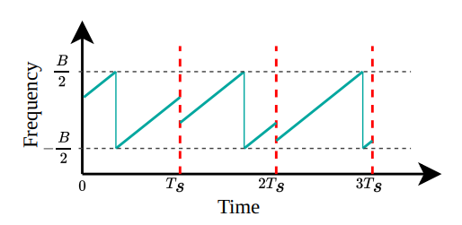
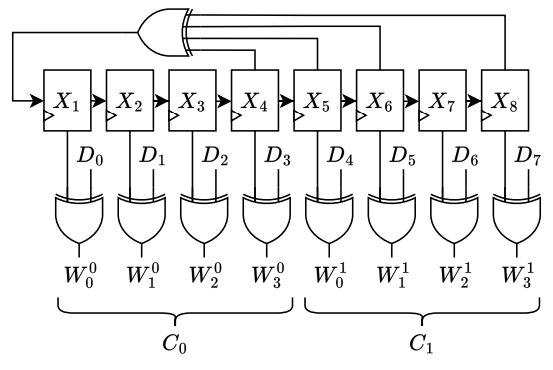
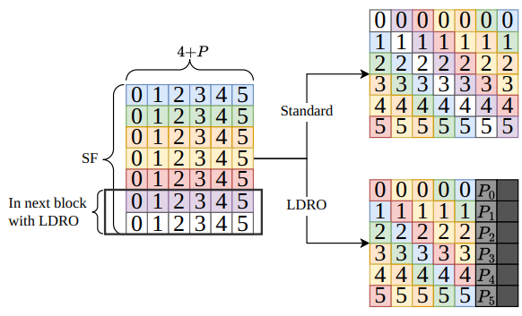
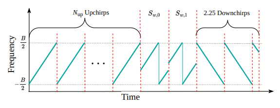
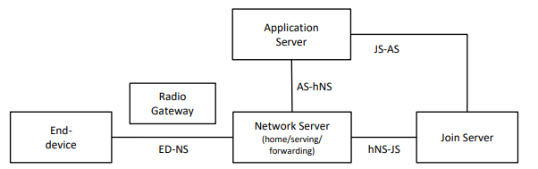

СОДЕРЖАНИЕ

# Оглавление

[Введение [5](#_Toc219672752)](#_Toc219672752)

[1 Постановка задачи [7](#постановка-задачи)](#постановка-задачи)

[1.1. Определение задач [7](#определение-задач)](#определение-задач)

[2 Обзорная часть [8](#обзорная-часть)](#обзорная-часть)

[2.1. Физический уровень LoRa
[8](#физический-уровень-lora)](#физический-уровень-lora)

[2.1.1. Модуляция с расширением спектра методом линейной частотной
модуляции
[8](#модуляция-с-расширением-спектра-методом-линейной-частотной-модуляции)](#модуляция-с-расширением-спектра-методом-линейной-частотной-модуляции)

[2.1.2. Структура кадра LoRa
[9](#структура-кадра-lora)](#структура-кадра-lora)

[2.1.3. Взбалтывание [11](#взбалтывание)](#взбалтывание)

[2.1.4. Заголовок [11](#заголовок)](#заголовок)

[2.1.5. Перемежение [12](#перемежение)](#перемежение)

[2.1.6. Преобразование в код Грея
[14](#преобразование-в-код-грея)](#преобразование-в-код-грея)

[2.1.7. Преамбула [14](#преамбула)](#преамбула)

[2.1.8. Параметры модуляции LoRa
[15](#параметры-модуляции-lora)](#параметры-модуляции-lora)

[2.2 LoRaWAN [16](#lorawan)](#lorawan)

[2.2.1. Модель сети [16](#модель-сети)](#модель-сети)

[2.2.2. Активация конечного устройства
[18](#активация-конечного-устройства)](#активация-конечного-устройства)

[2.2.3. Adaptive Data Rate
[19](#adaptive-data-rate)](#adaptive-data-rate)

[2.3. Meshtastic [20](#meshtastic)](#meshtastic)

[2.3.1. Модель сети [20](#модель-сети-1)](#модель-сети-1)

[2.3.2. Стек протоколов [21](#стек-протоколов)](#стек-протоколов)

[2.3.3. Пресеты модема и частотные планы
[22](#пресеты-модема-и-частотные-планы)](#пресеты-модема-и-частотные-планы)

[2.3.4. Интерфейсы управления
[22](#интерфейсы-управления)](#интерфейсы-управления)

[2.4. MeshCore [23](#meshcore)](#meshcore)

[2.4.1. Модель сети [23](#модель-сети-2)](#модель-сети-2)

[2.4.2. Стек протоколов и особенности
[23](#стек-протоколов-и-особенности)](#стек-протоколов-и-особенности)

[2.4.3. Интерфейсы и управление
[24](#интерфейсы-и-управление)](#интерфейсы-и-управление)

[2.5. Reticulum [24](#reticulum)](#reticulum)

[2.5.1. Модель сети [24](#модель-сети-3)](#модель-сети-3)

[2.5.2. Стек протоколов и особенности
[25](#стек-протоколов-и-особенности-1)](#стек-протоколов-и-особенности-1)

[2.6. Сравнение сетевых стеков
[26](#сравнение-сетевых-стеков)](#сравнение-сетевых-стеков)

[2.7. Обзор существующих решений эмуляции и симуляции LoRa-сетей
[27](#обзор-существующих-решений-эмуляции-и-симуляции-lora-сетей)](#обзор-существующих-решений-эмуляции-и-симуляции-lora-сетей)

[СПИСОК ЛИТЕРАТУРЫ [28](#_Toc230910473)](#_Toc230910473)

Введение

В современных условиях возрастающей зависимости от централизованных
систем связи (сотовых сетей, интернета) особую актуальность приобретают
децентрализованные системы связи. Одним из востребованных решений
является технология Meshtastic — открытый проект, реализующий
децентрализованную mesh-сеть для приемо-передатчиков LoRa.

Технология LoRa (Long Range) использует запатентованную модуляцию с
расширением спектра методом линейной частотной модуляции. Данная
модуляция обеспечивает высокую помехоустойчивость и дальность передачи
при минимальном энергопотреблении, что делает её основой большинства
LPWAN-решений. LoRaWAN является стандартным протоколом сетевого уровня
поверх LoRa, а Meshtastic реализует поверх LoRa децентрализованную
mesh-маршрутизацию.

При разработке распределённых беспроводных систем, таких как mesh-сети,
ключевой задачей является корректная оценка поведения радиоканала.
Экспериментальная проверка таких систем в реальных условиях требует
значительных материальных и временных ресурсов: необходимо несколько
физических устройств, возможность их размещения на требуемых
расстояниях, а повторяемость экспериментов существенно ограничена. В
связи с этим особую актуальность приобретают программные методы эмуляции
физического уровня радиоканала.

Одним из подходов является концепция Software-in-the-Loop (SITL), при
которой встроенное программное обеспечение и алгоритмы выполняются на
хост-компьютере путём запуска в виртуальной среде. В отличие от
Hardware-in-the-Loop (HITL), где используются реальные физические
компоненты, SITL позволяет эмулировать все уровни программно, что
снижает затраты и обеспечивает высокую воспроизводимость экспериментов.

Настоящая работа посвящена разработке программного эмулятора LoRa
mesh-сети на базе реальной прошивки Meshtastic с применением подхода
SITL. Документ включает описание физического уровня LoRa, протоколов
LoRaWAN и Meshtastic, архитектуры разработанного программного
обеспечения и результатов его работы.

# Постановка задачи

## Определение задач

Цель работы — разработка программного SITL-эмулятора полного стека
Meshtastic, позволяющего эмулировать поведение сети на всех уровнях без
использования физических устройств.

Для достижения цели были поставлены следующие задачи:

1.  Разработать модель канала связи, реализующую распространение
    IQ-сигналов между виртуальными узлами с учетом затухания и шума.

2.  Реализовать описание узлов в виде двух независимых графов обработки
    сигналов (путь приема и передачи) на базе фреймворка FutureSDR.

3.  Разработать механизм, связывающий узлы FutureSDR с моделью канала
    связи (блоки Signal Subscriber и Signal Publisher через каналы
    crossbeam)

4.  Реализовать виртуальный драйвер для эмуляции физического интерфейса
    Meshtastic

5.  Реализовать базовый графический интерфейс для управления
    виртуальными узлами и конфигурацией сети.

Ограничения и допущения:

> Модель затухания — свободное пространство (d-3),
> многолучевое распространение не моделируется.

# Обзорная часть

## Физический уровень LoRa

Среди множества технологий сетей дальнего радиуса действия с низким
энергопотреблением LoRaWAN стал одним из самых популярных и широко
распространённых решений. LoRa является физическим уровнем технологии
маломощных сетей дальнего радиуса (LPWAN).

LoRa использует запатентованную модуляцию с расширением спектра методом
линейной частотной модуляции (или расширение спектра с помощью чирпов).
Данная модуляция используется вместе с помехоустойчивым кодированием и
перемежением.

Протокол LoRaWAN является открытым стандартом, но физический уровень,
называемый LoRa, запатентован (Seller & Sornin U.S. Patent 9 252 834) и
является собственностью компании, что послужило причиной обратного
проектирования для понимания структуры кадров, кодирования и модуляции.

###  Модуляция с расширением спектра методом линейной частотной модуляции 

LoRa использует модуляцию, которая определяется двумя параметрами
передачи: коэффициентом расширения спектра (SF) и шириной пропускания
(BW).

Каждый символ состоит из N = 2SF чипов. Каждому значению
символа s соответствует определённый циклический сдвиг начальной
частоты,

где s ∈ {0, ..., N}.

Время передачи одного символа:

$$T\_{s} = \frac{N}{BW}$$

Символ кодируется как chirp-сигнал, в котором частота линейно нарастает
от –BW/2 до +BW/2 за время Ts, после чего циклически повторяется.
Циклический сдвиг, соответствующий значению символа s, определяет
начальную частоту chirp-а.

На приёмной стороне для демодуляции применяется операция умножения
принятого сигнала на down-chirp с последующим FFT — пик FFT
соответствует номеру символа.

Рисунок 2.1 — Спектрограмма c границами символов LoRa

Ключевые свойства CSS-модуляции:

Устойчивость к допплеровскому сдвигу: частотный сдвиг сигнала
проявляется как временной сдвиг в демодуляторе, который компенсируется
алгоритмом синхронизации.

Устойчивость к многолучевому распространению: расширение спектра снижает
влияние интерференции от отражений.

### Структура кадра LoRa

Существуют два вида фрейма, explicit и implicit. Отличие в наличие
заголовка, который присутствует только в explicit-кадрах. Через
заголовок кадр задает скорость помехоустойчивого кодирования (CR 4/5,
4/6, 4/7, 4/8) и наличие 2 байт контрольной суммы (CRC) в конце кадра.

Кадр состоит из преамбулы, заголовка (только для explicit), полезной
нагрузки и контрольной суммы. (Рисунок 2.2)

Рисунок 2.2 — структура кадра LoRa

>  style="width:4.95836in;height:4.94186in" />

Рисунок 2.3 — структура кодирования, взбалтывания и перемежения в кадре
LoRa

###  Взбалтывание

Операция взбалтывания рандомизируют битовые последовательности и
уменьшают вероятность появления длинных серий единиц или нулей на основе
операции суммы по модулю 2, для предотвращения проблем при передаче
данных. Взбалтывается только полезная нагрузка (Рисунок 2).

Псевдослучайная последовательность сгенерирована регистром сдвига с
линейной обратной связью.

Полином обратной связи:
*x*8 + *x*6 + *x*5 + *x*4 + 1

Рисунок 2.4 — Функциональная схема сбалтывания для одного байта данных

###  Заголовок 

Заголовок используется для передачи информации, которая необходима для
декодирования кадра. Состоит из длины полезной нагрузки, наличия CRC для
полезной нагрузки, скорость кодирования и контрольной суммы для
заголовка.

Рисунок 2.5 — Структура заголовка кадра LoRa ( L - байт для длины
полезной нагрузки, C - используется ли CRC, P - скорость кодирования,
H - CRC для заголовка)

CRC заголовка вычисляется по формуле: $H\_{CRC} = G \cdot \overline{h}$,
где
$\overline{h} = \left\lbrack L\_{7}\\,\\ L\_{6}\\,\\\ldots\\,\\ C\\ \right\rbrack$
является вектором битов, G генераторной матрицей:

$$G = \begin{bmatrix}
1 & 1 & 1 & 1 & 0 & 0 & 0 & 0 & 0 & 0 & 0 & 0 \\
1 & 0 & 0 & 0 & 1 & 1 & 1 & 0 & 0 & 0 & 0 & 1 \\
0 & 1 & 0 & 0 & 1 & 0 & 0 & 1 & 1 & 0 & 1 & 0 \\
0 & 0 & 1 & 0 & 0 & 1 & 0 & 1 & 0 & 1 & 1 & 1 \\
0 & 0 & 0 & 1 & 0 & 0 & 1 & 0 & 1 & 1 & 1 & 1
\end{bmatrix}$$

### Перемежение

Перемежение используется для распределения битов кодового слова для
улучшения возможности исправления ошибок кода.

Размер блока перемежителя задается количеством битов в кодовом слове

4 + P, где P количество битов четности, и используемом коэффициентом
расширения спектра (SF).

Перемежитель берет двоичную матрицу D размером *S**F* ⋅ (4 + *P*), в
которой каждая строка является словом.  
Диагональное перемежение определяется уравнением

*I**i*, *j* = *D*\[*i* − (*j* + 1)\] *m**o**d* *S**F*, *i*  ,

где *i* ∈ {0, …, 3 + *P*} и *j* ∈ {0, … , *S**F* − 1}

В LoRa eсть оптимизированный режим низкой скорости передачи данных
(LDRO), который уменьшает количество битов в блоке перемежителя до
(*S**F* − 2) ⋅ (4 + *P*). После перемежения к каждому кодовому слову
добавляется бит четности, значение которого определяется:

*P*= *B*0 ⊕ *B*1 ⊕ … ⊕ *B**S**F* − 2 

Рисунок 2.6 — Иллюстрация отличия перемежения с оптимизацией (P = 2, CR
= 4/6, SF = 7)

Для полного декодирования кадра приемнику нужно знать длину полезной
нагрузки, наличие CRC и кодовую скорость. Однако приемник не знает
заголовок до декодирования первого блока перемежителя (Рисунок 2.2). Для
этого первый блок перемежителя кодируется с наиболее надежной кодовой
скоростью CR = 4/8, для SF &gt; 6 используется с включенным LDRO.

Важно отметить, что первый блок всегда использует CR = 4/8, даже если
это передача implicit кадра.

### Преобразование в код Грея

Каждая строка перемеженной матрицы интерпретируется как двоичные
значения. Операция преобразования в код Грея используется для
преобразования значений, закодированных кодом Грея, в десятичное число.
После преобразования Грея каждый символ s отличается от соседних
символов только одним битом.

Преобразование, используемое LoRa задается формулой:

*s* = \[*I**i*  ⊕ (*I**i* ≫ 1)  + 1\] *m**o**d* *S**F*,
где *I**i* - i-я строка матрицы

Преобразование Грея используемое LoRa включает произвольное смещение +1
к преобразованным значениям.

###  Преамбула

Для синхронизации кадр LoRa начинается с преамбулы. Преамбула содержит
Nup восходящих чирпов, затем 2 символа называемых сетевым
идентификатором и в конце 2.25 нисходящих чирпов. (Рисунок 2.7) . Число
Nup  ∈ {0, … , 65535 } , где 8 является наиболее
распространённым.

Типовое значение сетевого идентификатора 0x34 для LoRaWAN или 0x12 для
частных сетей.

Значение может быть в диапазоне Sw ∈ {10*h*, … , *F**F**h* }.
Некоторые приемопередатчики определяют сетевой идентификатор как 16
битное значение, которое эквивалентно 8 битному через соотношение:

*X**Y**h* = *X*4*Y*4*h*

Разбивание сетевого идентификатора на слова Sw0 и
Sw1 задаются через соотношения:

*S**w*0 = (*S**w* ≫ 4) \* 8

*S**w*1 = (*S**w* & 0*x*0*F*) \* 8

Рисунок 2.7 — Спектрограмма преамбулы кадра LoRa

###  Параметры модуляции LoRa

SF (Spreading Factor, 7–12) — коэффициент расширения спектра. Определяет
количество чипов на символ (N = 2^SF). Увеличение SF повышает дальность
и чувствительность, но снижает скорость передачи данных. SF7
обеспечивает наибольшую скорость (~5,47 кбит/с при BW=125кГц), SF12 —
наибольшую дальность (~0,29 кбит/с).

BW (Bandwidth) — ширина полосы пропускания. Поддерживаемые значения:
62,5; 125; 250; 500кГц. Увеличение BW повышает скорость передачи, но
снижает чувствительность приёмника.

CR (Code Rate, 4/5–4/8) — скорость помехоустойчивого кодирования кодом
Хэмминга. CR 4/5 добавляет минимальную избыточность (1 бит на 4), CR 4/8
— максимальную (4 бита на 4). Увеличение избыточности повышает
устойчивость к ошибкам за счёт снижения скорости.

LDRO (Low Data Rate Optimization) — режим оптимизации для низких
скоростей передачи. Уменьшает размер блока перемежителя с SF·(4+P) до
(SF−2)·(4+P).

##  

##  LoRaWAN

LoRaWAN — это MAC-протокол, ориентированный на передачу данных на
большие расстояния при минимальном энергопотреблении. Описывает
организацию сети поверх физического уровня LoRa.

### Модель сети

Основные компоненты сети LoRaWAN:

**Конечное устройство (End-device)** — это датчик, исполнительный
механизм, либо устройство, совмещающее оба типа. Может содержать набор
датчиков и управляемых элементов. Обмен данными происходит через
радиошлюз.

**Радиошлюз (Radio Gateway)** работает полностью на физическом уровне.

Uplink (восходящий канал) – декодирует принятые радиопакеты и передает
их на сетевой сервер без обработки.

Downlink (нисходящий канал) – запросы от сетевого сервера передаются к
конечному устройству.

**Сетевой сервер (Network server)** — Центральный управляющий элемент
LoRaWAN сети. Каждый сетевой сервер имеет один или более ID (IEEE
EUI64). Сетевой сервер выполняет функции:

- Проверки адреса конечного устройства, и кадров.

- Механизм подтверждения.

- Адаптация скорости передачи данных.

- Отправка ответов на MAC-запросы, поступающего от конечного устройства.

- Пересылка полученных сообщений uplink с конечного устройства на
  соответствующий сервер приложения.

- Постановка в очередь сообщений downlink на отправку с любого сервера
  приложений на конечное устройство.

- Пересылка рукопожатий между конечным устройством и сервером активации.

**Сервер активации (Join Server)** — Отвечает за процедуру активации по
воздуху (OTA). Его функции:

- Обработка Join-request кадра от конечных устройств.

- Отправка Join-accept кадра и передача на конечное устройство

- Генерация ключа сеанса сети (Network Session Key) для обмена между
  конечным устройством и сетевым сервером.

- Генерация ключа сеанса приложения (Application Session Key) для обмена
  между сетевым сервером и сервером приложений.

Для генерации ключей Join server должен иметь следующие данные:

- DevEUI , глобальный id конечного устройства.

- AppKey.

- NwkKey (только для конечного устройства LoRaWAN v.1.1)

- ID сетевого сервера и сервера приложений.

- Версия LoRaWAN конечного устройства.

AppKey и NwkKey – root ключи. Объявлены только у конечного устройства и
у сервера активации, и никогда не отправляются ни в сетевой сервер, ни в
сервер приложения.

**Сервер приложений (Application Server)** — обрабатывает все данные
полученные от конечного устройства и отображает пользователю. Также
генерирует на уровне приложений downlink запросы.

>  style="width:5.60069in;height:1.75833in" />
>
> Рисунок 2.8 — Модель частной сети LoRaWAN.

### Активация конечного устройства

Существуют два вида активации конечного устройства в сети LoRaWAN:

1.  ABP (Activation by Personalization) — статическая активация.

В данном случае все ключи и параметры устройства задаются вручную до
подключения к сети, без использования Join-request(JoinEUI).

\- Конечное устройство получает DevAddr, AppSkey, сетевые ключи сессии
(SNwkSIntKey, FNwkSIntKey, NwkSEncKey). Данные параметры заданы
производителем или сконфигурированы пользователем.

\- После включения устройство сразу может передавать данные, не проходя
активацию.

Условия со стороны сервера:

1.  Сетевой сервер должен быть настроен с DevAddr и сетевыми ключами.

2.  Сервер приложений должен иметь одинаковый DevAddr и AppSKey для
    декодирования.

<!-- -->

1.  OTA (Over the Air) – динамическая активация

Процедура включает Join-request(JoinEUI) и получение сгенерированных
ключей от сервера активации (Join Server):

\- Изначально конечное устройство – Generic Device

> \- После привязки к сети (commissioning) оно становится Commissioned
> Device.

\- При успешной активации — OTA Activated Device.

> \- Конечное устройство может быть деактивировано по инициативе сервера
> или пользователя, через процедуру Exit.

\- Повторная активация приведет к созданию нового LoRaWAN сеанса.

Рисунок 2.9 — Два типа активации конечного устройства в сети LoRaWAN.

Generic Device — только DevEUI и корневые ключи (AppKey, NwkKey)

Commissioned Device — устройство связано с сетью.

OTA Activated Device — сервер активации активировал устройство. передав
сгенерированные ключи (Network Session Key) конечному устройству.

### Adaptive Data Rate

ADR (Adaptive data rate) — механизм оптимизации использования
радиоканала, при котором сетевой сервер управляет параметрами передачи
конечного устройства.

> Алгоритм ADR на стороне сервера:

1\. Сервер накапливает историю SNR последних 20 пакетов uplink.

2\. Вычисляется максимальное SNR: SNR\_max.

3\. Запас по линку: Margin = SNR\_max − SNR\_required(DR\_current) − 10
дБ.

4\. Если Margin &gt; 0, сервер снижает SF (повышает DR) на Margin / 3
ступени.

5\. Если устройство не отвечает на несколько последовательных запросов
LinkADRReq, оно увеличивает SF (снижает DR) вплоть до максимального.

## Meshtastic

Meshtastic — открытый проект, реализующий децентрализованную mesh-сеть
для LoRa приёмопередатчиков. В отличие от LoRaWAN, не требует
централизованной инфраструктуры (шлюзов, серверов).

### Модель сети

Meshtastic использует децентрализованную mesh-топологию на основе
управляемого затопления (managed flooding). Каждый узел, получивший
пакет впервые, ретранслирует его (с учётом счётчика hop\_limit).

Роли узлов:

CLIENT — стандартный узел с интерфейсом пользователя
(Bluetooth/WiFi/Serial).

CLIENT\_MUTE — принимает пакеты, но не ретранслирует.

ROUTER — оптимизирован для ретрансляции, не имеет пользовательского
интерфейса.

ROUTER\_CLIENT — совмещает функции ROUTER и CLIENT.

REPEATER — ретранслирует пакеты с максимальным приоритетом.

TRACKER — оптимизирован для периодической отправки данных о
местоположении.

Параметр hop\_limit (по умолчанию 3) ограничивает максимальное число
ретрансляций пакета и предотвращает зацикливание. Уникальный
идентификатор пакета (packet\_id + sender) позволяет каждому узлу
отбросить уже обработанный пакет.

Роли позволяют регулировать частоту передачи и приоритеты ретрансляции,
что важно в плотных сетях или при построении стационарных узлов.

### Стек протоколов

Meshtastic реализиует полный стек уровней:

Таблица 2.1 Уровни в meshtastic

<table style="width:67%;">
<colgroup>
<col style="width: 33%" />
<col style="width: 33%" />
</colgroup>
<thead>
<tr>
<th>Название уровня</th>
<th>Реализация в meshtastic</th>
</tr>
</thead>
<tbody>
<tr>
<td>Уровень приложений</td>
<td>Текстовые сообщения</td>
</tr>
<tr>
<td>Уровень представлений</td>
<td>Protobuf, шифрование</td>
</tr>
<tr>
<td>Транспортный уровень</td>
<td style="text-align: center;">hop-by-hop ACK</td>
</tr>
<tr>
<td>Сетевой уровень</td>
<td>Адресация, hop лимиты</td>
</tr>
<tr>
<td>Канальный уровень</td>
<td>MeshPacket</td>
</tr>
<tr>
<td>Физический уровень</td>
<td>LoRa PHY</td>
</tr>
</tbody>
</table>

Описание уровней:

Физический уровень полностью основан на стандарте LoRa. Используется
CSS-модуляция с настраиваемыми параметрами: BW, SF, CR и LDRO.

Канальный уровень определяет формат кадров — MeshPacket. На этом уровне
обеспечивается доставка только между узлами в пределах видимости.
Выполняются функции:

Сетевой уровень ретранслирует пакеты при hop\_limit &gt; 0, выполняет
адресацию по 32-битными идентификаторами узлов, поддерживает broadcast и
unicast. Meshtastic не делит сеть на логические подсети, а разделяет по
физичиской досягаемости (количество хопов).

На транспортном уровне надежная доставка реализована только между
соседними узлами. Сквозная надежная доставка от отправителя до конечного
получателя на уровне стека отсутствует.

Уровень представлений выполняет обработку данных (сериализация protobuf,
шифрование)

Уровень приложения: мобильное приложение, web-интерфейс, мессенджеры и
т.д.

### Пресеты модема и частотные планы

Meshtastic предлагает набор предопределенных настроек, которые позволяют
балансировать между дальностью связи, скоростью передачи данных и
устойчивостью к помехам. Каждый пресет определяет комбинацию параметров
LoRa: BW, SF, CR и LDRO.

Доступные частоты и слоты берутся из настроек регионов в Meshtastic.

Рисунок 2.10 — Частотные слоты для разных полос пропускания для региона
RU

### Интерфейсы управления

Прошивка Meshtastic поддерживает несколько интерфейсов управления и
конфигурирования устройства.

Основные интерфейсы управления:

Bluetooth, Serial (UART/USB), TCP/IP (Ethernet/Wi-Fi), MQTT.

Вся конфигурация основана на protocol buffers (protobuf), где можно
переопределить имя устройства, роль узла, параметры радио, управление
интерфейсами и другими настройками которые есть в документации \[2\].

Для программного управления рекомендуется использовать Meshtastic python
api библиотеку.

## MeshCore

MeshCore — это новый открытый протокол и прошивка для создания
децентрализованных LoRa mesh-сетей, позиционируемый как более
структурированная и масштабируемая альтернатива Meshtastic. Проект
появился в 2024-2025 годах.

### Модель сети

MeshCore использует гибридный подход к маршрутизации с разделением ролей
устройств. В отличии от meshtastic, где почти все узлы могут
ретранслировать трафик, meshcore строит сеть вокруг выделенных
ретрансляторов.

Основные роли устройств:

Companion — клиентское устройство. Не ретранслирует сообщения других
узлов, только отправляет и получает свои.

Repeater — Инфраструктурный ретранслятор. Основной элемент сети,
отвечает за пересылку сообщений. Станционарный компонент сети.

Room Server — сервер для хранения и распространения сообщений.

Алгоритм маршрутизации:

\- Основной режим — структурированная маршрутизация через известные
Repeaters.

\- При отсутствии маршрута используется flooding или fallback

\- Максимальное количество хопов — до 64.

\- Поддерживается явное указание пути сообщения.

### Стек протоколов и особенности

MeshCore использует собственный легкий протокол. Поддерживает end-to-end
шифрование. В отличие от Meshtastic работает с более жестким контролем
доступа к среде и уменьшенным количеством ретрансляций.

Ключевые отличия от Meshtastic:

- Клиенты (Companion) не ретранслируют трафик других пользователей.

- Pull модель для телеметрии и позиций (данные запрашиваются, а не
  постоянно отправляются)

- Улучшенная аналитика, просмотр маршрутизации пакетов и связей

> Данные отличия позволяют проще и эффективнее расширять инфраструктуру
> на MeshCore в отличие от Meshtastic.

### Интерфейсы и управление

Интерфейсы управления такие же, как и в meshtastic:

\- мобильные приложения;

\- веб-интерфейс

\- Bluetooth, Serial (UART/USB), TCP/IP (Ethernet/Wi-Fi), MQTT.

Или python-клиент или javascript библиотеки для управления и
взаимодействия с сетью.

## Reticulum

Reticulum — это криптографически адресованный сетевой стек. Разработан
как альтернатива традиционным IP-сетям для среды с ненадежными каналами
связи.

### Модель сети

Reticulum не привязан к определенному физическому интерфейсу и может
работать поверх любых интерфейсов: Wi-Fi, Ethernet, LoRa и других.

Ключевые концепции:

\- Destination — вместо традиционных IP-адресов используются
криптографические идентификаторы (128-битный публичный ключ)

\- Самоконфигурирующаяся многохоповая маршрутизация

\- Поддержка высоких задержек и низкой пропускной способности

\- Transport Nodes — узлы, выполняющие ретрансляцию

\- Instances — конечные пользовательские узлы

Reticulum работает в децентрализованном режиме с элементами
инфраструктуры, объединяя разные физические интерфейсы в единую сеть.

### Стек протоколов и особенности

Reticulum реализует полный сетевой стек с акцентом на криптографию.

Типы получателей (Destination):

- Одиночный, шифрование end-to-end

- Групповой

- Plain, без шифрования

- Link, установка зашифрованного канала (PFS)

Отсутствует фиксированная топология, узлы обнаруживают маршруты через
механизм Announce.

Механизм Announce: узлы периодически рассылают объявления со своим
адресом и публичным ключом. Transport Nodes накапливают эти объявления и
строят таблицу маршрутизации, отслеживая количество hop до каждого.

> Типы пакетов:

Announce (объявление), Packet (передача данных без установки
соединения), Link request/proof (установка зашифрованного канала)

Основные характеристики:

\- End-to-end шифрование, анонимность и защита метаданных

> \- Сообщения-ориентированный подход. Каждое сообщение передается как
> целостная единица с гарантией доставки или уведомлением об ошибке.
> Данный принцип лучше подходит для сетей с высокой задержкой.
>
> \- Автоматическая сборка и фрагментация сообщений с поддержкой
> повторной передачи.
>
> \- Многоинтерфейсная работа — стек может одновременно использовать
> несколько физических интерфейсов и динамически выбирать оптимальный
> путь.
>
> \- Динамическая маршрутизация на основе криптографических
> идентификаторов.
>
> \- Устойчивость к длительным задержкам и нестабильным каналам связи.

## Сравнение сетевых стеков

Для объективной оценки технологий, рассмотренных ранее, ниже приведено
сравнение LoRaWAN, Meshtastic, MeshCore и Reticulum.

Таблица 2.2 — Сравнение характеристик

<table style="width:100%;">
<colgroup>
<col style="width: 19%" />
<col style="width: 18%" />
<col style="width: 20%" />
<col style="width: 20%" />
<col style="width: 20%" />
</colgroup>
<thead>
<tr>
<th>Параметр</th>
<th>LoRaWAN</th>
<th>Meshtastic</th>
<th>MeshCore</th>
<th>Reticulum</th>
</tr>
</thead>
<tbody>
<tr>
<td>
Архитектур

Топология
</td>
<td>Централизованная, Звезда</td>
<td>Децентрализованная, Mesh</td>
<td>Децентрализованная, Mesh</td>
<td>Децентрализованная, Мульти-интерфейсный mesh</td>
</tr>
<tr>
<td>Требования инфраструктуры</td>
<td>Да</td>
<td>Нет</td>
<td>Минимально</td>
<td>Нет</td>
</tr>
<tr>
<td>Максимальное кол-во хопов</td>
<td>1</td>
<td>7</td>
<td>64</td>
<td>Не ограничено</td>
</tr>
<tr>
<td>Масштабируемость</td>
<td>1000 узлов на шлюз</td>
<td>До 1000 узлов</td>
<td>До 3000 узлов</td>
<td>Не ограничено</td>
</tr>
<tr>
<td>Интерфейсы</td>
<td>Только LoRa</td>
<td>Только LoRa</td>
<td>Только LoRa</td>
<td>Любой</td>
</tr>
<tr>
<td>Сложность развертывания</td>
<td>
Высокая

(нужна инфраструктура)
</td>
<td>Низкая</td>
<td>Низкая</td>
<td>Высокая (наличие навыков разработчика)</td>
</tr>
</tbody>
</table>

Выводы: LoRaWAN подходит для стационарных IoT-систем с централизованным
управлением и доступом к инфраструктуре.

Meshtastic — лучшее решение для мобильных mesh-сетей с быстрым
развертыванием.

MeshCore подходит для построения более крупных региональных mesh-сетей.

Reticulum предлагает гибкую архитектуру, с работой по разным каналам.

## Обзор существующих решений эмуляции и симуляции LoRa-сетей

Анализ существующих инструментов позволяет выявить их ключевые
ограничения.

Таблица 2.3 — Сравнение существующих инструментов эмуляции и симуляции
LoRa-сетей.

<table>
<colgroup>
<col style="width: 24%" />
<col style="width: 25%" />
<col style="width: 25%" />
<col style="width: 25%" />
</colgroup>
<thead>
<tr>
<th>Решение</th>
<th style="text-align: center;">Физ. уровень</th>
<th style="text-align: center;">Сетевой уровень</th>
<th style="text-align: center;">Реальное ПО</th>
</tr>
</thead>
<tbody>
<tr>
<td>GNURadio, gr-lora</td>
<td style="text-align: center;">DSP</td>
<td style="text-align: center;">Нет</td>
<td style="text-align: center;">—</td>
</tr>
<tr>
<td>ns-3</td>
<td style="text-align: center;">Вероятностный</td>
<td style="text-align: center;">LoRaWAN</td>
<td style="text-align: center;">Нет</td>
</tr>
<tr>
<td>OMNeT++/FLoRa</td>
<td style="text-align: center;">Вероятностный</td>
<td style="text-align: center;">LoRaWAN</td>
<td style="text-align: center;">Нет</td>
</tr>
<tr>
<td>LoRaSim</td>
<td style="text-align: center;">Вероятностный</td>
<td style="text-align: center;">Нет</td>
<td style="text-align: center;">—</td>
</tr>
<tr>
<td>Meshtasticator</td>
<td style="text-align: center;">Вероятностный</td>
<td style="text-align: center;">Meshtastic</td>
<td style="text-align: center;">Да</td>
</tr>
<tr>
<td>Данная работа</td>
<td style="text-align: center;">DSP</td>
<td style="text-align: center;">Meshtastic</td>
<td style="text-align: center;">Да</td>
</tr>
</tbody>
</table>

GNURadio с gr-lora\_sdr — реализует DSP-цепочку физического уровня LoRa.
Достоинство: полная верификация физического уровня. Ограничение: нет
поддержки сетевого уровня и реальной прошивки; требует вычислительных
ресурсов.

Ns-3 (LoRaWAN module) — дискретно-событийный симулятор с моделью
LoRaWAN. Достоинство: масштабируемость, поддержка большого числа узлов.
Ограничение: упрощенная вероятностная модель физического уровня; нет
поддержки Meshtastic; не использует реальную прошивку.

OMNeT++ / FLoRa — аналогичен ns-3 по классу инструментов. Предоставляют
вероятностные модели LoRa – канала и LoRaWAN. Ограничения те же, что и в
ns-3.

LoRaSim — Python-симулятор, оценивающий вероятность успешной доставки
пакета в сети LoRaWAN. Ограничение: отсутствует реализация сетевого
стека.

Meshtasticator — симулятор, специально разработанный для Meshtastic.
Реализует модель канала и алгоритм маршрутизации Meshtastic.
Достоинство: запускает реальную прошивку. Ограничение использует
упрощенную вероятностную модель физического уровня; сложность
использования и отсутствует документация по использованию.

Вывод: ни одно из рассмотренных решений не совмещает DSP-модель
физического уровня с запуском реальной прошивки.

# Программное обеспечение

СПИСОК ЛИТЕРАТУРЫ

1.  RF-SITL: A Software-in-the-loop Channel Emulator for UAV Swarm
    Networks Nicholas Mastronarde, Daniel Russell, Zhangyu Guan 2022

<!-- -->

1.  <https://m17-protocol-specification.readthedocs.io/en/latest/kiss_protocol.html>
    KISS Protocol (08.01.2026)

2.  <https://reticulum.network/manual/index.html> Reticulum Network
    Stack Manual (09.01.2026)

3.  <https://www.futuresdr.org/learn/introduction.html> FutureSDR
    documentation (07.01.2026)

4.  <https://www.futuresdr.org/blog/are-we-lora/> LoRa for FutureSDR
    implemented overview (07.01.2026)

5.  <https://meshtastic.org/docs/introduction/> Meshtastic documentation
    (08.01.2026)
