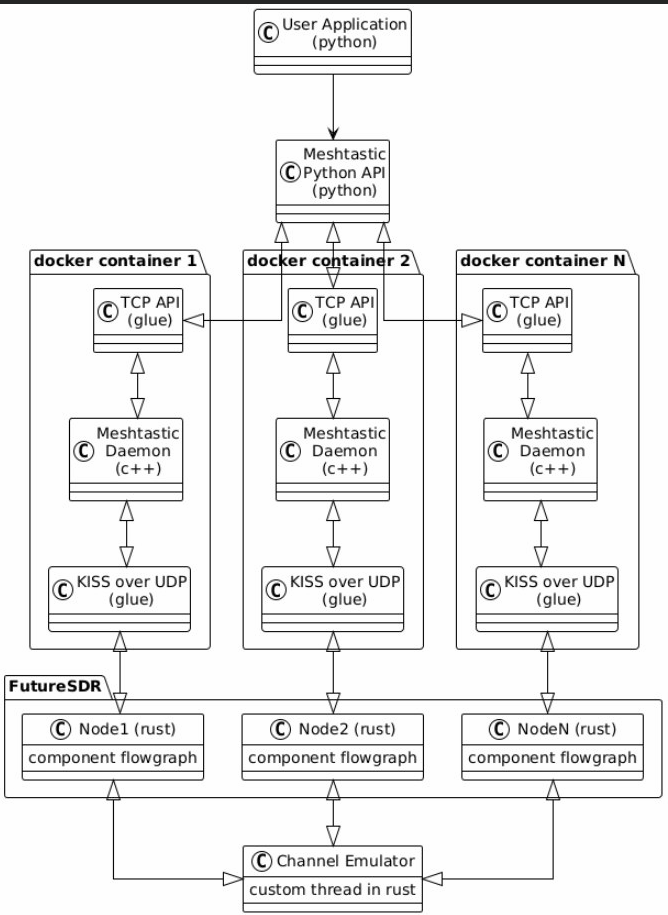
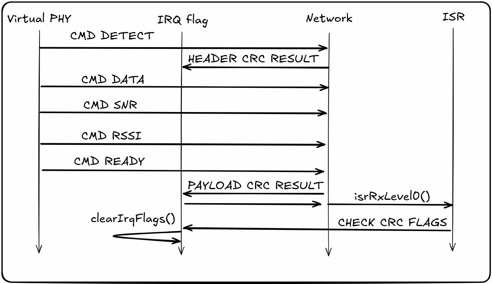

СОДЕРЖАНИЕ

# 

[ВВЕДЕНИЕ [4](#_Toc219672752)](#_Toc219672752)

[1 Архитектура эмулятора
[5](#архитектура-эмулятора)](#архитектура-эмулятора)

[2 Реализация физической части
[7](#реализация-физической-части)](#реализация-физической-части)

[2.1 Модель работы канала связи
[7](#модель-работы-канала-связи)](#модель-работы-канала-связи)

[2.2 Модель работы узла [8](#модель-работы-узла)](#модель-работы-узла)

[3 Описание работы KISS команд
[9](#описание-работы-kiss-команд)](#описание-работы-kiss-команд)

[ЗАКЛЮЧЕНИЕ [11](#_Toc175926239)](#_Toc175926239)

[СПИСОК ЛИТЕРАТУРЫ [12](#_Toc175926240)](#_Toc175926240)

­­

ВВЕДЕНИЕ

При разработке распределенных беспроводных систем, такие как mesh-сети,
ключевой задачей является корректная оценка поведения радиоканала при
одновременной передаче от множества узлов. Экспериментальная проверка
таких систем в реальных условиях требует значительных ресурсов. В связи
с этим особую актуальность приобретают программные методы эмуляции
физического уровня радиоканала.

Одним из подходов является концепция Software-in-the-Loop (SITL), при
которой встроенное программное обеспечение и алгоритмы выполняются на
хост-компьютере, путем запуска в виртуальной среде.

Такая эмуляция обеспечивает создание контролируемой и воспроизводимой
среды для тестирования, позволяя анализировать поведение системы в
условиях, которые сложно воссоздать в реальности, что делает его
идеальным для сложных систем.

Целью данной практической части является реализация модели
многоканального радиоканала с использованием инструмента FutureSDR и
интеграции с сетевым стеком.

# Архитектура эмулятора

На изображении (Рисунок 1)
показана архитектура разрабатываемого программного симулятора
предназначенного для моделирования работы сети Meshtastic включая
эмуляцию физического уровня и работы канала с помощью FutureSDR.

Рисунок 1 — Многоуровневая архитектура SITL.

> Архитектура состоит из следующих компонентов:

\- Channel Emulator: Эмулятор канала связи (среда). Данный компонент
связывает все узлы между собой.

\- Node 1..N: Узлы приемопередатчиков описавыемые с помощью графов в
FutureSDR.

\- KISS (Keep It Simple, Stupid) over UDP: Компонент реализующий
управление узлом и принятие данных и событий с узла с помощью KISS
команд отправляемых через UDP сокеты.

\- Meshtastic daemon: Процесс meshtastic, таже самая программа, что
работает на реальных устройствах.

\- TCP API: Сервер реализующий управление процессом meshtastic.

\- Meshtastic python API: Клиент для TCP сервера в процессе meshtastic.

\- User Application: Приложение через которое пользователь
взаимодействует с симулятором.

# Реализация физической части 

### 2.1 Модель работы канала связи

На рисунке 2 изображена реализация модели канала связи, которая
выполняется в отдельном потоке.

Рисунок 2 — Модель работы канала связи.

Элементы:  
1. *I/Q signal subsriber* и *I/Q signal publisher* — каналы crossbeam,
связывающие поток обработки канала с блоками FutureSDR (Рисунок 3).

По данным каналам передаются объекты со следующим описанием:

*pub struct IqFrame {*

*pub epoch: u64,*

*pub samples: \[Complex32; 1024\],*

*}*

где *epoch* — временная метка (номер фрейма), а *samples* — буфер
комплексных отсчетов для данного фрейма.

В случае отсутствия данных на передачу или прием буфер *samples*
заполняется нулевыми значениями для обеспечения синхронизации данных.

2*. Cnm* - матрица коэффициентов канала. Каждый сигнал
*xn(i)* умножается на комплексный коэффициент, перед тем, как
сложить сигналы для приемника m.

Передаваемые отсчеты в *IqFrame* будут суммироваться только при условии,
что их временные метки одинаковы. После этого сигнал *ȳm(i)*
отправляется на приемный граф FutureSDR для узла *m*.

### 2.2 Модель работы узла

Узел представляет собой описание в виде двух независимых между собой
отдельных графов: пути приема и пути передачи.

Перед приемом суммы всех сигналов для данного узла m добавляется
аддитивный белый гауссовский шум. Значение дисперсии белого шума можно
задать отдельно при создании узла. После добавления шума, приемник
попытается извлечь байты из результирующего сигнала *ym(i),*
которые будут отправлены на meshtastic daemon по команде.

Путь передачи отвечает за преобразованние данных, поступающих от уровня
сети в квадратурную модуляцию.

Рисунок 3 — Иллюстрация взаимодействия потоков эмуляции канала связи с
узлами в FutureSDR.

# Описание работы KISS команд

В процессе передачи и приема данных между сетевым и физическим уровнем
используется событийно-ориентированный обмен.

Рисунок 4 — Доступные команды программного драйвера.

Команды KISS такие, как установки частоты, скорости кода, коэффициента
расширения спектра, ширины полосы пропускания, длины преамбулы и
установки мощности передатчика, выполняются без ожидания последующей
логики, в отличии от команд отправки или приема данных.
Последовательность KISS команд для отправки (Рисунок 5) и приема

(Рисунок 6) данных.

Рисунок 5 — Последовательный граф отправки данных.

Рисунок 6 — Последовательный граф приема данных

ЗАКЛЮЧЕНИЕ

В ходе выполнения практической работы была реализована программная
архитектура эмуляции физического уровня с поддержкой многоканальной
модели радиоканала.

Разработаны следующие блоки для FutureSDR:  
ChannelPublisher, ChannelSubscriber на основе crossbeam канала и блок
AddAWGN для наложения шумов.

Разработан драйвер эмуляции физического интерфейса Meshtastic на основе
KISS команд, отправляемых через UDP.

СПИСОК ЛИТЕРАТУРЫ

1.  RF-SITL: A Software-in-the-loop Channel Emulator for UAV Swarm
    Networks Nicholas Mastronarde, Daniel Russell, Zhangyu Guan 2022

<!-- -->

1.  <https://m17-protocol-specification.readthedocs.io/en/latest/kiss_protocol.html>
    KISS Protocol (08.01.2026)

2.  <https://reticulum.network/manual/index.html> Reticulum Network
    Stack Manual (09.01.2026)

3.  <https://www.futuresdr.org/learn/introduction.html> FutureSDR
    documentation (07.01.2026)

4.  <https://www.futuresdr.org/blog/are-we-lora/> LoRa for FutureSDR
    implemented overview (07.01.2026)

5.  <https://meshtastic.org/docs/introduction/> Meshtastic documentation
    (08.01.2026)
