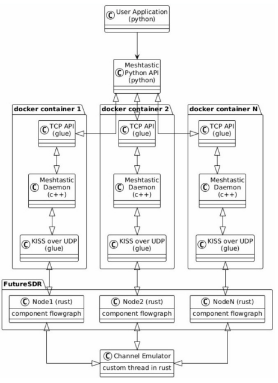
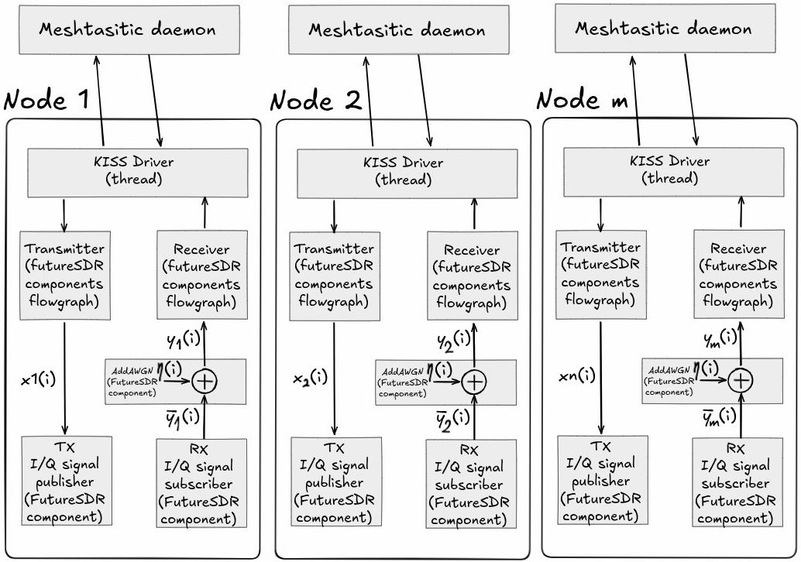

**ЭМУЛЯЦИЯ СТЕКА MESHTASTIC**  
**Анастасия Александровна Мельникова**

Старший преподаватель кафедры инновационных технологий языковой
коммуникации. Уфимский университет науки и технологий, Уфа, Российская
Федерация.

**Эмиль Рафкатович Багманов**

Студент кафедры телекоммуникационных систем, институт
электротехнического инжиниринга. Уфимский универсиитет науки и
технологий, Уфа, Российская Федерация.

**Аннотация**

**Предмет.** Взаимодействие физического и сетевого уровня на базе
технологии LoRa.

**Цели.** Разработка эмулятора полного стека Meshtastic, позволяющего
эмулировать поведение сети на всех уровнях без использования физических
устройств.

**Методология.** Компьютерное моделирование и концепция
Software-in-the-Loop (SITL). Эмуляция работы канала и обработки сигналов
с помощью инструмента FutureSDR.

**Результаты.** Разработан прототип open-source SITL-эмулятор
LoRaEmulator. Реализована базовая эмуляция взаимодействия узлов
Meshtastic через виртуальный радиоканал, реализована базовая графическая
визуализация узлов и механизмы управления узлами через графический
интерфейс приложения.

**Заключение.** Разработанный прототип SITL-эмулятора подтверждает
возможность эмуляции стека без использования физического оборудования.

**Ключевые слова:** LoRa, Meshtastic, Software-in-the-Loop, FutureSDR

**Введение**

В современных условиях возрастающей зависимости от централизованных
систем связи (сотовых сетей, интернета) особую актуальность приобретают
децентрализованные системы связи. Одним из решений является технология
Meshtastic – открытый проект, реализующий децентрализованную mesh-сеть
для приемо-передатчиков LoRa.

При разработке распределенных беспроводных систем, такие как mesh-сети,
ключевой задачей является корректная оценка поведения радиоканала.
Эксперементальная проверка таких систем в реальных условиях требует
значительных ресурсов. В связи с этим особую акутальность приобретают
программные методы эмуляции физического уровня радиоканала.

Одним из подходов является концепция Software-in-the-Loop (SITL), при
которой встроенное программное обеспечение и алгоритмы выполняются на
хост-компьютере, путем запуска в виртуальной среде.

**Постановка задачи**

Таким образом, целью данной работы является разработка эмулятора полного
стека Meshtastic, позволяющего эмулировать поведение сети на всех
уровнях без использования физических устройств.

Для достижения цели были поставлены следующие задачи:

\- Разработать модель канала связи

\- Реализовать описание узлов в виде двух независимых между собой
отдельных графов: пути приема и пути передачи данных в FutureSDR.

\- Разработать механизм, связывающий узлы в FutureSDR с моделью канала
связи (блоки Signal Subscriber, Signal Publisher – каналы crossbeam,
связывающие поток обработки канала с блоками FutureSDR).

\- Реализовать драйвер эмуляции физического интерфейса Meshtastic.

\- Реализовать базовый графический интерфейс.

**Материалы и методы**

Работа выполнялась с использованием подхода Software-in-the-Loop (SITL)
для эмуляции полного стека уровней без применения физического
оборудования.

**Software-in-the-Loop**

Выбор концепции SITL (Software-in-the-Loop) как основной метод,
обусловлен возможностью запуска встроенного программного обеспечения
узлов в виртуальной среде на хост-компьютере, в отличии от HITL
(Hardware-in-the-Loop), где используются реальные физические компоненты.
SITL позволяет эмулировать все уровни программно. Это снижает затраты и
обеспечивает высокую воспроизводимость экспериментов.

**Эмуляция физического уровня: FutureSDR**

Для эмуляции физического уровня технологии LoRa использовался
асинхронный фреймворк FutureSDR.

GNU Radio и FutureSDR оба являются инструментами для работы с SDR
(Software Defined Radio), однако их архитектурные подходы отличаются.

GNU Radio ориентирован на визуальное проектирование потоков обработки
сигналов. Пользователь формирует граф обработки в среде GNU Radio
Companion (GRC), соединяя блоки между собой. На основе созданной схемы
генерируется программный код исходя из выбранного (с++ или python) из
.grc описания, который затем используется для исполнения обработки.

Однако данный подход накладывает ограничение к гибкости и затрудняет
реализацию нестандартных сценариев и интеграцию.

FutureSDR использует противоположный подход, граф описывается программно
в виде набора объектов-блоков и их соединений. На основе этого описания
будет генерироваться граф, который можно будет посмотреть на локальном
сервере при запуске потоков обработки.

Это дает свободу действий при создании своих потоков обработки и
становится ориентирован на расширяемость, поскольку:

> \- отсутствует привязка к визуальному редактору;

\- логика обработки описывается напрямую в коде;

\- производительность

Именно по этой причине был выбран FutureSDR для выполнения данной
работы.

**Связь между узлами (crossbeam)**

Связь между моделью радиоканала и блоками обработки сигналов FutureSDR
реализована с помощью высокопроизводительных каналов библиотеки
crossbeam.

Crossbeam – это библиотека языка rust, предоставляющая набор
инструментов для многопоточного программирования. Crossbeam канал
позволяет нескольким потокам одновременно отправлять и принимать данные.
В отличии от shared memory (разделяемой памяти), где несколько потоков
работают с одной и той же областью памяти через мьютексы, каналы
crossbeam использует подход передачи сообщений (взаимодействие пары
subscriber и pusblisher).

Такой выбор обусловлен следующими преимуществами:

\- упрощение синхронизации.

\- высокая производительность.

\- естественная интеграция с асинхронной архитектурой FutureSDR.

**Архитектура эмулятора**

Пользовательские настройки приемопередатчиков и отправляемых сообщений
передаются в запущенный процесс meshtastic через TCP сокет в meshtastic
python API. После этого переданные параметры или сообщения передаются на
виртуальные физические узлы через реализованный виртуальный драйвер
(KISS (Keep It Simple, Stupid) over UDP). Виртуальные физические узлы
взаимодействуют между собой через эмулятор канала связи, принятые
сообщения передаются обратно на уровень выше до пользовательского уровня
приложений. (Рисунок 1).

Рисунок 1 - Многоуровневая архитектура SITL

Архитектура состоит из следующих компонентов:

\- User Application: Уровень пользовательского приложения

\- Meshtastic python API: Клиент для TCP сервера в процессе meshtastic.

\- TCP API: Сервер реализующий управление процессом meshtastic.

\- Meshtastic daemon: Процесс meshtastic, та же самая программа, что
работает на реальных устройствах.

\- KISS (Keep It Simple, Stupid) over UDP: Компонент реализующий
управление узлом и принятие данных и событий с узла с помощью KISS
команд, отправляемых через UDP сокеты.

\- Node 1..N: Узлы приемопередатчиков описываемые с помощью графов в
FutureSDR.

\- Channel Emulator: Эмулятор канала связи (среда). Данный компонент
связывает все узлы между собой.

**Модель работы канала связи**

На рисунке 2 изображена реализация модели канала связи, которая
выполняется в отдельном потоке.

Рисунок 2 — Модель работы канала связи.

Элементы:  
1. *I/Q signal subsriber* и *I/Q signal publisher* — каналы crossbeam,
связывающие поток обработки канала с блоками FutureSDR (Рисунок 3).

По данным каналам передаются объекты со следующим описанием:

*pub struct IqFrame {*

*pub epoch: u64,*

*pub samples: \[Complex32; 1024\],*

*}*

где *epoch* — временная метка (номер фрейма), а *samples* — буфер
комплексных отсчетов для данного фрейма.

В случае отсутствия данных на передачу или прием буфер *samples*
заполняется нулевыми значениями для обеспечения синхронизации данных.

2*. Cnm* - матрица коэффициентов канала. Каждый сигнал
*xn(i)* умножается на комплексный коэффициент, перед тем, как
сложить сигналы для приемника m.

Передаваемые отсчеты в *IqFrame* будут суммироваться только при условии,
что их временные метки одинаковы. После этого сигнал *ȳm(i)*
отправляется на приемный граф FutureSDR для узла *m*.

**Модель работы узла**

Узел представляет собой описание в виде двух независимых между собой
отдельных графов: пути приема и пути передачи.

Перед приемом суммы всех сигналов для данного узла m добавляется
аддитивный белый гауссовский шум. Значение дисперсии белого шума можно
задать отдельно при создании узла. После добавления шума, приемник
попытается извлечь байты из результирующего сигнала *ym(i),*
которые будут отправлены на meshtastic daemon по команде.

 Путь передачи отвечает за
преобразованние данных, поступающих от уровня сети в квадратурную
модуляцию.

Рисунок 3 — Иллюстрация взаимодействия потоков эмуляции канала связи с
узлами в FutureSDR.

**Результаты**

В ходе работы был разработан прототип SITL-эмулятора LoRaEmulator. С
помощью концепции SITL оригинальное сетевое программное обеспечение
запускалось в виртуальной среде на хост-компьютере. Каждый эмулируемый
узел представлялся двумя независимыми графами обработки сигналов
FutureSDR – графом передачи и графом приема. Связь между моделью
радиоканала и блоками FutureSDR осуществлялась через блоки Signal
Publisher и Signal Subscriber, соединенные каналами crossbeam.

В результате реализации драйвера эмуляции физического интерфейса
Meshtastic была продемонстрирована базовая работоспособность передачи
пакетов. Сообщение, отправленное с одного эмулируемого узла через
виртуальный радиоканал, корректно принималось и отображалось в
web-интерфейсе второго узла (Рисунок 4).

Рисунок 4 — Передача текстового сообщения между двумя виртуальными
узлами (Верхняя страница – web-интерфейс виртуального узла 1, нижняя
страница – web-интерфейс виртуального узла 2)

Также был реализован базовый графический интерфейс для управления и
настройки виртуальных узлов пользователем (Рисунок 5).

Рисунок 5 — Графический интерфейс для конфигурации эмуляции сети.

Разработанный прототип LoRaEmulator обеспечил возможность эмуляции узлов
через виртуальный радиоканал без использования физического оборудования.
Исходный код прототипа был размещен в открытых репозиториях:

\- Пользовательский интерфейс:
<https://github.com/Emile1154/LoRaEmulator>

\- meshtastic с реализацией виртуального драйвера KISS:
<https://github.com/Emile1154/firmware/tree/dev_softdriver_linux>

\- Граф узла FutureSDR и виртуальный драйвер KISS:
<u>https://github.com/Emile1154/LoRaSDR/tree/main</u>

**Заключение**

В настоящей работе разработан и прототип SITL-эмулятора подтверждает
возможность эмуляции стека без использования физического оборудования.

Данное решение обеспечивает эмуляцию взаимодействия виртуальных узлов
через виртуальный радиоканал, включая передачу пакетов и их отображение
во встроенном web-интерфейсе meshtastic.

Научная новизна заключается в создании SITL-инструмента,
ориентированного на полную эмуляцию всех уровней приложения, включая
виртуальный физический уровень и виртуальный радиоканал.

> **Список литературы**

1.  RF-SITL: A Software-in-the-loop Channel Emulator for UAV Swarm
    Networks Nicholas Mastronarde, Daniel Russell, Zhangyu Guan 2022

2.  <https://m17-protocol-specification.readthedocs.io/en/latest/kiss_protocol.html>
    KISS Protocol (08.01.2026)

3.  <https://reticulum.network/manual/index.html> Reticulum Network
    Stack Manual (09.01.2026)

4.  <https://www.futuresdr.org/learn/introduction.html> FutureSDR
    documentation (07.01.2026)

5.  <https://www.futuresdr.org/blog/are-we-lora/> LoRa for FutureSDR
    implemented overview (07.01.2026)

6.  <https://meshtastic.org/docs/introduction/> Meshtastic documentation
    (08.01.2026)
