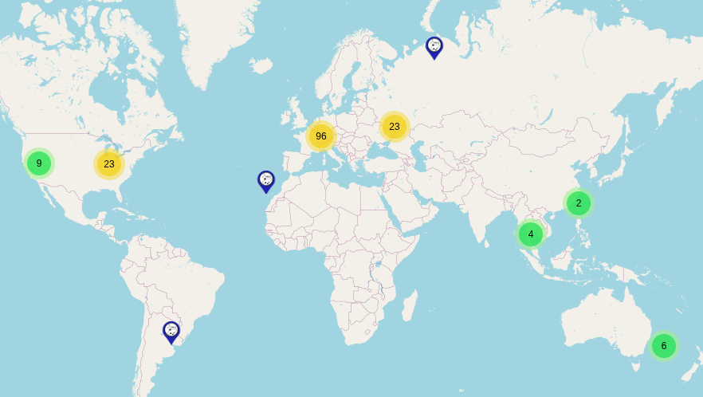
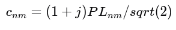
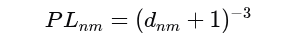
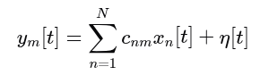
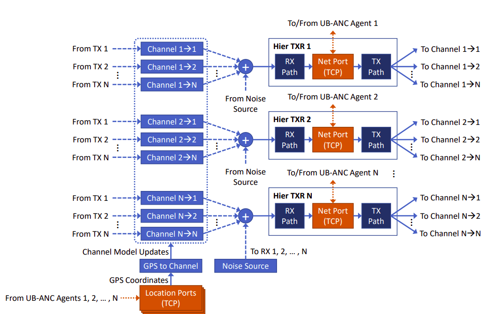

СОДЕРЖАНИЕ

# 

[ВВЕДЕНИЕ [4](#_Toc219673383)](#_Toc219673383)

[1 Симуляция и эмуляция аппаратной части
[5](#симуляция-и-эмуляция-аппаратной-части)](#симуляция-и-эмуляция-аппаратной-части)

[2 GNU Radio и FutureSDR
[6](#gnu-radio-и-futuresdr)](#gnu-radio-и-futuresdr)

[3 Meshtastic и Reticulum
[7](#meshtastic-и-reticulum)](#meshtastic-и-reticulum)

[4 Теоретическая модель канала
[8](#теоретическая-модель-канала)](#теоретическая-модель-канала)

[ЗАКЛЮЧЕНИЕ [9](#_Toc175926239)](#_Toc175926239)

[СПИСОК ЛИТЕРАТУРЫ [10](#_Toc175926240)](#_Toc175926240)

­­

ВВЕДЕНИЕ

При разработке распределенных беспроводных систем, такие как mesh-сети,
ключевой задачей является корректная оценка поведения радиоканала при
одновременной передаче от множества узлов. Экспериментальная проверка
таких систем в реальных условиях требует значительных ресурсов. В связи
с этим особую актуальность приобретают программные методы эмуляции
физического уровня радиоканала.

Одним из подходов является концепция Software-in-the-Loop (SITL), при
которой встроенное программное обеспечение и алгоритмы выполняются на
хост-компьютере, путем запуска в виртуальной среде.

Такая эмуляция обеспечивает создание контролируемой и воспроизводимой
среды для тестирования, позволяя анализировать поведение системы в
условиях, которые сложно воссоздать в реальности, что делает его
идеальным для сложных систем.

Целью данной теоретической части является анализ принципов SITL и их
адаптация для моделирования многоканального радиоканала в SDR.

# Симуляция и эмуляция аппаратной части

В задачах тестирования и разработки применяются подходы симуляции и
эмуляции аппаратной части. Несмотря на внешнее сходство, данные методы
решают различные классы задач.

Симуляция предполагает математическое упрощение поведения аппаратных
компонентов и среды распространения сигнала, как правило оперируя
абстрактными моделями, что позволяет исследовать поведение системы на
высоком уровне, но не учитывает особенности физической и аппаратной
реализации.

Эмуляция, в отличие от симуляции, ориентирована на воспроизведение
поведения аппаратной части таким образом, чтобы на ней могло исполняться
реальное поведение программного обеспечения. Копирование функционала
одной системы на другую.

В данной работе используется подход SITL с использованием SDR, который
относится к классу эмуляции. Обеспечивает тестирование сетевого и
физического уровня в условиях, близких к реальным.

# GNU Radio и FutureSDR

GNU Radio и FutureSDR оба являются инструментами для работы с SDR,
однако их архитектурные подходы отличаются.

GNU Radio ориентирован на визуальное проектирование потоков обработки
сигналов. Пользователь формирует граф обработки в среде GNU Radio
Companion (GRC), соединяя блоки между собой. На основе созданной схемы
генерируется программный код исходя из выбранного (с++ или python) из
.grc описания, который затем используется для исполнения обработки.

Однако данный подход накладывает ограничение к гибкости и затрудняет
реализацию нестандартных сценариев и интеграцию.

FutureSDR использует противоположный подход, граф описывается программно
в виде набора объектов-блоков и их соединений. На основе этого описания
будет генерироваться граф, который можно будет посмотреть на локальном
сервере при запуске потоков обработки.

Это дает свободу действий при создании своих потоков обработки и
становится ориентирован на расширяемость, поскольку:  
- отсутствует привязка к визуальному редактору;

\- логика обработки описывается напрямую в коде;

\- производительность

# Meshtastic и Reticulum

Meshtastic и Reticulum представляют собой два различных подхода к
построению децентрализованных сетей.

Meshtastic — это готовая к использованию платформа для автономной связи
на базе LoRa с упором на простоту.

В то время как Reticulum — это гибкий сетевой стек для создания
разнообразных mesh-сетей (LoRa, WiFi, Ethernet и других физических
интерфейсов), но требующий больше настроек для пользователя.

Рисунок 1 — Распространненость узлов сети Reticulum

Рисунок 2 — Распространненость узлов сети Meshtastic

# Теоретическая модель канала

Каждый из N передатчиков соединяется с остальными через отдельные
каналы, как показано на рисунке 3. Связь между выходом передатчика n и
входом передатчика m моделируется блоком канала Channel n→m.

 Каждый узел учитывает
затухание пути, которое зависит от расстояния между ними.

 Коэффициенты канала
рассчитываются как:

где *dnm* расстояние между узлами:

Тогда принимаемый сигнал на узле *m*:

где *xn\[t\]* — сигнал от узла n,

*η\[t\]* — аддитивный белый гауссовский шум

Модель канала может быть расширена: изменением экспоненты затухания,
добавлением многолучевого распространнения, направленных антенн и других
эффектов. \[1\]

Рисунок 3 — Централизованная SITL архитектура с N блоками
приемопередатчиков.

ЗАКЛЮЧЕНИЕ

В данной работе были рассмотрены различия между симуляцией и эмуляцией
аппаратной части. Описаны инструменты SDR, их возможности и ограничения.
Проведено сравнение Meshtastic и Reticulum. Описана теоретическая модель
радиоканала.

СПИСОК ЛИТЕРАТУРЫ

1.  RF-SITL: A Software-in-the-loop Channel Emulator for UAV Swarm
    Networks Nicholas Mastronarde, Daniel Russell, Zhangyu Guan 2022

2.  <https://m17-protocol-specification.readthedocs.io/en/latest/kiss_protocol.html>
    KISS Protocol (08.01.2026)

3.  <https://reticulum.network/manual/index.html> Reticulum Network
    Stack Manual (09.01.2026)

4.  <https://www.futuresdr.org/learn/introduction.html> FutureSDR
    documentation (07.01.2026)

5.  <https://www.futuresdr.org/blog/are-we-lora/> LoRa for FutureSDR
    implemented overview (07.01.2026)

6.  <https://meshtastic.org/docs/introduction/> Meshtastic documentation
    (08.01.2026)
